# Institutional Multi-Asset Liquidity & Data Platform (Portfolio Build)
**Product Name (working):** Orion Liquidity & Data Platform (Orion)  
**Document Version:** 1.0  
**Status:** Implementation-Ready PRD (Exhaustive)  
**Primary Audience:** Engineers, Architects, Product/Design, DevOps/SRE  
**Deployment Target:** AWS (ECS/Fargate), Event-Driven / Message Bus (Kafka/MSK)  
**Technology Stack:** Java 21 + Spring Boot 3.x (backend microservices), React + TypeScript (frontend)  
**Architecture Pattern Highlights:** Event-Driven + CQRS + Outbox + BFF (Backend-for-Frontend)

---

## 0. The One-Sentence Pitch
Orion is a cloud-native, event-driven platform that delivers **real-time multi-asset market data**, **electronic execution workflows (RFQ + optional CLOB)**, **trade capture + post-trade automation**, and **market analytics/data products**, all through a **single-screen web workstation** backed by **AWS-hosted microservices** and a **message bus**.

> Design goal: anyone reviewing the repo should instantly recognize the shape of an **institutional liquidity + data** platform (without referencing any particular real-world vendor).

---

## 1. 5000-Foot Overview (Big Picture)

### 1.1 What Orion Is
Orion is a portfolio-grade reference platform that models how modern institutional markets are served:
- **Liquidity discovery** and **price formation** across multiple instruments
- **Electronic workflows** for negotiation and execution (especially OTC-style RFQ)
- **Real-time distribution** of streaming data to many consumers (web UI, analytics services)
- **Immutable event trail** for auditability and replay
- **Cloud operations** with reliability, scaling, observability, and security controls

### 1.2 What Orion Is Not
- Not a live brokerage or production trading venue
- No custody, no real payments, no real regulatory claim
- No proprietary UIs or branded workflows from any specific company
- Connectivity to real exchanges/vendors is optional and typically simulated for portfolio safety

### 1.3 Why This Product Exists (Portfolio Value)
Orion demonstrates end-to-end competence in:
- **Java 21 + Spring Boot 3.x** microservices with Clean Architecture
- Event-driven systems and messaging patterns (Kafka)
- Low-latency distribution and fan-out (WebSockets, gRPC streaming, topic partitioning)
- Trading lifecycle state machines (RFQ → Quote → Accept → Trade)
- Microservices, CQRS, idempotency, outbox, DLQ, replay
- AWS deployment maturity (ECS/Fargate, MSK, RDS, Redis, IAM, networking)
- **React + TypeScript** single-page application with real-time data streaming
- Observability (metrics, tracing, logs, SLOs) and operational rigor

---

## 2. Problem Statement
Institutional trading workflows require:
- **Streaming market data** with rapid updates and consistent snapshots
- **Electronic execution** that handles negotiations, quotes, acceptances, and partial fills
- **Auditability** for who did what, when, and why (correlation across services)
- **Reliability** under partial failure (retries, replays, idempotency)
- **Scalability** from dozens to thousands of concurrent sessions (especially data streaming)
- **Post-trade workflow automation** (confirmations, settlement states, enrichment)
- **Analytics and data products** derived from events (TCA-lite, benchmarks, indices)

Orion addresses these with a message-bus-first architecture deployed on AWS.

---

## 3. Goals, Non-Goals, and Success Criteria

### 3.1 Goals
1. **Single-screen Workstation**: Market Watch + RFQ Ticket + Blotters + Analytics + Admin.
2. **Event-Driven Core**: Every meaningful business change emits a domain event.
3. **Production-Style Correctness**: Outbox, idempotent consumers, DLQs, replayable logs.
4. **AWS-Native Deployment**: IaC, environments, secure networking, observability.
5. **Measurable Performance**: Load tests and latency metrics published in the repo.

### 3.2 Non-Goals
- Not building a regulated exchange or broker.
- Not implementing full FIX certification in MVP (optional stretch).
- Not implementing full clearing/settlement integration (simulate states).
- Not building a full risk engine (implement key pre-trade controls).

### 3.3 Success Criteria (Portfolio Grade)
- **Market data**: 1k concurrent WebSocket subscribers in staging benchmark.
- **End-to-end tick latency** (ingest → bus → UI): p99 < 250ms (demo-scale).
- **RFQ throughput**: 20 RFQs/sec sustained with quote fan-in.
- **Order throughput** (if CLOB enabled): 100 orders/sec sustained.
- **Resilience**: Restart any stateless service without losing orders/trades.
- **Replay**: Rebuild read models from Kafka topics end-to-end.
- **Audit**: CorrelationID shows a complete chain across gateway → services → events.

---

## 4. Product Principles (Non-Negotiable)
1. **Event log is the source of truth for “what happened.”**
2. **All consumers must be idempotent.** Assume duplicates and retries.
3. **Hot path vs Cold path separation.** Don’t block hot workflows on slow IO.
4. **BFF is the UI contract boundary.** UI never talks to internal services directly.
5. **Security by default.** Least privilege IAM, TLS everywhere, secrets management.
6. **Observability built in.** Metrics, traces, logs from day 1.
7. **Schema evolution discipline.** Backward compatible within major versions.

---

## 5. Personas & Permissions

### 5.1 Personas
- **Trader**: views prices, sends RFQs, accepts quotes, places/cancels orders, views trades.
- **Sales/Broker Ops**: monitors RFQ flow, provides quotes (or supervises LP bots), monitors hit ratio.
- **Risk Controller**: configures limits, reviews breaches, activates kill switch.
- **Analyst**: explores derived metrics, TCA-lite, benchmarks, exports.
- **Admin**: manages users, entitlements, reference data, venue/instrument configuration.
- **Platform Engineer (internal)**: operates infrastructure, monitors health, responds to incidents.

### 5.2 Roles (RBAC)
- `ROLE_TRADER`
- `ROLE_SALES`
- `ROLE_RISK`
- `ROLE_ANALYST`
- `ROLE_ADMIN`
- `ROLE_PLATFORM` (internal ops APIs only)

### 5.3 Entitlements Model (ABAC + RBAC)
In addition to roles, a user has entitlements:
- Asset classes allowed (FX, Rates, Credit, etc.)
- Instruments allowed (by product group / ID)
- Venues allowed
- Max notional and rate limits (per user/desk/tenant)

### 5.4 Personas-to-Roles Mapping (Summary)

| Persona                 | Typical Roles                 | Notes                                        |
|-------------------------|-------------------------------|----------------------------------------------|
| Trader                  | `ROLE_TRADER`                | Front-office user of workstation UI          |
| Sales/Broker Ops        | `ROLE_SALES`                 | May also have `ROLE_TRADER` in small teams   |
| Risk Controller         | `ROLE_RISK`                  | Configures limits and monitors breaches      |
| Analyst                 | `ROLE_ANALYST`               | Heavier access to analytics and exports      |
| Admin                   | `ROLE_ADMIN`                 | Manages users, ref data, feature flags       |
| Platform Engineer       | `ROLE_PLATFORM`              | Internal ops APIs only, no trading actions   |

---

## 6. Scope & Releases

### 6.1 MVP Scope (must ship)
- Auth + tenants + entitlements
- Market data ingest (simulated + replay) + streaming UI
- RFQ workflow + quote collection + accept → trade
- Trades blotter + audit trail
- Event bus + outbox + idempotent consumers + DLQ
- AWS deployment (dev/staging) with IaC

### 6.2 V1 Scope (strong portfolio)
- OMS lifecycle for orders + cancels + amendments
- Risk controls (limits/throttles/kill switch)
- Post-trade confirmation + settlement simulation state machine
- Analytics dashboard (TCA-lite, spreads, response-time metrics)
- Observability dashboards + load test harness + reports

### 6.3 V2 Scope (stretch)
- Optional CLOB matching engine for 1–2 instruments
- FIX adapter (simulated counterparty sessions)
- EventBridge/SNS notifications for alerts and exports
- Searchable blotters using OpenSearch
- Multi-region DR narrative (backup replication, runbooks)

---

## 7. System Architecture

### 7.1 High-Level Architecture (Context)
- Web workstation (browser)
- BFF (Backend-for-Frontend) as the UI gateway and contract
- **gRPC** for internal service-to-service communication
- Domain microservices (RFQ, OMS, Execution, Market Data, Post-Trade, Analytics, Admin)
- Kafka message bus (AWS MSK)
- Datastores (RDS Postgres, Redis, S3; optional OpenSearch)
- Observability stack (CloudWatch + OTel + metrics store/dashboards)

### 7.2 Key Architectural Patterns
- **BFF pattern**: UI calls only the BFF (REST/GraphQL + WebSockets).
- **gRPC for internals**: BFF → services and service → service calls use gRPC for performance and type safety.
- **CQRS**: Write services emit events; read models are projections for UI queries.
- **Outbox**: Ensure atomic DB update + event publishing.
- **Sagas**: Multi-step workflows (RFQ acceptance → trade → confirmation → settlement).
- **Idempotency**: Exactly-once effects via dedup/sequence checks, not exactly-once delivery.

### 7.2.1 Communication Protocol Matrix

| Source | Target | Protocol | Rationale |
|--------|--------|----------|----------|
| Browser | BFF | REST + WebSocket | Browser compatibility |
| BFF | Query Services | gRPC (unary) | Low latency reads |
| BFF | Command Services | gRPC (unary) | Type-safe commands |
| BFF | Market Data Projection | gRPC (server streaming) | Real-time tick streaming |
| Service | Service (sync) | gRPC | Performance, contracts |
| Service | Service (async) | Kafka | Decoupling, replay |
| LP Bot | RFQ Service | gRPC (bidirectional streaming) | High-frequency quotes |

### 7.3 Component Diagram (Mermaid)

```mermaid
flowchart TB
  subgraph clients[" 🖥️ Client Applications"]
    UI["📊 Web Workstation"]
    UI2["⚙️ Admin Console"]
    UI3["📈 Analytics UI"]
  end

  subgraph bff[" 🔌 Backend-for-Frontend Layer"]
    BFF["Workstation API"]
    BFF_ADMIN["Admin API"]
    BFF_ANALYTICS["Analytics API"]
  end

  subgraph auth[" 🔐 Identity"]
    AUTH["OIDC Auth\nCognito / Keycloak"]
  end

  subgraph query[" 📖 Query Services"]
    MDQ["Market Data Query"]
    TRD_Q["Trade Query"]
    NOTIF["Notifications"]
  end

  subgraph command[" ✏️ Command Services"]
    RFQ_API["RFQ Service"]
    OMS_API["OMS Service"]
  end

  subgraph processing[" ⚡ Processing Services"]
    MDING["MarketData Ingest"]
    EXEC["Execution Service"]
    POST["Post-Trade Service"]
    ANA["Analytics Engine"]
  end

  subgraph messaging[" 📨 Event Bus"]
    BUS[("Kafka / MSK")]
  end

  subgraph data[" 💾 Data Stores"]
    PSQL[("PostgreSQL")]
    REDIS[("Redis")]
    S3[("S3")]
    OS[("OpenSearch")]
  end

  UI <-->|REST/WS| BFF
  UI2 <-->|REST| BFF_ADMIN
  UI3 <-->|REST| BFF_ANALYTICS

  BFF & BFF_ADMIN & BFF_ANALYTICS --> AUTH
  BFF -->|gRPC| MDQ & RFQ_API & OMS_API & TRD_Q & NOTIF
  BFF_ADMIN -->|gRPC| RFQ_API & OMS_API
  BFF_ANALYTICS -->|gRPC| ANA

  MDING --> BUS
  RFQ_API & OMS_API & EXEC & POST & ANA <--> BUS

  RFQ_API & OMS_API & EXEC & POST & ANA --> PSQL
  MDQ --> REDIS
  TRD_Q --> OS
  ANA --> S3

  classDef clientStyle fill:#e1f5fe,stroke:#01579b,stroke-width:2px,color:#01579b
  classDef bffStyle fill:#fff3e0,stroke:#e65100,stroke-width:2px,color:#e65100
  classDef authStyle fill:#fce4ec,stroke:#880e4f,stroke-width:2px,color:#880e4f
  classDef queryStyle fill:#e0f2f1,stroke:#004d40,stroke-width:2px,color:#004d40
  classDef commandStyle fill:#fff9c4,stroke:#f57f17,stroke-width:2px,color:#f57f17
  classDef processingStyle fill:#e8f5e9,stroke:#1b5e20,stroke-width:2px,color:#1b5e20
  classDef busStyle fill:#f3e5f5,stroke:#4a148c,stroke-width:2px,color:#4a148c
  classDef dataStyle fill:#eceff1,stroke:#37474f,stroke-width:2px,color:#37474f

  class UI,UI2,UI3 clientStyle
  class BFF,BFF_ADMIN,BFF_ANALYTICS bffStyle
  class AUTH authStyle
  class MDQ,TRD_Q,NOTIF queryStyle
  class RFQ_API,OMS_API commandStyle
  class MDING,EXEC,POST,ANA processingStyle
  class BUS busStyle
  class PSQL,REDIS,S3,OS dataStyle
```


### 7.4 Why BFF Exists (Explicit Requirements)

* Prevents UI from coupling to internal microservices and their churn
* Aggregates calls (reduces chatty UI patterns)
* Enforces entitlements consistently for UI-facing operations
* Handles WebSocket session management, backpressure, fan-out strategy
* Provides a stable contract for multiple UIs (Workstation, Admin, Analytics)
* **Translates REST/WebSocket to gRPC** for internal service communication

### 7.5 Why gRPC for Internal Communication

| Consideration | gRPC Advantage |
|--------------|----------------|
| **Performance** | Binary Protobuf serialization is 3-10x faster than JSON |
| **Streaming** | Native support for server, client, and bidirectional streaming |
| **Type Safety** | Compile-time contract enforcement via code generation |
| **Deadlines** | Built-in timeout propagation prevents cascading failures |
| **Interceptors** | Standardized middleware for auth, logging, metrics |
| **Load Balancing** | gRPC-aware L7 load balancing with health checking |

#### 7.5.1 gRPC Streaming Use Cases in Orion

| Use Case | Stream Type | Description |
|----------|-------------|-------------|
| Market Data Ticks | Server Streaming | BFF subscribes, receives continuous tick updates |
| RFQ Quote Watch | Server Streaming | BFF watches for incoming quotes on an RFQ |
| LP Quote Flow | Bidirectional | LP bots send quotes, receive RFQ notifications |
| Trade Blotter Live | Server Streaming | Real-time trade updates pushed to BFF |

### 7.6 Technology Stack (Preferred)

> **This is the canonical technology stack for Orion. All backend services, shared libraries, and tooling MUST use this stack unless an explicit exception is documented in an ADR.**

#### 7.6.1 Backend (Microservices)

| Component | Technology | Version | Notes |
|-----------|-----------|---------|-------|
| **Language** | Java | 21 (LTS) | Virtual threads (Project Loom) for high-throughput I/O |
| **Framework** | Spring Boot | 3.x | Auto-configuration, actuator, security, web |
| **Build Tool** | Maven | 3.9+ | Multi-module project with parent POM |
| **gRPC** | grpc-java + protobuf-java | Latest stable | Service-to-service communication |
| **Kafka Client** | Spring Kafka | Matches Spring Boot BOM | Event bus producer/consumer |
| **Database Access** | Spring Data JPA + Hibernate | Matches Spring Boot BOM | PostgreSQL dialect |
| **Caching** | Spring Data Redis / Lettuce | Matches Spring Boot BOM | Redis sessions and snapshots |
| **Testing** | JUnit 5 + Mockito + Testcontainers | Latest stable | Unit, integration, contract tests |
| **Observability** | Micrometer + OpenTelemetry Java Agent | Latest stable | Metrics, traces, logs |
| **API Docs** | SpringDoc OpenAPI | 2.x | Auto-generated Swagger for BFF REST endpoints |

#### 7.6.2 Frontend (Web Workstation)

| Component | Technology | Version | Notes |
|-----------|-----------|---------|-------|
| **Language** | TypeScript | 5.x | Strict mode enabled |
| **Framework** | React | 18+ | Single-page application |
| **Build Tool** | Vite | Latest | Fast dev server and build |
| **State Management** | Zustand or Redux Toolkit | Latest | Global state for market data, blotters |
| **WebSocket** | Native WebSocket / SockJS | — | Real-time streaming from BFF |
| **Testing** | Vitest + React Testing Library | Latest | Component and integration tests |

#### 7.6.3 Infrastructure & Shared

| Component | Technology | Notes |
|-----------|-----------|-------|
| **Container Runtime** | Docker | Multi-stage builds for Java (JRE slim) and React (nginx) |
| **Local Dev Orchestration** | Docker Compose | Kafka (Redpanda), PostgreSQL, Redis |
| **IaC** | Terraform | AWS provisioning |
| **CI/CD** | GitHub Actions | Build, test, deploy pipelines |
| **Schema Definition** | Protocol Buffers (proto3) | gRPC contracts + Java/JS code generation |
| **Event Schemas** | JSON Schema (repo-based) | Event envelope validation |
| **Monorepo Structure** | Maven multi-module | Parent POM with services/, libs/, web/ modules |

#### 7.6.4 Why Java + Spring Boot?

1. **JVM maturity for financial systems** — proven track record in institutional trading platforms for low-latency, high-throughput workloads.
2. **Virtual threads (Java 21)** — eliminates reactive complexity while achieving high concurrency for I/O-bound Kafka consumers and gRPC servers.
3. **Spring ecosystem breadth** — Spring Boot, Spring Security, Spring Kafka, Spring Data JPA, Spring gRPC all work together with minimal glue code.
4. **Testcontainers** — first-class Java support for integration testing with real Kafka, PostgreSQL, and Redis containers.
5. **Strong typing + compile-time safety** — catches contract drift between services at build time via protobuf code generation.
6. **Operational maturity** — JVM tooling (JFR, async-profiler, GC tuning) is battle-tested for production observability.

---

## 8. Functional Requirements (Exhaustive)

### 8.1 Authentication, Sessions, and Identity

```mermaid
sequenceDiagram
  autonumber
  box rgb(225, 245, 254) Client
    participant UI as 🖥️ Web UI
  end
  box rgb(255, 243, 224) BFF
    participant BFF as 🔌 BFF
  end
  box rgb(252, 228, 236) Identity
    participant IDP as 🔐 OIDC Provider
  end
  box rgb(232, 245, 233) Services
    participant SVC as 📦 Domain Service
  end

  UI->>IDP: Redirect to login
  IDP-->>UI: Auth code
  UI->>IDP: Exchange code for tokens
  IDP-->>UI: Access + Refresh tokens (JWT)
  Note over UI: Store tokens securely

  UI->>BFF: API request + Bearer token
  BFF->>BFF: Validate JWT signature
  BFF->>BFF: Extract roles, tenant, entitlements
  BFF->>SVC: gRPC call + context metadata
  SVC-->>BFF: Response
  BFF-->>UI: JSON response

  rect rgb(255, 248, 225)
    Note over UI,IDP: Silent Token Refresh
    UI->>IDP: Refresh token request
    IDP-->>UI: New access token
  end
```



**FR-IDENT-01** OIDC login via Cognito or Keycloak.
**FR-IDENT-02** Issue JWT access token with roles + tenant + entitlements claims.
**FR-IDENT-03** Refresh tokens supported (UI silent renew).
**FR-IDENT-04** Session timeout configurable.
**FR-IDENT-05** Admin can disable a user (immediate token invalidation via short TTL + revocation list optional).
**FR-IDENT-06** Audit login/logout and failed attempts.

### 8.2 Multi-Tenancy

**FR-TENANT-01** Support tenants; all data is tenant-scoped.
**FR-TENANT-02** Tenant ID is mandatory in every request and event envelope.
**FR-TENANT-03** Enforce tenant isolation at:

* BFF authorization
* Service layer (mandatory tenant filter)
* DB (row-level tenant key)
**FR-TENANT-04** Multi-tenant topic strategy: either shared topics with tenant key, or per-tenant topics for strict isolation (MVP uses shared topics with tenantId field).

### 8.3 Reference Data (Instruments, Venues, LPs)

**FR-REF-01** Admin can create/update instruments: id, assetClass, symbol, tenor, currency, tickSize, lotSize, tradingHours.
**FR-REF-02** Admin can configure venues: executionType (RFQ/CLOB), supported instruments, session windows.
**FR-REF-03** Admin can configure liquidity providers (LPs): enabled, instruments supported, quote rules, throttles.
**FR-REF-04** Reference data changes emit events (`InstrumentUpdated`, `VenueUpdated`, `LPConfigUpdated`) to refresh caches/read models.

### 8.4 Market Data (Ingest, Normalize, Distribute)

```mermaid
flowchart LR
  subgraph sources[" 📡 Data Sources"]
    SIM["🎲 Simulator"]
    REPLAY["⏯️ Replay"]
    ADAPT["🔌 Adapter"]
  end

  subgraph ingest[" 📥 Ingestion Layer"]
    ING["📦 Market Data\nIngest Service"]
    NORM["⚖️ Normalize"]
    VAL["✅ Validate"]
  end

  subgraph bus[" 📨 Event Bus"]
    KAFKA[("Kafka\ninstrumentId partition")]
  end

  subgraph projection[" 📊 Projection Layer"]
    PROJ["🔄 Snapshot\nProjector"]
    REDIS[("⚡ Redis\nLatest Ticks")]
  end

  subgraph distribution[" 📤 Distribution"]
    BFF["🔌 BFF"]
    STREAM["🌊 gRPC Stream"]
    COALESCE["⏱️ Coalesce\n10Hz"]
  end

  subgraph clients[" 🖥️ Clients"]
    UI["📊 Web UI"]
  end

  SIM & REPLAY & ADAPT --> ING
  ING --> NORM --> VAL --> KAFKA
  KAFKA --> PROJ --> REDIS
  KAFKA --> STREAM
  BFF --> REDIS
  STREAM --> BFF
  BFF --> COALESCE --> UI

  classDef sourceStyle fill:#e3f2fd,stroke:#1565c0,color:#1565c0
  classDef ingestStyle fill:#e8f5e9,stroke:#2e7d32,color:#2e7d32
  classDef busStyle fill:#f3e5f5,stroke:#4a148c,color:#4a148c
  classDef projStyle fill:#fff8e1,stroke:#ff8f00,color:#ff8f00
  classDef distStyle fill:#fff3e0,stroke:#e65100,color:#e65100

  class SIM,REPLAY,ADAPT sourceStyle
  class ING,NORM,VAL ingestStyle
  class KAFKA busStyle
  class PROJ,REDIS projStyle
  class BFF,STREAM,COALESCE distStyle
```



#### 8.4.1 Ingestion Modes

**FR-MD-ING-01** Simulated generator:

* random walk mid-price
* configurable spread behavior
* configurable volatility regimes

**FR-MD-ING-02** Replay mode:

* load recorded datasets from S3 (or local) and publish at speed factor (1x, 5x, 0.2x).

**FR-MD-ING-03** Adapter mode (optional):

* pluggable connector interface for external feeds (mock implementation in portfolio).

#### 8.4.2 Normalization

**FR-MD-NORM-01** Normalize all ticks to a canonical schema:

* instrumentId, bid, ask, mid, timestamp, source, quality flags

**FR-MD-NORM-02** Drop or tag malformed ticks; never crash ingestion.

**FR-MD-NORM-03** Detect stale feed with heartbeat; publish `MarketDataStale` events.

#### 8.4.3 Distribution

**FR-MD-DIST-01** Publish ticks to Kafka by instrument partition key.
**FR-MD-DIST-02** Provide snapshot service returning latest tick + optional orderbook depth.
**FR-MD-DIST-03** WebSocket streaming via BFF:

* subscribe/unsubscribe by instrument/watchlist
* snapshot-first then incremental
* automatic resubscribe on reconnect

**FR-MD-DIST-04** Backpressure strategy:

* server-side coalescing to fixed UI update rate (e.g., 10Hz) while preserving raw stream in Kafka.

**FR-MD-DIST-05** UI shows stale indicators when last tick exceeds threshold.

### 8.5 Workstation UI Requirements


**FR-UI-01** Market Watch:

* watchlists (create, rename, reorder)
* pinned instruments
* streaming best bid/ask/mid/spread
* “last update age” and data quality flags

**FR-UI-02** RFQ Ticket:

* select instrument, side, size, expiry
* optional constraints (min size, partial allowed)
* send RFQ, see quotes, accept quote
* show time remaining and quote ranking

**FR-UI-03** Blotters:

* RFQs blotter (stateful)
* Orders blotter (if OMS enabled)
* Trades blotter (always)
* filter/sort/search; export CSV

**FR-UI-04** Analytics dashboard:

* spreads over time
* response-time distributions
* slippage vs mid
* trade volumes

**FR-UI-05** Workspace personalization:

* layout saved per user (local storage or server profile)
* theme (light/dark)

**FR-UI-06** Audit visibility:

* show correlationId for RFQs/Orders/Trades for debugging and traceability

### 8.6 RFQ Workflow (OTC-Style Execution)

#### 8.6.1 RFQ Lifecycle

States:

* `CREATED` → `SENT` → `QUOTING` → `ACCEPTED` | `REJECTED` | `EXPIRED` → `TRADED` (if accepted)


**FR-RFQ-01** RFQ creation includes:

* instrumentId, side, size, expiryTime, requester, tenantId, optional venue

**FR-RFQ-02** Routing:

* select eligible LPs based on instrument, tenant, throttles, entitlements

**FR-RFQ-03** Quote collection:

* accept quotes until expiry
* discard late quotes
* idempotent quote handling (dedupe by quoteId)

**FR-RFQ-04** Quote ranking:

* best price wins; tie-break by earliest received
* show spread/impact estimate if mid available

**FR-RFQ-05** Quote acceptance:

* requires optimistic concurrency (RFQ still open and not expired)
* triggers trade execution flow

**FR-RFQ-06** RFQ cancellation:

* requester can cancel before accept/expiry

**FR-RFQ-07** “Last look” simulation (optional):

* LP may reject acceptance based on timing/price drift rules (configurable)

**FR-RFQ-08** Metrics:

* RFQ response time per LP
* win ratio
* quote distribution

#### 8.6.2 LP Bot Service (Liquidity Simulation)

**FR-LP-01** LP bots subscribe to RFQs and publish quotes.
**FR-LP-02** Pricing model configurable:

* quote = mid +/- spread adjustments
* inventory bias (optional)
* throttles per second

**FR-LP-03** Quote expiry is shorter than RFQ expiry (optional)

**FR-LP-04** LP bots never directly call execution; they publish quote events only.

### 8.7 OMS (Orders) — V1+

#### 8.7.1 Order Types

**FR-OMS-01** Support order types (V1):

* LIMIT
* MARKET (optional)

**FR-OMS-02** Fields:

* orderId, instrumentId, side, qty, limitPrice, timeInForce, owner, tenantId

**FR-OMS-03** Client idempotency key required for order submission retries.

#### 8.7.2 Order Lifecycle

States:

* `NEW` → `ACK` → `PARTIAL_FILL` → `FILLED`
* `NEW/ACK/PARTIAL_FILL` → `CANCEL_REQUESTED` → `CANCELLED`
* `REJECTED` terminal


**FR-OMS-04** Enforce valid state transitions (finite state machine).
**FR-OMS-05** Cancels are idempotent; cancelling an already cancelled order returns stable response.
**FR-OMS-06** Amendments (optional V1):

* amend remaining qty or limit price
* reject invalid amend after fill completion

### 8.8 Execution Service (RFQ Accept → Trade)

**FR-EXEC-01** On `QuoteAccepted`, create a `Trade` with immutable fields:

* tradeId, instrumentId, side, qty, price, buyer/seller parties (simulated), venue, timestamps

**FR-EXEC-02** Publish `TradeExecuted` event immediately (hot path).

**FR-EXEC-03** Persist trade asynchronously (cold path) using outbox or async worker.

**FR-EXEC-04** Ensure exactly-once effect for trade creation via:

* unique constraint on tradeId
* dedupe by (rfqId, acceptedQuoteId) pair

### 8.9 Matching Engine (CLOB) — V2 Stretch

**FR-ME-01** Price-time priority per instrument.
**FR-ME-02** Support:

* add order
* cancel order
* match and emit fill events
  **FR-ME-03** Persistence strategy:
* rebuild order book from compacted topic or snapshot + delta replay
  **FR-ME-04** Generate `TradeExecuted` for each match with fill details.

### 8.10 Risk & Controls (Pre-Trade + Operational)

**FR-RISK-01** Pre-trade checks for RFQ:

* per-user RFQ rate limit
* max notional
* instrument entitlement check

**FR-RISK-02** Pre-trade checks for orders:

* max order size
* max open orders
* notional limits

**FR-RISK-03** Kill switch:

* per-tenant and global
* blocks new RFQs and orders immediately (BFF enforced + service enforced)

**FR-RISK-04** Risk breach generates:

* `RiskLimitBreached` event
* user-facing notification and dashboard entry

**FR-RISK-05** All decisions are auditable with reasons.

### 8.11 Post-Trade (Confirmations + Settlement Simulation)

**FR-PT-01** Confirmation generation:

* JSON confirmation payload stored and retrievable
* optional PDF render (stretch)

**FR-PT-02** Settlement workflow states:

* `PENDING` → `SETTLED` | `FAILED` → `RETRYING` → terminal (after max retries)


**FR-PT-03** Settlement simulation rules:

* random failure probability configurable
* deterministic retries with backoff

**FR-PT-04** Post-trade emits events:

* `TradeConfirmed`, `SettlementRequested`, `SettlementCompleted`, `SettlementFailed`

**FR-PT-05** Reconciliation report (V1):

* list unsettled trades
* export to S3

### 8.12 Analytics & Data Products

**FR-ANA-01** Derived metrics (streaming):

* mid/spread time series
* RFQ response time distributions
* hit ratio per LP
* volume and notional aggregates

**FR-ANA-02** TCA-lite:

* slippage vs mid at decision time
* spread capture
* time-to-execution

**FR-ANA-03** Benchmark series:

* rolling VWAP
* simple index per basket (configurable basket definitions)

**FR-ANA-04** Exports:

* CSV export from UI
* scheduled exports to S3 (optional)

**FR-ANA-05** Analytics is non-blocking:

* if analytics service is down, trading workflows still function.

### 8.13 Notifications

**FR-NOTIF-01** In-app notifications:

* RFQ events (quote received, RFQ expired)
* risk breaches
* settlement failures

**FR-NOTIF-02** Optional external notifications (V2):

* route selected alerts to SNS/email or EventBridge targets.

### 8.14 Admin Console

**FR-ADMIN-01** Manage:

* users, roles, entitlements
* instruments, venues, LP configs
* limits and kill switch
* feature flags per tenant (enable OMS, enable CLOB, enable replay)

**FR-ADMIN-02** Admin actions emit audit events and are replayable.

---

## 9. Event-Driven / Message Bus Requirements (Very Detailed)

### 9.1 Core Rule

All domain services must publish events for state changes. Services must never assume exactly-once delivery.

### 9.2 Command vs Event

* **Command (sync)**: UI → BFF (REST) → domain service (**gRPC**)
  Example: `CreateRFQ`, `AcceptQuote`, `PlaceOrder`
* **Query (sync)**: UI → BFF (REST) → query service (**gRPC** or Redis)
  Example: `GetSnapshot`, `ListTrades`, `GetRFQDetails`
* **Event (async)**: service → Kafka (immutable fact)
  Example: `RFQCreated`, `QuoteReceived`, `TradeExecuted`

### 9.3 Event Envelope (Mandatory Standard)

All events must use a canonical envelope to support tracing, correlation, governance.

```json
{
  "eventId": "uuid",
  "eventType": "TradeExecuted",
  "eventVersion": 1,
  "occurredAt": "2026-02-09T12:34:56.789Z",
  "producer": "execution-service",
  "tenantId": "tenant-001",
  "correlationId": "corr-abc",
  "causationId": "cmd-xyz",
  "entity": {
    "entityType": "Trade",
    "entityId": "trade-123",
    "sequence": 7
  },
  "payload": { }
}
```

### 9.4 Topic Naming Convention

`<env>.<domain>.<stream>.v<major>`
Examples:

* `dev.marketdata.ticks.v1`
* `dev.rfq.lifecycle.v1`
* `dev.rfq.quotes.v1`
* `dev.oms.orders.v1`
* `dev.execution.trades.v1`
* `dev.posttrade.settlement.v1`
* `dev.risk.alerts.v1`
* `dev.admin.changes.v1`
* `dev.dlq.<service>.v1`

### 9.5 Partitioning Strategy (Ordering Guarantees)

* Market data ticks: partition key = `instrumentId`
* RFQ lifecycle: partition key = `rfqId`
* Quotes: partition key = `rfqId` (keeps quotes ordered per RFQ)
* Orders: partition key = `orderId`
* Trades: partition key = `tradeId` (or `instrumentId` if desired for analytics locality)
* Settlement: partition key = `tradeId`

**Requirement:** Any consumer that maintains entity state must rely on partition ordering for that entity key.

### 9.6 Delivery Semantics

* Bus provides **at-least-once** delivery.
* Consumers must provide **exactly-once effects** using:

  * idempotency keys
  * entity sequence numbers
  * processed-event tables
  * unique constraints in DB

### 9.7 Idempotency Requirements (Consumer Side)

**FR-EVENT-IDEMP-01** Every consumer maintains a `processed_events` log keyed by:

* (tenantId, consumerGroup, eventId) OR
* (tenantId, entityId, sequence) for entity streams

**FR-EVENT-IDEMP-02** Replays must not create duplicates.

**FR-EVENT-IDEMP-03** If consumer crashes mid-transaction, retry must be safe.

### 9.8 Outbox Pattern (Producer Side) — Mandatory

**FR-OUTBOX-01** Every state change + event record must be written in the same DB transaction.

```mermaid
sequenceDiagram
  autonumber
  box rgb(232, 245, 233) Domain Service
    participant SVC as 📦 Service
    participant DB as 🐘 PostgreSQL
  end
  box rgb(255, 243, 224) Outbox Publisher
    participant OUT as 📤 Outbox Publisher
  end
  box rgb(243, 229, 245) Event Bus
    participant K as 📨 Kafka
  end

  SVC->>DB: BEGIN TRANSACTION
  SVC->>DB: UPDATE entity state
  SVC->>DB: INSERT into outbox_events
  SVC->>DB: COMMIT
  Note over SVC,DB: Atomic write guarantees consistency

  loop Poll outbox table
    OUT->>DB: SELECT unpublished events
    DB-->>OUT: event rows
    OUT->>K: publish event
    K-->>OUT: ack
    OUT->>DB: UPDATE published_at = now()
  end
```



**FR-OUTBOX-02** A dedicated outbox publisher:

* polls outbox table
* publishes to Kafka
* marks rows published after Kafka ack
  **FR-OUTBOX-03** Outbox publisher must be:
* horizontally scalable (partition by table shard or id ranges)
* safe for duplicates (publishing same outbox row twice must still be safe)

### 9.9 DLQ & Poison Message Strategy

```mermaid
flowchart TB
  subgraph consumer[" 📥 Event Consumer"]
    RECV["📨 Receive Event"]
    PROC["⚙️ Process"]
    SUCCESS["✅ Success"]
    FAIL["❌ Failure"]
    RETRY["🔄 Retry Logic"]
  end

  subgraph dlq[" ⚠️ Dead Letter Queue"]
    DLQ[("📂 DLQ Topic")]
    ALERT["🚨 Alert"]
    REVIEW["🔍 Manual Review"]
    REPLAY["▶️ Replay"]
  end

  RECV --> PROC
  PROC --> SUCCESS
  PROC --> FAIL
  FAIL --> RETRY
  RETRY -->|"Retry 1-N\nexp backoff"| PROC
  RETRY -->|"Max retries\nexceeded"| DLQ
  DLQ --> ALERT
  ALERT --> REVIEW
  REVIEW --> REPLAY
  REPLAY -->|"Fixed"| RECV
  SUCCESS --> COMMIT["💾 Commit Offset"]

  classDef successStyle fill:#c8e6c9,stroke:#2e7d32,color:#1b5e20
  classDef failStyle fill:#ffcdd2,stroke:#c62828,color:#b71c1c
  classDef dlqStyle fill:#fff3e0,stroke:#e65100,color:#e65100

  class SUCCESS,COMMIT successStyle
  class FAIL,DLQ failStyle
  class ALERT,REVIEW,REPLAY dlqStyle
```



**FR-DLQ-01** Any event that fails processing after N retries must be placed on a DLQ topic.
**FR-DLQ-02** DLQ entries must include:

* original event payload
* error message and stack summary
* consumer version
  **FR-DLQ-03** Provide tooling:
* view DLQ messages
* replay selected messages after fix

### 9.10 Retry Strategy

* transient failures: exponential backoff (e.g., 0.5s, 1s, 2s, 5s, 10s)
* max retries before DLQ (configurable per consumer)
* do not retry non-recoverable validation errors (DLQ immediately)

### 9.11 Schema Strategy & Versioning

**FR-SCHEMA-01** Use **Protobuf** for gRPC service contracts (`/proto/v1/`) and JSON schemas for Kafka events (`/schemas/v1/`).
**FR-SCHEMA-02** Backward compatible changes only within `v1`:

* adding optional fields allowed
* removing/renaming fields not allowed

**FR-SCHEMA-03** Breaking changes require new major version (`v2`) and dual publishing window if needed.

### 9.13 CQRS Pattern (Command Query Responsibility Segregation)

Orion separates write operations (commands) from read operations (queries) for scalability and performance:

```mermaid
flowchart TB
  subgraph writes[" ✏️ Write Side"]
    CMD["📨 Command"]
    WSVC["📦 Write Service"]
    WSTORE[("🐘 Write Store")]
    OUTBOX[("📤 Outbox")]
  end

  subgraph bus[" 📨 Event Bus"]
    KAFKA[("Kafka")]
  end

  subgraph reads[" 📖 Read Side"]
    PROJ["🔄 Projector"]
    RSTORE1[("⚡ Redis\nSnapshots")]
    RSTORE2[("🔍 OpenSearch\nBlotters")]
    RSTORE3[("🐘 Read DB\nReports")]
  end

  subgraph query[" 📊 Query Side"]
    QRY["📊 Query"]
    QSVC["📖 Query Service"]
  end

  CMD --> WSVC
  WSVC --> WSTORE
  WSVC --> OUTBOX
  OUTBOX --> KAFKA
  KAFKA --> PROJ
  PROJ --> RSTORE1 & RSTORE2 & RSTORE3

  QRY --> QSVC
  QSVC --> RSTORE1 & RSTORE2 & RSTORE3

  classDef writeStyle fill:#fff9c4,stroke:#f57f17,color:#f57f17
  classDef readStyle fill:#e0f2f1,stroke:#004d40,color:#004d40
  classDef busStyle fill:#f3e5f5,stroke:#4a148c,color:#4a148c
  classDef storeStyle fill:#eceff1,stroke:#37474f,color:#37474f

  class CMD,WSVC writeStyle
  class QRY,QSVC,PROJ readStyle
  class KAFKA busStyle
  class WSTORE,OUTBOX,RSTORE1,RSTORE2,RSTORE3 storeStyle
```



**Benefits:**
- Write and read models can scale independently
- Read models optimized for specific query patterns
- Multiple read projections from same event stream
- Read models are rebuildable by replaying events
**FR-SCHEMA-04** Consumers must ignore unknown fields (forward compatibility).
**FR-SCHEMA-05** Protobuf best practices:

* Reserve deleted field numbers to prevent reuse
* Use `optional` for nullable fields
* Include `oneof` for polymorphic messages

### 9.12 Exactly-once “Business Guarantee” (What We Promise)

Orion guarantees:

* a trade is created at most once for a given acceptance (by unique constraints + idempotency)
* RFQ acceptance is processed once (optimistic concurrency + state checks)
* analytics may process duplicates but dedupe in aggregates

---

## 10. Data & Storage (Models, Read Models, Retention)

### 10.1 Primary Stores

* **RDS Postgres**: transactional state, outbox, idempotency logs, audit, projections
* **Redis**: hot snapshots, session caching, watchlist caching
* **S3**: archives, replay datasets, exports, daily snapshots
* **Optional OpenSearch**: fast search/filter of blotters

### 10.2 Data Retention

* Kafka:

  * market data ticks: shorter retention (e.g., 3–14 days) plus S3 archive if desired
  * lifecycle events: longer retention (e.g., 30–90 days)
* Postgres:

  * orders/trades: full retention for portfolio, partition by day/month
* S3:

  * “golden” replay datasets retained long-term

### 10.3 Core Tables (Minimum)

* `tenants`
* `users`, `user_roles`, `user_entitlements`
* `instruments`, `venues`, `liquidity_providers`
* `rfqs`, `quotes`
* `orders`, `fills` (V1+)
* `trades`
* `settlement_status`
* `outbox_events`
* `processed_events` (per consumer group)
* `audit_log` (append-only)
* `ui_preferences` (workspace layouts, watchlists)

### 10.4 Read Models (CQRS Projections)

* `rm_market_snapshot` (Redis + DB fallback)
* `rm_rfq_blotter`
* `rm_trade_blotter`
* `rm_order_blotter` (V1+)
* `rm_analytics_metrics` (aggregates)

**FR-READMODEL-01** Read models must be rebuildable from Kafka topics.
**FR-READMODEL-02** Read models are eventually consistent; UI reflects that explicitly.

---

## 11. API Contracts (BFF-First)

### 11.1 BFF (Workstation) APIs

**Authentication**

* `GET /me` returns user profile, roles, entitlements

**Market Data**

* `GET /market/snapshot?instrumentId=...`
* `WS /stream/market` subscribe/unsubscribe messages

  * `SUBSCRIBE {instrumentIds:[]}`
  * `UNSUBSCRIBE {instrumentIds:[]}`

**RFQ**

* `POST /rfqs` create RFQ
* `GET /rfqs` list + filters
* `GET /rfqs/{id}` details (quotes, status)
* `POST /rfqs/{id}/accept` accept quote
* `POST /rfqs/{id}/cancel`

**Trades**

* `GET /trades` filters/search
* `GET /trades/{id}` details + confirmation status

**Orders (V1+)**

* `POST /orders`
* `POST /orders/{id}/cancel`
* `POST /orders/{id}/amend`
* `GET /orders`

### 11.2 BFF (Admin) APIs

* `POST /admin/instruments`
* `POST /admin/venues`
* `POST /admin/lps`
* `POST /admin/limits`
* `POST /admin/killswitch/enable|disable`
* `POST /admin/users`

### 11.3 Internal Service APIs (gRPC)

Internal services are not directly called by UI. Only BFF calls internal services via **gRPC**.

#### 11.3.1 gRPC Service Definitions

All internal services expose gRPC interfaces defined in `/proto/v1/`:

**MarketDataService** (`marketdata.proto`)
```protobuf
service MarketDataService {
  // Unary: get current snapshot
  rpc GetSnapshot(SnapshotRequest) returns (SnapshotResponse);
  
  // Server streaming: subscribe to real-time ticks
  rpc StreamTicks(TickSubscription) returns (stream MarketTick);
}
```

**RFQService** (`rfq.proto`)
```protobuf
service RFQService {
  rpc CreateRFQ(CreateRFQRequest) returns (CreateRFQResponse);
  rpc GetRFQ(GetRFQRequest) returns (RFQDetails);
  rpc AcceptQuote(AcceptQuoteRequest) returns (AcceptQuoteResponse);
  rpc CancelRFQ(CancelRFQRequest) returns (CancelRFQResponse);
  
  // Server streaming: watch RFQ updates (quotes arriving)
  rpc WatchRFQ(WatchRFQRequest) returns (stream RFQUpdate);
}
```

**ExecutionService** (`execution.proto`)
```protobuf
service ExecutionService {
  rpc GetTrade(GetTradeRequest) returns (TradeDetails);
  rpc ListTrades(ListTradesRequest) returns (ListTradesResponse);
}
```

**PostTradeService** (`posttrade.proto`)
```protobuf
service PostTradeService {
  rpc GetConfirmation(GetConfirmationRequest) returns (ConfirmationDetails);
  rpc GetSettlementStatus(SettlementStatusRequest) returns (SettlementStatus);
}
```

**AdminService** (`admin.proto`)
```protobuf
service AdminService {
  rpc CreateInstrument(CreateInstrumentRequest) returns (Instrument);
  rpc UpdateInstrument(UpdateInstrumentRequest) returns (Instrument);
  rpc SetKillSwitch(KillSwitchRequest) returns (KillSwitchResponse);
  rpc UpdateLimits(UpdateLimitsRequest) returns (LimitsResponse);
}
```

#### 11.3.2 gRPC Benefits in Orion

| Benefit | Application |
|---------|-------------|
| **Low latency** | Sub-millisecond serialization for hot paths |
| **Strong typing** | Protobuf schemas prevent contract drift |
| **Streaming** | Server-streaming for market data; bidirectional for LP quotes |
| **Code generation** | Auto-generated clients/servers reduce boilerplate |
| **Deadlines** | Built-in timeout propagation across service calls |
| **Load balancing** | gRPC-aware L7 load balancing in service mesh |

---

## 12. Non-Functional Requirements (Very Detailed)

### 12.1 Performance

* **Market data fan-out** must not degrade command handling.
* **BFF streaming** must support session multiplexing (one WS per user).
* **Coalescing** required for high-frequency ticks to avoid UI overload.
* **Hot path** operations must avoid synchronous DB writes where possible:

  * publish event quickly, persist via outbox/async worker.

### 12.2 Reliability & Resilience

* Stateless services must be horizontally scalable.
* Any single service restart should not lose critical state.
* Database operations must be transactional and safe for retries.
* Consumers handle duplicates and out-of-order events (within reason).
* Circuit breakers and timeouts for service-to-service calls.

### 12.3 Availability Targets (Portfolio SLOs)

* Staging SLO target: 99.5% availability during demos/tests.
* RTO (recovery time objective): < 15 minutes in staging (redeploy).
* RPO (recovery point objective): < 5 minutes (RDS backups + event log replay).

### 12.4 Security

* TLS everywhere (ALB + internal)
* IAM least privilege per ECS task role
* Secrets in AWS Secrets Manager; never in env files in repo
* KMS encryption for MSK, RDS, S3 objects
* WAF optional for public endpoints
* Audit logs immutable and tenant-scoped

### 12.5 Compliance-Aware Features (Non-Claims)

* Full audit trail for state changes
* Entitlements enforcement
* Data retention controls
* Tamper-evident logging pattern (append-only + hash chain optional stretch)

### 12.6 Observability

* **Metrics**

  * command latency (p50/p95/p99)
  * WS connected sessions
  * Kafka producer/consumer throughput and lag
  * DLQ counts
  * error rates by service and endpoint
* **Tracing**

  * OpenTelemetry traces propagated via correlationId
* **Logging**

  * structured JSON logs with tenantId, correlationId, entityId

---

## 13. AWS Deployment Architecture (ECS + MSK)

### 13.1 AWS Services (Recommended)

* **VPC**: multi-AZ, private subnets for compute/data, public for ALB only
* **ECS Fargate**: microservices runtime
* **ALB**: ingress for REST + WebSocket (with HTTP/2 for gRPC support)
* **ECR**: container registry
* **MSK (Kafka)**: event bus
* **RDS Postgres**: primary relational store
* **ElastiCache Redis**: caching and snapshots
* **S3**: archives, exports, replay datasets
* **CloudWatch**: logs, metrics, alarms
* **App Mesh** (optional): service mesh for gRPC load balancing and observability
* **Optional**: OpenSearch (search), EventBridge/SNS (alerts), API Gateway (if desired)

### 13.1.1 AWS Deployment Diagram (Mermaid)

```mermaid
flowchart TB
  User["🌐 Browser Clients"]:::userStyle

  subgraph AWS[" ☁️ AWS Cloud"]
    subgraph VPC[" 🔒 VPC - Multi-AZ"]
      subgraph public[" 🌍 Public Subnets"]
        ALB["⚖️ Application\nLoad Balancer"]
      end

      subgraph private[" 🔐 Private Subnets"]
        subgraph compute[" 🖥️ Compute"]
          ECS_BFF["📦 ECS Fargate\nBFF Services"]
          ECS_SVCS["📦 ECS Fargate\nDomain Services"]
        end

        subgraph datastores[" 💾 Data Stores"]
          MSK[("📨 MSK\nKafka")]
          RDS[("🐘 RDS\nPostgres")]
          REDIS[("⚡ ElastiCache\nRedis")]
          OS[("🔍 OpenSearch")]
        end
      end
    end

    subgraph external[" 🔗 AWS Services"]
      S3[("📁 S3\nBuckets")]
      CW[("📊 CloudWatch")]
    end
  end

  User -->|HTTPS/REST| ALB
  ALB --> ECS_BFF
  ECS_BFF -->|gRPC| ECS_SVCS
  ECS_SVCS --> MSK & RDS & REDIS & OS
  ECS_SVCS --> S3 & CW
  MSK --> CW

  classDef userStyle fill:#e3f2fd,stroke:#1565c0,stroke-width:2px,color:#1565c0
  classDef lbStyle fill:#fff3e0,stroke:#e65100,stroke-width:2px,color:#e65100
  classDef computeStyle fill:#e8f5e9,stroke:#2e7d32,stroke-width:2px,color:#2e7d32
  classDef dataStyle fill:#fce4ec,stroke:#c2185b,stroke-width:2px,color:#c2185b
  classDef extStyle fill:#f5f5f5,stroke:#616161,stroke-width:2px,stroke-dasharray:5,5,color:#616161

  class User userStyle
  class ALB lbStyle
  class ECS_BFF,ECS_SVCS computeStyle
  class MSK,RDS,REDIS,OS dataStyle
  class S3,CW extStyle
```



### 13.2 Network & Security Groups

* ALB in public subnet
* ECS tasks in private subnets
* MSK, RDS, Redis in private subnets only
* Security group rules:

  * ALB → BFF tasks (443/HTTPs termination + internal port)
  * BFF → internal services (only required ports)
  * services → MSK (Kafka port)
  * services → RDS/Redis
* VPC endpoints optional to reduce NAT usage (S3, ECR, CloudWatch)

### 13.3 Environments

* `local`: docker compose (redpanda/kafka + postgres + redis)
* `dev`: small AWS footprint for iterative testing
* `staging`: production-like; load tests and demo
* `prod-demo`: hardened staging clone with stricter security and HA

### 13.4 Scaling Strategy

* ECS autoscaling for:

  * BFF (based on CPU + WS connection metrics)
  * ingestion and analytics consumers (based on Kafka lag)
* Kafka partitions sized to scale consumer groups.
* Read models:

  * Redis can scale; cache warming via projections.

### 13.5 Infrastructure as Code

Terraform modules:

* `infra/network` (VPC, subnets, routing, endpoints)
* `infra/compute` (ECS cluster, services, ALB, autoscaling)
* `infra/data` (MSK, RDS, Redis, S3)
* `infra/security` (KMS, secrets, IAM roles/policies)
* `infra/observability` (dashboards, alarms, log groups)

---

## 14. Detailed Flows (Sequence Diagrams)

### 14.1 Market Data Tick Flow

```mermaid
sequenceDiagram
  autonumber
  box rgb(225, 245, 254) Client
    participant UI as 🖥️ Web UI
  end
  box rgb(255, 243, 224) BFF Layer
    participant BFF as 🔌 Workstation BFF
  end
  box rgb(232, 245, 233) Services
    participant MDQ as 📊 MarketData Query
    participant ING as 📈 MarketData Ingest
    participant PROJ as 📊 Snapshot Projector
  end
  box rgb(243, 229, 245) Messaging
    participant K as 📨 Kafka/MSK
  end
  box rgb(255, 248, 225) Data
    participant R as ⚡ Redis
  end

  ING->>K: publish MarketTickReceived
  activate K
  PROJ->>K: consume MarketTickReceived
  deactivate K
  PROJ->>R: update latest snapshot
  activate R
  deactivate R

  UI->>BFF: WS SUBSCRIBE(instrumentId)
  activate BFF
  BFF->>MDQ: gRPC GetSnapshot()
  activate MDQ
  MDQ->>R: read snapshot
  R-->>MDQ: snapshot data
  MDQ-->>BFF: SnapshotResponse
  deactivate MDQ
  BFF-->>UI: send snapshot

  rect rgb(240, 255, 240)
    Note over BFF,MDQ: gRPC Server Streaming
    BFF->>MDQ: gRPC StreamTicks()
    loop Streaming Updates
      MDQ-->>BFF: stream MarketTick
      BFF-->>UI: WS push incremental update
    end
  end
  deactivate BFF
```



### 14.2 RFQ to Trade Flow

```mermaid
sequenceDiagram
  autonumber
  box rgb(225, 245, 254) Client
    participant UI as 🖥️ Web UI
  end
  box rgb(255, 243, 224) BFF Layer
    participant BFF as 🔌 Workstation BFF
  end
  box rgb(232, 245, 233) Domain Services
    participant RFQ as 💬 RFQ Service
    participant LP as 🏦 LP Bot Service
    participant EX as ✅ Execution Service
    participant PT as 📋 PostTrade Service
  end
  box rgb(243, 229, 245) Messaging
    participant K as 📨 Kafka/MSK
  end

  rect rgb(240, 248, 255)
    Note over UI,K: Phase 1: RFQ Creation via gRPC
    UI->>+BFF: POST /rfqs
    BFF->>+RFQ: gRPC CreateRFQ()
    RFQ->>RFQ: write rfq + outbox
    RFQ->>K: publish RFQCreated
    RFQ-->>-BFF: CreateRFQResponse
    BFF-->>-UI: 201 Created
  end

  rect rgb(240, 255, 240)
    Note over LP,K: Phase 2: Quote Collection
    LP->>K: consume RFQCreated
    LP->>K: publish QuoteReceived
    RFQ->>K: consume QuoteReceived
    RFQ->>RFQ: aggregate quotes
  end

  rect rgb(248, 245, 255)
    Note over UI,RFQ: Phase 2b: Watch Quotes via gRPC Streaming
    BFF->>RFQ: gRPC WatchRFQ(rfqId)
    loop Quote Updates
      RFQ-->>BFF: stream RFQUpdate
      BFF-->>UI: WS push quote update
    end
  end

  rect rgb(255, 248, 240)
    Note over UI,K: Phase 3: Quote Acceptance via gRPC
    UI->>+BFF: POST /rfqs/{id}/accept
    BFF->>+RFQ: gRPC AcceptQuote()
    RFQ->>K: publish QuoteAccepted
    RFQ-->>-BFF: AcceptQuoteResponse
    BFF-->>-UI: 200 OK
  end

  rect rgb(248, 240, 255)
    Note over EX,PT: Phase 4: Execution & Post-Trade
    EX->>K: consume QuoteAccepted
    EX->>K: publish TradeExecuted
    PT->>K: consume TradeExecuted
    PT->>K: publish TradeConfirmed
    PT->>K: publish SettlementRequested
  end
```



---

## 15. Edge Cases & Failure Modes (Must Handle)

### 15.1 Market Data

* out-of-order ticks: accept but mark `late=true` if timestamp behind by threshold
* burst ticks: coalesce for UI; persist raw stream separately if needed
* stale feed: show stale indicator, publish stale event

### 15.2 RFQ

* RFQ expires while accepting quote: deterministic rule via RFQ version check
* duplicate quote events: dedupe by quoteId + rfqId
* accept same quote twice (retries): idempotent accept endpoint using idempotency key
* LP last-look rejection: emit `QuoteAcceptanceRejected` and return to quoting if RFQ still open

### 15.3 Orders (V1+)

* cancel after fill complete: reject cancel with reason
* amend after partial fill: allow amend only on remaining qty (policy)
* duplicate order submissions: idempotency key ensures stable result

### 15.4 Messaging

* consumer lag: autoscale, alert, and degrade UI update frequency
* poison message: DLQ + alert
* schema mismatch: reject event to DLQ with diagnostics

### 15.5 Data Stores

* RDS transient failure: retry with backoff; do not block hot path if possible
* Redis down: BFF falls back to DB snapshot or indicates “snapshot unavailable”
* MSK partition unavailable: degrade gracefully, keep commands functioning when possible

---

## 16. Testing Strategy (Portfolio Proof)

### 16.1 Test Types

* Unit tests: state machines, pricing rules, validation, idempotency logic
* Contract tests: schema validation for all events
* Integration tests: Kafka + Postgres + Redis locally
* E2E tests: UI flows (login → subscribe → RFQ → accept → trade)
* Performance tests: load generator for:

  * tick fan-out
  * RFQ throughput
  * WS subscribers
* Resilience tests:

  * kill service during load and verify recovery
  * replay topics to rebuild read models and compare checksums

### 16.2 Benchmark Artifacts

Store in repo:

* `benchmarks/latency-report.md`
* `benchmarks/load-test-configs/`
* screenshots of dashboards + raw metrics exports

---

## 17. Milestones (Execution Plan)

### Milestone M0 — Foundations

* repo structure, shared libs, CI skeleton
* local docker compose environment

### Milestone M1 — Event Bus + Market Data

* MSK/Kafka topics, event envelope, schema repo
* ingest + snapshot projector + WS streaming via BFF

### Milestone M2 — RFQ + Quotes + Trade Execution

* RFQ service + LP bot + execution service
* trade blotter read model + UI

### Milestone M3 — AWS Deployment

* Terraform for VPC/ECS/MSK/RDS/Redis
* staging environment deployed with smoke tests

### Milestone M4 — Risk + Post-Trade + Analytics

* limits + kill switch + settlement simulation
* analytics service + dashboard

### Milestone M5 — Hardening & Showcase

* observability dashboards
* load tests + resilience tests
* polished README + architecture docs + demo scripts

---

## 18. Repo Structure (Recommended)

```
pom.xml                          # Parent POM (Maven multi-module)

/docs
  /prd
    PRD.md
  /architecture
    diagrams.md
    decisions.md (ADRs)
  /runbooks
    incident-response.md
    replay-procedure.md

/services                        # Java Spring Boot microservices (each is a Maven module)
  /bff-workstation               # src/main/java, src/test/java, pom.xml
  /bff-admin
  /marketdata-ingest
  /marketdata-projection
  /rfq-service
  /lp-bot-service
  /execution-service
  /posttrade-service
  /analytics-service
  /admin-service
  /notification-service (optional)

/libs                            # Shared Java libraries (Maven modules)
  /event-model                   # Canonical event envelope, serialization, validation
  /security                      # Auth helpers, tenant enforcement, JWT utilities
  /observability                 # OTel, logging, metrics helpers
  /common                        # Shared DTOs, exceptions, constants

/proto                           # Protocol Buffer definitions (gRPC contracts)
  /v1
    common.proto
    marketdata.proto
    rfq.proto
    order.proto
    trade.proto

/schemas                         # JSON Schemas for Kafka event envelopes
  /v1
    marketdata.tick.json
    rfq.created.json
    rfq.quote_received.json
    rfq.quote_accepted.json
    trade.executed.json
    ...

/web                             # React + TypeScript frontend (Vite)
  /workstation                   # Main trading workstation SPA
  /admin-console                 # Admin UI

/infra
  /terraform
  /docker-compose

/benchmarks                      # JMH microbenchmarks + load test scripts
/scripts                         # Dev utility scripts
```

---

## 19. Open Questions (Decide Early)

1. BFF contract style: REST-only vs REST + GraphQL (GraphQL can be compelling for workstation aggregation).
2. MSK vs self-managed Kafka for cost: keep local redpanda + AWS MSK as environments.
3. Schema registry: repo-based JSON schemas (MVP) vs Confluent/AWS schema registry (stretch).
4. Matching engine inclusion: V2 only or include minimal in V1?
5. Search: do we add OpenSearch for blotters or keep DB-only?

---

## 20. Acceptance Checklist (Definition of Done)

A release is “portfolio complete” when:

* Workstation UI supports subscribe + RFQ + accept → trade + blotter
* All state changes are events with canonical envelope
* Outbox implemented for each writing service
* Consumers are idempotent, DLQ exists, replay documented
* AWS staging deploy is reproducible via Terraform
* Dashboards show core latency, throughput, lag, errors
* Load tests and resilience tests are documented and reproducible
* README explains architecture and demo steps without external context

---

## Appendix A — Minimum Event Catalog (v1)

Market Data:

* `MarketTickReceived`
* `MarketSnapshotUpdated`
* `MarketDataStaleDetected`

RFQ:

* `RFQCreated`
* `RFQSent`
* `QuoteReceived`
* `RFQExpired`
* `QuoteAccepted`
* `RFQCancelled`
* `QuoteAcceptanceRejected` (optional)

Orders (V1+):

* `OrderPlaced`
* `OrderAcknowledged`
* `OrderRejected`
* `OrderCancelled`
* `OrderAmended`
* `OrderFilled` (if matching engine exists)

Execution:

* `TradeExecuted`

Post-Trade:

* `TradeConfirmed`
* `SettlementRequested`
* `SettlementCompleted`
* `SettlementFailed`

Risk/Admin:

* `RiskLimitBreached`
* `KillSwitchEnabled`
* `KillSwitchDisabled`
* `InstrumentUpdated`
* `VenueUpdated`
* `LPConfigUpdated`

---

## Appendix B — Glossary

* **BFF**: Backend-for-Frontend, a UI-specific API layer.
* **CQRS**: Separate write model and read model.
* **Outbox**: DB table storing events to publish reliably.
* **DLQ**: Dead Letter Queue/Topic for poison messages.
* **RFQ**: Request for Quote; negotiate prices with liquidity providers.
* **CLOB**: Central Limit Order Book; matching engine approach.

---
 
