# Orion — Institutional Multi-Asset Liquidity & Data Platform (Event-Driven on AWS)

Orion is a **portfolio-grade**, **cloud-native**, **event-driven** platform that models how modern institutional markets are served: **real-time market data**, **electronic execution workflows (RFQ + optional CLOB)**, **trade capture + post-trade automation**, and **analytics/data products**—all delivered through a **single-screen web workstation**.

> This project is intentionally vendor-neutral. It does not reference or replicate any proprietary system.  
> The goal is to demonstrate the **architecture and workflow patterns** used in institutional liquidity and data platforms.

---

## Table of Contents
- [Why Orion](#why-orion)
- [Key Capabilities](#key-capabilities)
- [Architecture Overview](#architecture-overview)
- [Core Services](#core-services)
- [Event-Driven Design](#event-driven-design)
- [BFF (Backend-for-Frontend)](#bff-backend-for-frontend)
- [Tech Stack](#tech-stack)
- [Repo Structure](#repo-structure)
- [Local Development](#local-development)
- [AWS Deployment](#aws-deployment)
- [Observability](#observability)
- [Testing & Benchmarks](#testing--benchmarks)
- [Security & Multi-Tenancy](#security--multi-tenancy)
- [Roadmap](#roadmap)
- [License](#license)

---

## Why Orion
Institutional trading workflows demand:
- **fast, streaming market data** distribution at scale
- **execution workflows** that handle negotiation and state transitions (RFQ → quotes → accept → trade)
- **auditability and replay** (what happened, when, and why)
- **resilience** under partial failures (duplicates, retries, reprocessing)
- **cloud operations maturity** (IaC, scaling, metrics/tracing)

Orion demonstrates those capabilities end-to-end using an **event-driven microservices** architecture deployed on **AWS**.

---

## Key Capabilities

### Workstation (Single Screen)
- Real-time **Market Watch** with streaming bid/ask/mid/spread
- **RFQ Ticket**: create RFQ, receive quotes, accept a quote, generate trade
- **Blotters**: RFQs, Trades (Orders in V1+)
- **Analytics**: spreads, response times, TCA-lite metrics
- **Admin**: instruments, venues, liquidity provider configs, limits, kill switch

### Market Data
- **Simulated generator** (random walk + volatility regimes + spreads)
- **Replay mode** (dataset replay at configurable speed)
- Snapshot-first + incremental update streaming via WebSockets

### Execution (OTC RFQ)
- RFQ lifecycle state machine
- Liquidity provider bots publish quotes
- Quote acceptance triggers trade execution (idempotent & auditable)

```mermaid
flowchart LR
  A["📝 Create RFQ"] --> B["📤 Route to LPs"]
  B --> C["💬 Collect Quotes"]
  C --> D{"Best Quote?"}
  D -->|Accept| E["✅ Execute Trade"]
  D -->|Timeout| F["⏱️ Expired"]
  E --> G["📋 Post-Trade"]

  style A fill:#e3f2fd,stroke:#1565c0
  style B fill:#fff3e0,stroke:#e65100
  style C fill:#f3e5f5,stroke:#7b1fa2
  style D fill:#fff9c4,stroke:#f57f17
  style E fill:#c8e6c9,stroke:#2e7d32
  style F fill:#ffcdd2,stroke:#c62828
  style G fill:#e0f2f1,stroke:#00695c
```



### Post-Trade
- Trade confirmations (JSON payloads; PDF optional)
- Settlement simulation state machine (PENDING → SETTLED/FAILED → retries)

### Analytics & Data Products
- Derived time series: mid, spread, volume
- TCA-lite: slippage vs mid, spread capture, time-to-execute
- Exports (CSV) and optional S3 scheduled outputs

---

## Architecture Overview

Orion uses:
- **BFF (Backend-for-Frontend)** for UI-specific APIs (REST/GraphQL) and WebSocket streaming
- **gRPC** for high-performance internal service-to-service communication
- **Kafka (AWS MSK)** as the message bus for immutable domain events
- **CQRS** read models (projections) for fast workstation queries
- **Outbox pattern** for correct event publishing
- **Idempotent consumers + DLQ** for resilience
- **AWS ECS/Fargate** for runtime, **RDS Postgres** for persistence, **Redis** for hot snapshots

### Communication Patterns

| Path | Protocol | Why |
|------|----------|-----|
| UI ↔ BFF | REST + WebSocket | Browser compatibility, real-time streaming |
| BFF → Domain Services | **gRPC** | Low latency, strongly-typed contracts, streaming |
| Service ↔ Service (sync) | **gRPC** | Performance, schema enforcement, bidirectional streaming |
| Service → Service (async) | Kafka | Decoupling, replay, event sourcing |

### Diagram

```mermaid
flowchart TB
  subgraph clients[" 🖥️ Client Layer"]
    UI["📊 Web Workstation"]
    UI2["⚙️ Admin Console"]
  end

  subgraph bff[" 🔌 BFF Layer"]
    BFF["Workstation API"]
    BFF_ADMIN["Admin API"]
  end

  subgraph auth[" 🔐 Auth"]
    AUTH["OIDC\nCognito / Keycloak"]
  end

  subgraph services[" ⚡ Domain Services"]
    MDING["📈 MarketData Ingest"]
    RFQ["💬 RFQ Service"]
    EXEC["✅ Execution Service"]
    POST["📋 PostTrade Service"]
    ANA["📊 Analytics Service"]
  end

  subgraph messaging[" 📨 Event Bus"]
    BUS[("Kafka / MSK")]
  end

  subgraph data[" 💾 Data Stores"]
    PSQL[("PostgreSQL")]
    REDIS[("Redis")]
    S3[("S3")]
  end

  UI <-->|REST/WS| BFF
  UI2 <-->|REST| BFF_ADMIN
  BFF & BFF_ADMIN --> AUTH
  BFF -->|gRPC| RFQ & EXEC & POST
  BFF_ADMIN -->|gRPC| RFQ & POST

  MDING --> BUS
  RFQ & EXEC & POST & ANA <--> BUS

  RFQ & EXEC & POST & ANA --> PSQL
  BFF --> REDIS
  ANA --> S3

  classDef clientStyle fill:#e1f5fe,stroke:#01579b,stroke-width:2px,color:#01579b
  classDef bffStyle fill:#fff3e0,stroke:#e65100,stroke-width:2px,color:#e65100
  classDef authStyle fill:#fce4ec,stroke:#880e4f,stroke-width:2px,color:#880e4f
  classDef serviceStyle fill:#e8f5e9,stroke:#1b5e20,stroke-width:2px,color:#1b5e20
  classDef busStyle fill:#f3e5f5,stroke:#4a148c,stroke-width:2px,color:#4a148c
  classDef dataStyle fill:#fff8e1,stroke:#ff6f00,stroke-width:2px,color:#ff6f00

  class UI,UI2 clientStyle
  class BFF,BFF_ADMIN bffStyle
  class AUTH authStyle
  class MDING,RFQ,EXEC,POST,ANA serviceStyle
  class BUS busStyle
  class PSQL,REDIS,S3 dataStyle
```


---

## Core Services

### BFF Layer

* `bff-workstation`: UI contract boundary, request aggregation, entitlements enforcement, WebSockets
* `bff-admin`: admin UI contract boundary (reference data, limits, kill switch)
* (optional) `bff-analytics`: analytics UI contract boundary

### Domain Services

* `marketdata-ingest`: generators/replayers/adapters → publish ticks to Kafka
* `marketdata-projection`: builds snapshots/read models (Redis + DB fallback)
* `rfq-service`: RFQ lifecycle + routing + quote aggregation
* `lp-bot-service`: simulated liquidity providers publishing quotes
* `execution-service`: quote acceptance → trade creation + `TradeExecuted` events
* `posttrade-service`: confirmations + settlement simulation
* `analytics-service`: consumes events, builds derived metrics, exports
* `admin-service`: reference data + limits + feature flags + entitlements (optional split)

### Supporting Services (Optional)

* `notification-service`: in-app notifications, optional SNS/EventBridge integration
* `matching-engine-service`: minimal CLOB for 1–2 instruments (V2 stretch)
* `search-service`: OpenSearch indexing for blotters (V2 stretch)

---

## Event-Driven Design

### Principles

* Every meaningful business change emits an **immutable domain event**
* Delivery is **at-least-once** → consumers must be **idempotent**
* Read models are **eventually consistent** projections (CQRS)

### Event Flow Architecture

```mermaid
flowchart LR
  subgraph producers[" ✏️ Producers"]
    P1["RFQ Service"]
    P2["Execution Service"]
    P3["MarketData Ingest"]
  end

  subgraph bus[" 📨 Kafka"]
    T1[("rfq.lifecycle.v1")]
    T2[("execution.trades.v1")]
    T3[("marketdata.ticks.v1")]
  end

  subgraph consumers[" 📥 Consumers"]
    C1["LP Bot Service"]
    C2["PostTrade Service"]
    C3["Analytics Service"]
    C4["BFF Projections"]
  end

  P1 -->|outbox| T1
  P2 -->|outbox| T2
  P3 --> T3

  T1 --> C1 & C4
  T2 --> C2 & C3 & C4
  T3 --> C3 & C4

  classDef prodStyle fill:#fff9c4,stroke:#f57f17
  classDef busStyle fill:#f3e5f5,stroke:#7b1fa2
  classDef consStyle fill:#e8f5e9,stroke:#2e7d32

  class P1,P2,P3 prodStyle
  class T1,T2,T3 busStyle
  class C1,C2,C3,C4 consStyle
```



### Canonical Event Envelope

All events share a standard envelope (correlation + governance):

```json
{
  "eventId": "uuid",
  "eventType": "TradeExecuted",
  "eventVersion": 1,
  "occurredAt": "2026-02-09T12:34:56.789Z",
  "producer": "execution-service",
  "tenantId": "tenant-001",
  "correlationId": "corr-abc",
  "causationId": "cmd-xyz",
  "entity": { "entityType": "Trade", "entityId": "trade-123", "sequence": 7 },
  "payload": {}
}
```

### Topic Strategy (Example)

`<env>.<domain>.<stream>.v<major>`

* `dev.marketdata.ticks.v1`
* `dev.rfq.lifecycle.v1`
* `dev.rfq.quotes.v1`
* `dev.execution.trades.v1`
* `dev.posttrade.settlement.v1`
* `dev.risk.alerts.v1`
* `dev.dlq.<service>.v1`

### Outbox Pattern (Correctness)

Write services persist state and an outbox event **in the same DB transaction**; an outbox publisher publishes to Kafka and marks events delivered.

### DLQ & Replay

Consumers retry transient failures and route poison messages to DLQ topics. Read models can be rebuilt by replaying topics.

---

## BFF (Backend-for-Frontend)

Orion uses a **BFF** layer to:

* keep the UI stable while internal services evolve
* reduce UI chattiness by aggregating multiple domain calls
* provide a single place for entitlements enforcement and response shaping
* manage WebSocket sessions, subscriptions, coalescing, and backpressure

The UI **never** calls internal microservices directly.

---

## Tech Stack

**Runtime**

* Java (recommended: 21) + Spring Boot (services)
* **gRPC + Protobuf** for internal service communication
* Web UI (React/Next.js recommended)
* Kafka (local: Redpanda or Kafka; AWS: MSK)

**Communication**

* **REST/WebSocket**: UI ↔ BFF (browser compatibility)
* **gRPC**: BFF ↔ Services, Service ↔ Service (performance + streaming)
* **Kafka**: Async events, CQRS projections, replay

**Data**

* Postgres (local + AWS RDS)
* Redis (local + AWS ElastiCache)
* S3 for archives/exports
* Optional OpenSearch for blotter search

**Infra**

* Local: Docker Compose
* AWS: ECS/Fargate + MSK + RDS + ElastiCache + ALB + ECR
* IaC: Terraform

**Observability**

* OpenTelemetry (traces + metrics)
* CloudWatch logs/alarms (AWS)
* Grafana/Prometheus optional (local or AWS managed)

---

## Repo Structure

```
/docs
  /prd
    PRD.md
  /architecture
    diagrams.md
    decisions.md (ADRs)
  /runbooks
    incident-response.md
    replay-procedure.md

/services
  /bff-workstation
  /bff-admin
  /marketdata-ingest
  /marketdata-projection
  /rfq-service
  /lp-bot-service
  /execution-service
  /posttrade-service
  /analytics-service
  /admin-service
  /notification-service (optional)

/libs
  /event-model
  /security
  /observability

/schemas
  /v1
    marketdata.tick.json
    rfq.created.json
    rfq.quote_received.json
    rfq.quote_accepted.json
    trade.executed.json

/proto
  /v1
    common.proto
    marketdata.proto
    rfq.proto
    execution.proto
    posttrade.proto
    admin.proto

/infra
  /docker-compose
  /terraform

/benchmarks
/scripts
```

---

## Local Development

### Prerequisites

* Docker + Docker Compose
* JDK 21 (or your chosen version)
* Node.js (for UI) if applicable

### Start Dependencies

```bash
cd infra/docker-compose
docker compose up -d
```

This should bring up:

* Kafka/Redpanda
* Postgres
* Redis
* (optional) observability stack

### Run Services (Example)

```bash
# from each service directory
./mvnw spring-boot:run
```

### Quick Smoke Test Flow

1. Log in to Workstation (local OIDC or dev mode)
2. Open Market Watch and subscribe to an instrument
3. Create RFQ → see quotes from LP bots
4. Accept quote → trade appears in Trades blotter
5. Observe events flowing through Kafka and projections updating

---

## AWS Deployment

### Target Architecture

* ECS/Fargate for services
* MSK for Kafka
* RDS Postgres + ElastiCache Redis
* ALB for REST/WebSocket ingress
* ECR for container images
* CloudWatch for logs/alarms
* S3 for replay datasets and exports

### Deploy (Terraform)

```bash
cd infra/terraform
terraform init
terraform plan
terraform apply
```

> Expect separate workspaces or stacks per environment: `dev`, `staging`, `prod-demo`.

### CI/CD (Suggested)

* Build/test on push
* Build images and push to ECR
* Deploy to ECS using task definition updates
* Optional: deployment circuit breaker + rollback

---

## Observability

### What We Measure

* p50/p95/p99 command latency (RFQ create/accept, order place/cancel)
* tick ingest → UI update latency
* Kafka producer/consumer throughput and **consumer lag**
* WebSocket connection count and message rates
* DLQ message count
* error rates by service and endpoint

### How to Use It in Demos

* show a dashboard while generating RFQs and streaming ticks
* kill a service under load and show recovery + no duplication (idempotency)
* replay topics and rebuild a read model (CQRS proof)

---

## Testing & Benchmarks

### Test Types

* Unit tests: state machines, validation, idempotency logic
* Contract tests: schema validation for events
* Integration tests: Kafka + Postgres + Redis with Compose
* E2E tests: UI flow (subscribe → RFQ → accept → trade)
* Performance tests: tick fan-out, RFQ throughput, WS subscribers
* Resilience tests: restart services mid-stream; verify correctness

### Benchmark Outputs

Place results in:

* `benchmarks/latency-report.md`
* `benchmarks/load-tests/`
* (optional) screenshots of dashboards

---

## Security & Multi-Tenancy

### Multi-Tenancy

* Every request and event includes `tenantId`
* Tenant isolation enforced at BFF and service layers
* Data is tenant-scoped in Postgres tables

### Security Controls

* TLS everywhere
* IAM least privilege (per ECS task role)
* Secrets stored in Secrets Manager (AWS)
* KMS encryption for MSK/RDS/S3
* Audit logs are append-only and tenant-scoped

---

## Roadmap

### MVP

* Market data ingest + snapshots + WebSocket streaming (BFF)
* RFQ workflow + LP bots + trade execution
* Trade blotter + audit trail
* Outbox + idempotent consumers + DLQ
* AWS staging deploy via Terraform

### V1

* OMS lifecycle (orders/cancel/amend)
* Risk controls (limits + kill switch)
* Post-trade confirmations + settlement simulation
* Analytics dashboard (TCA-lite)
* Load tests + observability dashboards

### V2 (Stretch)

* Minimal CLOB matching engine for 1–2 instruments
* FIX adapter (simulation-friendly)
* OpenSearch indexing for blotters
* EventBridge/SNS notifications and scheduled exports
* Multi-region DR narrative and runbooks

---
 

> Note: this project is for educational/portfolio purposes and does not provide financial advice or production trading functionality.

 
