# Communication Patterns

> How Orion services talk to each other — protocol selection, data flow, and messaging patterns.

---

## 1. Protocol Matrix

| Source | Target | Protocol | Pattern | Rationale |
|--------|--------|----------|---------|-----------|
| Browser | BFF | REST + WebSocket | Request/Response + Streaming | Browser compatibility |
| BFF | Query Services | gRPC (unary) | Request/Response | Low-latency typed reads |
| BFF | Command Services | gRPC (unary) | Request/Response | Type-safe commands |
| BFF | Market Data Query | gRPC (server streaming) | Subscribe/Stream | Real-time tick distribution |
| Service | Service (sync) | gRPC | Request/Response | Performance + contracts |
| Service | Service (async) | Kafka | Publish/Subscribe | Decoupling + replay |
| LP Bot | RFQ Service | gRPC (bidirectional) | Streaming | High-frequency quote flow |

---

## 2. gRPC (Synchronous Service-to-Service)

### Why gRPC?

| Advantage | Detail |
|-----------|--------|
| **Performance** | Binary Protobuf serialization — 3-10× faster than JSON |
| **Streaming** | Native server, client, and bidirectional streaming |
| **Type Safety** | Compile-time contract enforcement via code generation |
| **Deadlines** | Built-in timeout propagation prevents cascading failures |
| **Interceptors** | Standardized middleware for auth, logging, metrics |
| **Load Balancing** | gRPC-aware L7 balancing with health checking |

### gRPC Services Defined

| Service | Proto File | RPCs | Streaming RPCs |
|---------|-----------|------|---------------|
| MarketDataService | `v1/marketdata/marketdata.proto` | 3 | StreamTicks (server) |
| RFQService | `v1/rfq/rfq.proto` | 6 | WatchRFQ (server) |
| ExecutionService | `v1/execution/execution.proto` | 2 | — |
| PostTradeService | `v1/posttrade/posttrade.proto` | 3 | — |
| AdminService | `v1/admin/admin.proto` | 6 | — |

See [gRPC Services Reference](../api/grpc-services.md) for full contract details.

### gRPC Context Propagation

Every gRPC call carries metadata headers:

```
x-correlation-id: corr-abc-123
x-tenant-id: acme-corp
x-user-id: trader-42
x-security-context: <Base64-encoded JSON>
```

The `SecurityContextSerializer` (from `orion-security`) handles encoding/decoding. Server interceptors (implemented in service stories) extract these into `OrionSecurityContext` and `CorrelationContext`.

### Streaming Use Cases

```mermaid
sequenceDiagram
    participant BFF as 🔌 BFF
    participant MDS as 📊 MarketDataService
    participant RFQ as 📝 RFQService

    Note over BFF,MDS: Server Streaming — Market Ticks
    BFF->>MDS: StreamTicks(["EUR/USD", "GBP/USD"])
    MDS-->>BFF: MarketTick (EUR/USD bid=1.0850)
    MDS-->>BFF: MarketTick (GBP/USD bid=1.2600)
    MDS-->>BFF: MarketTick (EUR/USD bid=1.0851)
    Note over BFF,MDS: Continuous stream until cancelled

    Note over BFF,RFQ: Server Streaming — RFQ Watch
    BFF->>RFQ: WatchRFQ(rfq-001)
    RFQ-->>BFF: RFQUpdate (new_quote from Citi)
    RFQ-->>BFF: RFQUpdate (new_quote from JPM)
    RFQ-->>BFF: RFQUpdate (expired)
```



---

## 3. Kafka (Asynchronous Event-Driven)

### Topic Naming Convention

```
<env>.<domain>.<stream>.v<major>
```

| Topic | Partition Key | Publisher | Consumers |
|-------|--------------|-----------|-----------|
| `dev.marketdata.ticks.v1` | `instrumentId` | Market Data Ingest | Market Data Query, Analytics |
| `dev.rfq.lifecycle.v1` | `rfqId` | RFQ Service | Execution, Notifications, Analytics |
| `dev.rfq.quotes.v1` | `rfqId` | LP Bots / RFQ Service | RFQ Service, Analytics |
| `dev.execution.trades.v1` | `tradeId` | Execution Service | Post-Trade, Analytics, Blotters |
| `dev.posttrade.settlement.v1` | `tradeId` | Post-Trade Service | Notifications, Analytics |
| `dev.risk.alerts.v1` | `tenantId` | Risk checks | Notifications, Admin |
| `dev.admin.changes.v1` | `entityId` | Admin Service | All services (cache refresh) |
| `dev.dlq.<service>.v1` | original key | Consumer error handler | Ops tooling |

### Event Envelope

Every Kafka event uses the canonical `EventEnvelope<T>` format (from `orion-event-model`):

```json
{
  "eventId": "uuid",
  "eventType": "TradeExecuted",
  "eventVersion": 1,
  "occurredAt": "2026-02-12T12:34:56.789Z",
  "producer": "execution-service",
  "tenantId": "tenant-001",
  "correlationId": "corr-abc",
  "causationId": "cmd-xyz",
  "entity": {
    "entityType": "Trade",
    "entityId": "trade-123",
    "sequence": 7
  },
  "payload": { ... }
}
```

See [Event Catalog](../api/events.md) for all event types and their payloads.

### Delivery & Idempotency

```mermaid
flowchart TD
    PUB["📦 Service writes\nDB + Outbox in one TX"]
    PUB --> POLL["📤 Outbox Publisher\npolls outbox table"]
    POLL --> KAFKA["📨 Kafka\n(at-least-once)"]
    KAFKA --> CONSUMER["📥 Consumer reads event"]
    CONSUMER --> DEDUP{"🔍 Already processed?\n(eventId or entity sequence)"}
    DEDUP -->|Yes| SKIP["⏭️ Skip duplicate"]
    DEDUP -->|No| PROCESS["⚙️ Process + mark processed"]
    PROCESS --> COMMIT["💾 Commit offset"]

    style PUB fill:#e8f5e9,stroke:#388e3c
    style KAFKA fill:#f3e5f5,stroke:#7b1fa2
    style DEDUP fill:#fff3e0,stroke:#e65100
    style PROCESS fill:#e3f2fd,stroke:#1976d2
```



**Key guarantees:**
- **Producer side:** Outbox pattern ensures atomic DB update + event record in one transaction
- **Bus delivery:** At-least-once (Kafka default)
- **Consumer side:** Idempotent processing via `processed_events` table keyed by `(tenantId, consumerGroup, eventId)`

### DLQ Strategy

Failed events (after N retries with exponential backoff) go to a dead letter queue topic:

1. Transient failures: retry with backoff (0.5s, 1s, 2s, 5s, 10s)
2. Max retries exceeded → publish to `dev.dlq.<service>.v1`
3. Non-recoverable validation errors → DLQ immediately (no retry)
4. DLQ entries include original event, error message, consumer version
5. Ops can review and replay from DLQ after fix

---

## 4. REST + WebSocket (Browser ↔ BFF)

### REST Conventions

The BFF exposes REST APIs for browser consumption. See [REST Conventions](../api/rest-conventions.md).

### WebSocket (Real-Time Streaming)

```mermaid
sequenceDiagram
    participant UI as 🖥️ Browser
    participant BFF as 🔌 BFF
    participant MDS as 📊 Market Data (gRPC)

    UI->>BFF: WS Connect /stream/market
    UI->>BFF: SUBSCRIBE {"instrumentIds": ["EUR/USD"]}
    BFF->>MDS: StreamTicks(["EUR/USD"])
    loop Continuous
        MDS-->>BFF: MarketTick (raw, e.g. 100Hz)
        BFF-->>UI: Coalesced tick (10Hz max)
    end
    UI->>BFF: UNSUBSCRIBE {"instrumentIds": ["EUR/USD"]}
```



**Key patterns:**
- One WebSocket per user session (multiplexed subscriptions)
- Server-side coalescing to ~10 Hz to prevent UI overload
- Snapshot-first, then incremental updates
- Auto-resubscribe on reconnect
- Backpressure: if client falls behind, skip intermediate updates

---

## 5. Security Propagation Across Protocols

| Protocol | How Security Context Travels |
|----------|------------------------------|
| REST | `Authorization: Bearer <JWT>` header → BFF validates, extracts context |
| gRPC | `x-security-context` metadata → Base64-encoded JSON (via `SecurityContextSerializer`) |
| Kafka | `tenantId` + `correlationId` in `EventEnvelope` fields; full context in headers if needed |
| WebSocket | Initial JWT validated on WS handshake; session bound to user context |

---

*Last updated after US-01-06*
