# Architecture Diagrams

> Mermaid-based architecture diagrams for the Orion platform. Render in any Markdown viewer that supports Mermaid (GitHub, VS Code, etc.).

---

## 1. C4 Context Diagram

```mermaid
flowchart TB
    subgraph external[" 🌍 External"]
        TRADER["👤 Trader"]
        ADMIN_USER["👤 Admin"]
        LP["🤖 LP Bot"]
    end

    subgraph orion[" 🏗️ Orion Platform"]
        BFF["🔌 BFF Layer\n<i>REST + WebSocket + gRPC</i>"]
        SERVICES["📦 Domain Services\n<i>RFQ, Execution, Market Data,\nPost-Trade, Analytics, Admin</i>"]
        BUS["📨 Event Bus\n<i>Kafka / MSK</i>"]
        DATA["💾 Data Stores\n<i>Postgres, Redis, S3</i>"]
    end

    subgraph identity[" 🔐 Identity Provider"]
        IDP["OIDC\nCognito / Keycloak"]
    end

    TRADER -->|"HTTPS/WS"| BFF
    ADMIN_USER -->|"HTTPS"| BFF
    LP -->|"gRPC bidi-stream"| SERVICES
    BFF -->|"gRPC"| SERVICES
    BFF --> IDP
    SERVICES <--> BUS
    SERVICES --> DATA

    classDef extStyle fill:#e1f5fe,stroke:#01579b,color:#01579b
    classDef orionStyle fill:#e8f5e9,stroke:#2e7d32,color:#1b5e20
    classDef idpStyle fill:#fce4ec,stroke:#880e4f,color:#880e4f

    class TRADER,ADMIN_USER,LP extStyle
    class BFF,SERVICES,BUS,DATA orionStyle
    class IDP idpStyle
```

---

## 2. RFQ Lifecycle State Machine

---

## 3. Order Lifecycle State Machine (V1+)

---

## 4. Settlement State Machine

---

## 5. CQRS Data Flow

```mermaid
flowchart LR
    subgraph write[" ✏️ Write Side"]
        CMD["Command"] --> WSVC["Write Service"]
        WSVC --> DB[("Postgres\n+ Outbox")]
    end

    DB --> KAFKA[("Kafka")]

    subgraph read[" 📖 Read Side"]
        KAFKA --> PROJ["Projector"]
        PROJ --> REDIS[("Redis\nSnapshots")]
        PROJ --> RDB[("Read DB\nReports")]
    end

    subgraph query[" 📊 Query Side"]
        QRY["Query"] --> QSVC["Query Service"]
        QSVC --> REDIS & RDB
    end

    style write fill:#fff9c4,stroke:#f57f17
    style read fill:#e0f2f1,stroke:#004d40
    style query fill:#e3f2fd,stroke:#1976d2
```

---

## 6. Outbox Pattern

---

## 7. Market Data Flow

```mermaid
flowchart LR
    subgraph sources[" 📡 Sources"]
        SIM["🎲 Simulator"]
        REPLAY["⏯️ Replay"]
    end

    subgraph ingest[" 📥 Ingest"]
        ING["Normalize\n+ Validate"]
    end

    subgraph bus[" 📨 Bus"]
        KAFKA[("Kafka\ninstrumentId key")]
    end

    subgraph serve[" 📊 Serve"]
        PROJ["Snapshot\nProjector"]
        REDIS[("Redis")]
        STREAM["gRPC\nStream"]
    end

    subgraph client[" 🖥️ Client"]
        BFF["BFF\n(coalesce 10Hz)"]
        UI["Browser"]
    end

    SIM & REPLAY --> ING --> KAFKA
    KAFKA --> PROJ --> REDIS
    KAFKA --> STREAM --> BFF
    REDIS --> BFF
    BFF --> UI
```

---

## 8. AWS Deployment Architecture

```mermaid
flowchart TB
    USER["🌐 Browser"]

    subgraph AWS[" ☁️ AWS"]
        subgraph VPC[" 🔒 VPC"]
            subgraph pub[" Public"]
                ALB["⚖️ ALB"]
            end
            subgraph priv[" Private"]
                ECS_BFF["📦 ECS\nBFF"]
                ECS_SVC["📦 ECS\nServices"]
                MSK[("📨 MSK")]
                RDS[("🐘 RDS")]
                REDIS_AWS[("⚡ ElastiCache")]
            end
        end
        S3[("📁 S3")]
        CW[("📊 CloudWatch")]
    end

    USER -->|HTTPS| ALB --> ECS_BFF
    ECS_BFF -->|gRPC| ECS_SVC
    ECS_SVC --> MSK & RDS & REDIS_AWS
    ECS_SVC --> S3 & CW
```

---

## 9. Security Context Flow

```mermaid
flowchart LR
    UI["🖥️ Browser\nJWT in header"]
    BFF["🔌 BFF\nValidate JWT\nExtract context"]
    SVC["📦 Service\nRead gRPC metadata\nEnforce tenant"]

    UI -->|"Bearer token"| BFF
    BFF -->|"x-security-context\n(Base64 JSON)"| SVC
    SVC -->|"tenantId + correlationId\nin EventEnvelope"| KAFKA[("📨 Kafka")]
```

---

*Last updated after US-01-06*
