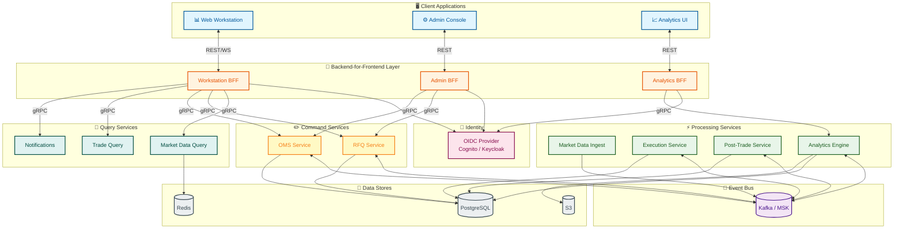

# System Architecture Overview

> High-level architecture for the Orion Liquidity & Data Platform.

---

## 1. What Is Orion?

Orion is a **cloud-native, event-driven** institutional trading platform built with **Java 21 + Spring Boot 3.x** microservices. It delivers:

- **Real-time multi-asset market data** ingestion and streaming
- **Electronic execution workflows** (RFQ + optional CLOB)
- **Trade capture and post-trade automation** (confirmations, settlement)
- **Market analytics and data products** (TCA-lite, benchmarks)
- **Single-screen web workstation** (React + TypeScript)

All backed by **AWS-hosted microservices** and a **Kafka event bus**.

---

## 2. Architecture Style

Orion uses a **layered event-driven microservices** architecture:

| Layer | Responsibility | Technologies |
|-------|---------------|-------------|
| **Client** | Browser-based workstation UI | React 18+, TypeScript 5.x, Vite |
| **BFF (Backend-for-Frontend)** | API gateway, aggregation, WebSocket management | Spring Boot, REST + WebSocket → gRPC |
| **Domain Services** | Business logic (RFQ, Execution, Market Data, etc.) | Spring Boot, gRPC, Kafka |
| **Event Bus** | Async decoupling, event sourcing, replay | Apache Kafka (Redpanda locally, AWS MSK production) |
| **Data Stores** | Persistence, caching, search | PostgreSQL, Redis, S3, optional OpenSearch |
| **Observability** | Metrics, traces, logs | Micrometer, OpenTelemetry, CloudWatch |

### Key Architectural Patterns

| Pattern | Where Used | Purpose |
|---------|-----------|---------|
| **BFF** | UI ↔ Services boundary | Stable contract for multiple UIs; translates REST/WS to gRPC |
| **CQRS** | All domain services | Separate write (command) and read (query) models for scalability |
| **Event Sourcing** | Kafka topics | Immutable event log as source of truth for "what happened" |
| **Outbox** | Every write service | Atomic DB + event publish via outbox table polling |
| **Saga** | RFQ → Quote → Accept → Trade → Confirm → Settle | Multi-step workflows across services |
| **Idempotency** | All consumers | Exactly-once business effects via dedup keys and sequence checks |

---

## 3. High-Level Component Diagram



---

## 4. Technology Stack

### 4.1 Backend

| Component | Technology | Version | Notes |
|-----------|-----------|---------|-------|
| Language | Java | 21 (LTS) | Virtual threads for high-throughput I/O |
| Framework | Spring Boot | 3.4.3 | Auto-config, actuator, security |
| Build Tool | Maven | 3.9.11 | Multi-module with parent POM + wrapper |
| Service Communication | gRPC (grpc-java) | 1.71.0 | Binary Protobuf over HTTP/2 |
| Schema Definition | Protocol Buffers | 4.29.3 | proto3 with `protoc` code generation |
| Event Bus | Apache Kafka | — | Redpanda locally, AWS MSK in production |
| Database | PostgreSQL | 15+ | Spring Data JPA + Hibernate |
| Cache | Redis | 7+ | Spring Data Redis / Lettuce |
| Testing | JUnit 5 + AssertJ + Mockito + Testcontainers | — | Unit + integration tests |
| Observability | Micrometer + OpenTelemetry | — | Metrics, traces, structured logs |

### 4.2 Frontend

| Component | Technology | Notes |
|-----------|-----------|-------|
| Language | TypeScript 5.x | Strict mode |
| Framework | React 18+ | Single-page application |
| Build | Vite | Fast dev server |
| Testing | Vitest + React Testing Library | Component + integration |

### 4.3 Infrastructure

| Component | Technology | Notes |
|-----------|-----------|-------|
| Containers | Docker | Multi-stage builds |
| Local Orchestration | Docker Compose | Redpanda, PostgreSQL, Redis |
| IaC | Terraform | AWS provisioning |
| CI/CD | GitHub Actions | Build, test, deploy |
| Cloud | AWS (ECS Fargate, MSK, RDS, ElastiCache) | Multi-AZ VPC |

---

## 5. Maven Module Structure

```
Orion/
├── pom.xml                              ← Parent POM (BOM, plugins, modules)
├── libs/
│   ├── event-model/                     ← Canonical event envelope (47 tests)
│   ├── security/                        ← Auth, RBAC, ABAC, tenant isolation (75 tests)
│   ├── observability/                   ← Correlation, metrics, tracing, health (102 tests)
│   └── grpc-api/                        ← Protobuf definitions + generated gRPC stubs (81 tests)
├── services/
│   ├── bff-workstation/                 ← Web workstation BFF (planned)
│   ├── market-data-ingestion/           ← Tick ingestion + normalization (planned)
│   ├── market-data-query/               ← Snapshot + streaming distribution (planned)
│   ├── rfq-service/                     ← RFQ lifecycle management (planned)
│   ├── execution-service/               ← Trade creation + execution (planned)
│   ├── post-trade-service/              ← Confirmations + settlement (planned)
│   ├── analytics-engine/                ← TCA, benchmarks, derived metrics (planned)
│   └── admin-service/                   ← Instruments, limits, kill switch (planned)
├── web/                                 ← React frontend (planned)
├── infra/
│   └── docker-compose/                  ← Local dev environment
├── build-tools/
│   └── verification/                    ← Structural verification tests (85 tests)
└── docs/                                ← Architecture, API, ADRs, runbooks
```

**Current build status:** 390 tests across 5 modules, 0 failures.

---

## 6. Design Principles

1. **Event log is the source of truth** for "what happened"
2. **All consumers must be idempotent** — assume duplicates and retries
3. **Hot path vs cold path separation** — don't block hot workflows on slow I/O
4. **BFF is the UI contract boundary** — UI never talks to internal services directly
5. **Security by default** — tenant isolation enforced at every service boundary
6. **Observability built in** — metrics, traces, structured logs from day 1
7. **Schema evolution discipline** — backward-compatible within major versions

---

## 7. Related Documents

| Document | Description |
|----------|-------------|
| [services.md](services.md) | Detailed service catalog and responsibilities |
| [communication.md](communication.md) | Communication patterns (gRPC, Kafka, REST, WebSocket) |
| [diagrams/](diagrams/) | Architecture diagrams (C4, sequence, state machines) |
| [../api/grpc-services.md](../api/grpc-services.md) | gRPC service contracts reference |
| [../api/events.md](../api/events.md) | Event catalog (types, envelopes, topics) |
| [../api/rest-conventions.md](../api/rest-conventions.md) | REST API conventions for BFF |
| [../adr/](../adr/) | Architecture Decision Records |
| [../knowledge.md](../knowledge.md) | Detailed business flow documentation |

---

*Last updated after US-01-06 · 390 tests · 5 modules*
