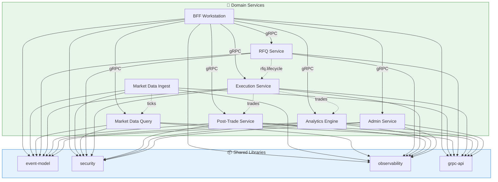

# Service Catalog

> Describes every microservice and shared library in the Orion platform — its purpose, responsibilities, data ownership, and communication patterns.

---

## 1. Shared Libraries (Built ✅)

Shared libraries are pure Java modules with no Spring dependency. They provide the vocabulary and utilities that every service uses.

### 1.1 Event Model (`libs/event-model`)

| Attribute | Value |
|-----------|-------|
| **Artifact** | `com.orion:orion-event-model` |
| **Purpose** | Canonical event envelope for all Kafka-published events |
| **Tests** | 47 |
| **ADR** | [002 — Event Envelope Canonical Format](../adr/002-event-envelope-canonical-format.md) |

**Key types:**
- `EventEnvelope<T>` — Generic wrapper: eventId, type, timestamp, producer, tenant, correlation, entity, payload
- `EventFactory` — Creates events with auto-generated UUIDs and timestamps
- `EventSerializer` — Jackson-based JSON serialization/deserialization
- `EventValidator` — Validates required envelope fields

**Dependencies:** Jackson (JSON)

---

### 1.2 Security (`libs/security`)

| Attribute | Value |
|-----------|-------|
| **Artifact** | `com.orion:orion-security` |
| **Purpose** | Authentication, authorization (RBAC + ABAC), and tenant isolation primitives |
| **Tests** | 75 |
| **ADR** | [003 — Shared Security Primitives](../adr/003-shared-security-primitives.md) |

**Key types:**
- `OrionSecurityContext` — Full security context (user + tenant + roles + entitlements)
- `AuthenticatedUser` — User identity (userId, email, username)
- `TenantContext` — Tenant identity and type (Standard/Premium/Enterprise)
- `Role` — Enum with hierarchy (ADMIN > SALES > TRADER)
- `Entitlements` — ABAC: allowed asset classes, instruments, venues, trading limits
- `RoleChecker` — RBAC checks with hierarchy resolution
- `EntitlementChecker` — ABAC checks (asset class, instrument, venue, notional limit)
- `TenantIsolationEnforcer` — Fails fast on cross-tenant access
- `SecurityContextSerializer` — JSON + Base64 for gRPC metadata propagation

**Dependencies:** Jackson (JSON)

---

### 1.3 Observability (`libs/observability`)

| Attribute | Value |
|-----------|-------|
| **Artifact** | `com.orion:orion-observability` |
| **Purpose** | Correlation context, metrics, tracing, health checks — shared observability primitives |
| **Tests** | 102 |
| **ADR** | [004 — Shared Observability Primitives](../adr/004-shared-observability-primitives.md) |

**Key types:**
- `CorrelationContext` — Tracking data: correlationId, tenantId, userId, requestId, spanId, traceId
- `CorrelationContextHolder` — ThreadLocal + SLF4J MDC bridge for per-request context
- `SensitiveDataRedactor` — Strips passwords, tokens, secrets from log maps
- `SpanHelper` — Wraps OpenTelemetry Tracer for span creation with correlation
- `MetricFactory` — Wraps Micrometer MeterRegistry with auto tenant labels
- `HealthCheck` — Functional interface returning `CompletableFuture<ComponentHealth>`
- `HealthCheckRegistry` — Aggregates component health checks into overall status

**Dependencies:** SLF4J, Micrometer, OpenTelemetry API

---

### 1.4 gRPC API (`libs/grpc-api`)

| Attribute | Value |
|-----------|-------|
| **Artifact** | `com.orion:orion-grpc-api` |
| **Purpose** | Protobuf definitions + generated gRPC service stubs for all inter-service communication |
| **Tests** | 81 |
| **ADR** | [005 — Protobuf/gRPC Service Contracts](../adr/005-protobuf-grpc-service-contracts.md) |

**Proto files:** 8 files defining 5 services + shared types
**Generated code:** 132 Java source files auto-compiled by `protobuf-maven-plugin`

See [gRPC Services Reference](../api/grpc-services.md) for full contract details.

**Dependencies:** protobuf-java, grpc-protobuf, grpc-stub

---

## 2. Domain Services (Planned)

These services will be implemented in upcoming epics. Each is a Spring Boot 3.x microservice running on Java 21 with virtual threads.

### 2.1 BFF Workstation (`services/bff-workstation`)

| Attribute | Value |
|-----------|-------|
| **Responsibility** | UI gateway — translates REST/WebSocket to internal gRPC calls |
| **Exposes** | REST API + WebSocket (to browser) |
| **Consumes** | gRPC (to all internal services) |
| **Data** | Stateless (no database) — caches via Redis |
| **Key patterns** | Session multiplexing, backpressure/coalescing, entitlement enforcement |

The BFF is the **only** service that browsers talk to. It:
- Validates JWT tokens and extracts security context
- Translates REST requests to gRPC calls
- Manages WebSocket sessions for real-time streaming
- Coalesces high-frequency market data to ~10 Hz for UI
- Enforces kill switch and tenant isolation at the edge

---

### 2.2 Market Data Ingestion (`services/market-data-ingestion`)

| Attribute | Value |
|-----------|-------|
| **Responsibility** | Ingest, normalize, and publish market ticks to Kafka |
| **Publishes to** | `<env>.marketdata.ticks.v1` (Kafka) |
| **Data sources** | Simulated generator, replay from S3, optional adapter |
| **Data** | Stateless (no database) |

Ingestion modes:
- **Simulator** — Random walk mid-price with configurable spreads and volatility
- **Replay** — Historical datasets from S3 at configurable speed (1x, 5x, 0.2x)
- **Adapter** — Pluggable connector interface for external feeds

---

### 2.3 Market Data Query (`services/market-data-query`)

| Attribute | Value |
|-----------|-------|
| **Responsibility** | Snapshot serving + real-time tick streaming via gRPC |
| **gRPC service** | `MarketDataService` (3 RPCs) |
| **Data** | Redis (latest snapshots), Kafka (tick stream) |

---

### 2.4 RFQ Service (`services/rfq-service`)

| Attribute | Value |
|-----------|-------|
| **Responsibility** | RFQ lifecycle management — create, route to LPs, collect quotes, accept, cancel |
| **gRPC service** | `RFQService` (6 RPCs) |
| **Publishes** | `<env>.rfq.lifecycle.v1`, `<env>.rfq.quotes.v1` (Kafka) |
| **Data** | PostgreSQL (rfqs, quotes tables) |
| **Key patterns** | State machine, optimistic concurrency, idempotency keys, outbox |

RFQ states: `CREATED → SENT → QUOTING → ACCEPTED/REJECTED/EXPIRED/CANCELLED → TRADED`

---

### 2.5 Execution Service (`services/execution-service`)

| Attribute | Value |
|-----------|-------|
| **Responsibility** | Trade creation from accepted quotes (and future CLOB matches) |
| **gRPC service** | `ExecutionService` (2 RPCs) |
| **Publishes** | `<env>.execution.trades.v1` (Kafka) |
| **Data** | PostgreSQL (trades table) |
| **Key patterns** | Exactly-once trade creation, outbox, unique constraint on (rfqId, quoteId) |

---

### 2.6 Post-Trade Service (`services/post-trade-service`)

| Attribute | Value |
|-----------|-------|
| **Responsibility** | Confirmation generation, settlement simulation state machine |
| **gRPC service** | `PostTradeService` (3 RPCs) |
| **Publishes** | `<env>.posttrade.settlement.v1` (Kafka) |
| **Data** | PostgreSQL (confirmations, settlements tables) |
| **Key patterns** | Settlement state machine with configurable failure/retry simulation |

Settlement states: `PENDING → INSTRUCTED → MATCHED → SETTLED/FAILED`

---

### 2.7 Analytics Engine (`services/analytics-engine`)

| Attribute | Value |
|-----------|-------|
| **Responsibility** | TCA-lite, spread analytics, response time distributions, volume aggregates |
| **Data** | PostgreSQL + S3 (exports) |
| **Key patterns** | Streaming aggregations, non-blocking (analytics down doesn't affect trading) |

---

### 2.8 Admin Service (`services/admin-service`)

| Attribute | Value |
|-----------|-------|
| **Responsibility** | Instrument/venue/LP management, kill switch, trading limits, user admin |
| **gRPC service** | `AdminService` (6 RPCs) |
| **Publishes** | `<env>.admin.changes.v1` (Kafka) |
| **Data** | PostgreSQL (instruments, venues, liquidity_providers, limits tables) |

---

## 3. Infrastructure Services (Local Dev)

These run via Docker Compose for local development (see `infra/docker-compose/`):

| Service | Image | Port | Purpose |
|---------|-------|------|---------|
| Redpanda | `redpandadata/redpanda` | 19092 | Kafka-compatible message broker |
| PostgreSQL | `postgres:15-alpine` | 5432 | Relational database |
| Redis | `redis:7-alpine` | 6379 | In-memory cache |
| Redpanda Console | `redpandadata/console` | 8080 | Kafka admin UI |
| pgAdmin | `dpage/pgadmin4` | 5050 | Database admin UI |
| Redis Commander | `rediscommander/redis-commander` | 8081 | Cache inspector UI |

---

## 4. Service Dependency Graph

---

*Last updated after US-01-06*
