```mermaid
flowchart TD
    A["🚀 Developer clones repo"] --> B["./mvnw verify\n<i>Run this one command</i>"]
    B --> C["📋 Maven reads root pom.xml\n<i>Finds the master blueprint</i>"]
    C --> D["🔨 Builds each module\nin dependency order\n<i>Currently: verification tests</i>"]
    D --> E["✅ 48 tests run — All pass!\n<i>Structure is correct</i>"]

    style A fill:#e8f5e9,stroke:#4caf50,color:#1b5e20
    style B fill:#e3f2fd,stroke:#1976d2,color:#0d47a1
    style C fill:#e3f2fd,stroke:#1976d2,color:#0d47a1
    style D fill:#e3f2fd,stroke:#1976d2,color:#0d47a1
    style E fill:#e8f5e9,stroke:#4caf50,color:#1b5e20
```

```mermaid
flowchart TD
    CMD["🐳 docker compose up -d"]

    subgraph NET ["🌐 orion-network"]
        RP["🟢 Redpanda\n<i>Messages · :19092</i>"] --> CON["📊 Console\n<i>Kafka UI · :8080</i>"]
        PG["🐘 Postgres\n<i>Storage · :5432</i>"] --> PGA["📁 pgAdmin\n<i>DB Admin · :5050</i>"]
        RD["⚡ Redis\n<i>Cache · :6379</i>"] --> RDC["📋 Redis Commander\n<i>Cache Inspector · :8081</i>"]
    end

    CMD --> RP & PG & RD
    CON & PGA & RDC --> OK["✅ All services healthy"]

    style CMD fill:#e3f2fd,stroke:#1976d2,color:#0d47a1
    style RP fill:#c8e6c9,stroke:#388e3c,color:#1b5e20
    style PG fill:#e3f2fd,stroke:#1565c0,color:#0d47a1
    style RD fill:#fff3e0,stroke:#e65100,color:#bf360c
    style CON fill:#f3e5f5,stroke:#7b1fa2,color:#4a148c
    style PGA fill:#f3e5f5,stroke:#7b1fa2,color:#4a148c
    style RDC fill:#f3e5f5,stroke:#7b1fa2,color:#4a148c
    style OK fill:#e8f5e9,stroke:#4caf50,color:#1b5e20
```

```mermaid
flowchart TD
    A["📢 Trade #123 executed!"]
    A --> B["🏭 EventFactory.create\n<i>UUID · timestamp · correlation ID · v1</i>"]

    B --> FIELDS

    subgraph ENV ["📨 EventEnvelope"]
        FIELDS["eventId: abc-123-def\neventType: TradeExecuted\noccurredAt: 2025-07-12T...\nproducer: execution-svc\ntenantId: tenant-001\ncorrelationId: xyz-789\nentity: Trade / trade-123 / v1\npayload: price 99.5 · qty 100"]
    end

    FIELDS --> D["🔍 EventValidator.validate\n<i>Checks all required fields</i>\nValidationResult: valid ✅"]
    D --> E["📤 EventSerializer.serialize\nJSON string sent to Redpanda 🚀"]

    style A fill:#fff3e0,stroke:#e65100,color:#bf360c
    style B fill:#e3f2fd,stroke:#1976d2,color:#0d47a1
    style FIELDS fill:#fce4ec,stroke:#c62828,color:#b71c1c
    style D fill:#e8f5e9,stroke:#388e3c,color:#1b5e20
    style E fill:#e8f5e9,stroke:#4caf50,color:#1b5e20
```

```mermaid
flowchart TD
    REQ["🔐 HTTP Request\n<i>Authorization: Bearer eyJhbG...</i>"]
    REQ --> EXT["🔑 BearerTokenExtractor\nExtracts token from Bearer header"]
    EXT --> JWT["🔄 Service validates JWT\n<i>Builds security context</i>"]

    JWT --> INFO

    subgraph CTX ["📦 OrionSecurityContext"]
        INFO["👤 trader-42 · jane@acme\n🏢 acme-corp · Premium\n🎭 SALES → implies TRADER\n📊 FX, RATES\n💰 maxNotional: 50,000,000"]
    end

    INFO --> ROLE["🎭 RoleChecker\n<i>SALES implies TRADER</i>\n✅ Authorized"]
    INFO --> ENT["📋 EntitlementChecker\n<i>Can trade FX?</i>\n✅ Entitled"]
    INFO --> TEN["🏢 TenantEnforcer\n<i>acme-corp == acme-corp</i>\n✅ Isolated"]

    ROLE & ENT & TEN --> OK["✅ Request proceeds!"]

    style REQ fill:#fff3e0,stroke:#e65100,color:#bf360c
    style EXT fill:#e3f2fd,stroke:#1976d2,color:#0d47a1
    style JWT fill:#e3f2fd,stroke:#1976d2,color:#0d47a1
    style INFO fill:#fce4ec,stroke:#c62828,color:#b71c1c
    style ROLE fill:#e8f5e9,stroke:#388e3c,color:#1b5e20
    style ENT fill:#e8f5e9,stroke:#388e3c,color:#1b5e20
    style TEN fill:#e8f5e9,stroke:#388e3c,color:#1b5e20
    style OK fill:#c8e6c9,stroke:#2e7d32,color:#1b5e20
```

```mermaid
flowchart TD
    REQ["📨 Incoming Request\n<i>from UI or another service</i>"]
    REQ --> CTX["🏷️ CorrelationContextHolder.set\n<i>Stores tracking number on thread</i>"]
    CTX --> MDC["📋 SLF4J MDC populated\n<i>correlationId · tenantId · userId</i>"]

    MDC --> LOG["📝 Every log.info call\nautomatically includes\ncorrelation + tenant IDs"]
    MDC --> SPAN["⏱️ SpanHelper.withSpan\n<i>Creates a named stopwatch</i>\nAttaches correlation.id"]
    MDC --> MET["📊 MetricFactory\n<i>counter++ · timer.record</i>\nAuto-tagged with service + tenant"]

    LOG & SPAN & MET --> OBS["🔭 Full Observability\nLogs + Traces + Metrics\nall linked by correlation ID"]

    subgraph HC ["🏥 Health Checks"]
        REG["HealthCheckRegistry"] --> PG["🐘 Postgres\n✅ 5ms"]
        REG --> RD["⚡ Redis\n✅ 2ms"]
        REG --> KF["📬 Kafka\n🔴 timeout"]
    end

    REG --> HR["HealthResult\n🟡 DEGRADED"]

    style REQ fill:#fff3e0,stroke:#e65100,color:#bf360c
    style CTX fill:#e3f2fd,stroke:#1976d2,color:#0d47a1
    style MDC fill:#e3f2fd,stroke:#1976d2,color:#0d47a1
    style LOG fill:#e8f5e9,stroke:#388e3c,color:#1b5e20
    style SPAN fill:#e8f5e9,stroke:#388e3c,color:#1b5e20
    style MET fill:#e8f5e9,stroke:#388e3c,color:#1b5e20
    style OBS fill:#c8e6c9,stroke:#2e7d32,color:#1b5e20
    style REG fill:#e3f2fd,stroke:#1976d2,color:#0d47a1
    style PG fill:#e8f5e9,stroke:#388e3c,color:#1b5e20
    style RD fill:#e8f5e9,stroke:#388e3c,color:#1b5e20
    style KF fill:#fce4ec,stroke:#c62828,color:#b71c1c
    style HR fill:#fff3e0,stroke:#e65100,color:#bf360c
```

# 🧒 Orion Platform — ELI5 Guide

> **ELI5** = "Explain Like I'm 5." This guide describes what we've built in the simplest possible terms. No jargon, just plain English.

---

## 🏠 What is Orion?

Imagine a **huge trading floor** where banks, hedge funds, and investors all want to buy and sell bonds. Right now, they do a lot of this with phone calls, chat messages, and spreadsheets — it's slow and messy.

**Orion** is a computer system that automates all of that. It's like a **super-fast post office** specifically for bond trades: someone asks for a price, someone else sends a price back, they agree, and the trade happens — all electronically in milliseconds.

---

## 📚 What We've Built (Implementation Log)

### ✅ US-01-01: Initialize Maven Multi-Module Monorepo

**📅 Implemented:** 2025-07-12  
**📁 Location:** Root directory (`/`)

#### What Did We Build?

We created the **empty building** — the organized folder structure where all of Orion's code will live.

#### Why Do We Need This?

Think of it like building a house. Before you move in any furniture (code), you need to lay the foundation, put up walls, and label every room. That's exactly what a "monorepo" is — **one big, well-organized house** for all our code.

Without this structure, developers would be throwing code into random folders like tossing clothes on the floor. With it, everyone knows exactly where to find things.

#### The Parts We Created

| File / Folder | What It Is | Simple Explanation |
|---|---|---|
| `pom.xml` | Parent build file | The "master blueprint" that tells Maven how to build everything |
| `mvnw` / `mvnw.cmd` | Maven wrapper scripts | A "batteries-included" button so you don't need to install Maven separately |
| `.gitignore` | Git ignore rules | A list of files Git should pretend don't exist (like temporary files) |
| `.editorconfig` | Editor settings | Rules so everyone's code editor uses the same spacing and formatting |
| `services/` | Microservices folder | Where each backend service (like RFQ, pricing) will live |
| `libs/` | Shared libraries folder | Reusable code that multiple services share (like a toolbox) |
| `proto/` | Protocol Buffers folder | Definitions for how services talk to each other (like a dictionary) |
| `schemas/` | Event schemas folder | Templates for the messages services send to each other |
| `web/` | Frontend folder | Where the React UI code will live |
| `infra/` | Infrastructure folder | Docker and Terraform configs to run everything |
| `docs/` | Documentation folder | Guides, architecture docs, and this very file! |
| `benchmarks/` | Performance tests folder | Where we'll put speed tests |
| `scripts/` | Utility scripts folder | Helper scripts for common tasks |
| `build-tools/verification/` | Structure tests | Automated tests that make sure this layout stays correct |

#### How It Works (The Flow)

#### Key Concepts

| Concept | Simple Explanation |
|---|---|
| **Monorepo** | "Mono" = one. One single repository holding all the code for every service, library, and tool. Like keeping all your toys in one big toy chest instead of scattered around the house. |
| **Maven** | A build tool for Java. It reads `pom.xml` files and knows how to compile code, run tests, and package apps. Think of it as a robot chef that follows recipes. |
| **Multi-module** | The monorepo is split into modules (services, libs, etc.). Each module has its own `pom.xml` but they all share settings from the parent. Like rooms in a house — separate but connected. |
| **POM** | "Project Object Model" — an XML file (`pom.xml`) that describes a project: what it depends on, how to build it, what plugins to use. The recipe for the robot chef. |
| **TDD** | "Test-Driven Development" — we write the test *first* (saying what we expect), then write code to make the test pass. Like writing the exam questions before studying, so you know exactly what to learn. |
| **Maven Wrapper** | The `mvnw` script. It downloads the exact Maven version the project needs so everyone uses the same one. Like shipping a tool with its own batteries. |
| **Spring Boot** | A framework that makes it easy to build Java web applications. It handles a ton of boilerplate so developers can focus on business logic. Like a pre-built house frame — just add walls and furniture. |

---

## 📖 Glossary

| Term | Meaning |
|---|---|
| **Monorepo** | A single Git repository containing all project code |
| **Maven** | Java build automation tool |
| **POM** | Project Object Model — Maven's configuration file |
| **Module** | A sub-project within the Maven monorepo |
| **TDD** | Test-Driven Development — tests written before code |
| **CI/CD** | Continuous Integration / Continuous Delivery — automated build + deploy |
| **gRPC** | A fast protocol for services to communicate |
| **Protobuf** | Protocol Buffers — a compact data format used by gRPC |
| **Docker** | A tool that runs apps in isolated containers |
| **Docker Compose** | Starts multiple Docker containers from one YAML recipe |
| **Redpanda** | A lightweight Kafka-compatible message broker |
| **PostgreSQL** | A relational database for permanent data storage |
| **Redis** | An in-memory cache for super-fast data access |
| **Health Check** | A periodic ping to verify a service is running |
| **Named Volume** | Docker storage that persists after containers stop |
| **SLF4J** | Simple Logging Facade for Java — a standard logging API that lets you swap implementations |
| **MDC** | Mapped Diagnostic Context — thread-local storage in SLF4J that stamps every log with context (like correlation ID) |
| **Micrometer** | A metrics facade for Java — creates counters, timers, and gauges that work with Prometheus, CloudWatch, etc. |
| **OpenTelemetry** | An open standard for distributed tracing — tracks requests as they flow across services |
| **Span** | A named, timed segment of work in a distributed trace (e.g., "Handle RFQ" → 25ms) |
| **Correlation ID** | A tracking number that follows a single request across all services for end-to-end tracing |
| **ThreadLocal** | A Java variable that's different for every thread — each request gets its own isolated copy |
| **CompletableFuture** | Java's way of representing an async result — "I'll give you the answer later" |
| **Redaction** | Replacing sensitive data (passwords, tokens) with "[REDACTED]" in logs to prevent leaks |

---

### ✅ US-01-02: Docker Compose Local Development Environment

**📅 Implemented:** 2025-07-12  
**📁 Location:** `infra/docker-compose/`

#### What Did We Build?

We set up a **one-command playground** that spins up all the infrastructure our services need (a database, a message bus, and a cache) right on your laptop.

#### Why Do We Need This?

Imagine you're building a restaurant (our trading platform). Before you cook anything, you need a kitchen — stoves, fridges, running water. In software:

- **PostgreSQL** = the fridge (stores data permanently)
- **Redpanda/Kafka** = the order ticket system (passes messages between cooks)
- **Redis** = the countertop (fast temporary storage for things you need right now)

Without Docker Compose, every developer would have to install and configure these tools by hand. Docker Compose gives everyone the **exact same kitchen** with one command.

#### The Parts We Created

| File | What It Is | Simple Explanation |
|------|-----------|-------------------|
| `docker-compose.yml` | Infrastructure recipe | One file that describes all 6 services and how they connect |
| `.env.example` | Config template | A list of settings (usernames, passwords) you can customize |
| `init-scripts/postgres/01-init-databases.sql` | Database setup | Creates separate databases for each microservice on first start |
| `scripts/start-local-env.sh` | Start script (Linux/Mac) | Starts everything and waits until it's healthy |
| `scripts/start-local-env.ps1` | Start script (Windows) | Same thing, but for PowerShell |
| `scripts/reset-local-env.sh` | Reset script (Linux/Mac) | Wipes all data and starts fresh |
| `scripts/reset-local-env.ps1` | Reset script (Windows) | Same thing, but for PowerShell |

#### How It Works (The Flow)

#### Key Concepts

| Concept | Simple Explanation |
|---------|-------------------|
| **Docker** | A tool that runs apps in isolated boxes called "containers." Each container is like a mini computer with just one program installed. |
| **Docker Compose** | A tool that starts MULTIPLE Docker containers at once from a recipe file (`docker-compose.yml`). |
| **Redpanda** | A Kafka-compatible message broker — a post office that passes messages between services. Lighter than Apache Kafka. |
| **PostgreSQL** | A relational database — a giant spreadsheet that stores data permanently. |
| **Redis** | An in-memory cache — a super-fast sticky note board. Data is fast to read but can be lost on restart. |
| **Named Volume** | Docker's way of saving data outside a container. Even if the container is deleted, the data stays. |
| **Health Check** | A periodic "are you okay?" ping that Docker sends to each service to make sure it's running. |
| **.env file** | A file with secret settings (passwords, etc.) that is NOT saved in Git — each developer has their own copy. |

---

### ✅ US-01-03: Setup Shared Event Model Library

**📅 Implemented:** 2025-07-12  
**📁 Location:** `libs/event-model/`

#### What Did We Build?

We created a **shared vocabulary** for all services to communicate — like agreeing that every letter sent through the post office must use the same envelope format.

#### Why Do We Need This?

Imagine 10 different cooks in our restaurant kitchen (microservices). Each cook needs to pass notes to the others: "Order received!", "Food is ready!", "Table 5 cancelled!". If every cook invents their own note format, chaos ensues.

The **Event Model** is a set of rules that says: "Every note MUST have these fields: who wrote it, when, what kind of note it is, and the actual message." Now every cook speaks the same language.

In software terms, every event flowing through our Redpanda message bus uses the same **EventEnvelope** format — a standard wrapper around every message.

#### The Parts We Created

| File | What It Is | Simple Explanation |
|------|-----------|-------------------|
| `EventEnvelope.java` | The standard envelope | Every event is wrapped in this — like a postal envelope with sender, date, tracking number |
| `EventEntity.java` | Entity tracking | Identifies WHAT thing the event is about (e.g., "Trade #123, version 1") |
| `EventType.java` | Event type registry | A list of all 30 known event types (TradeExecuted, RFQCreated, etc.) |
| `EntityType.java` | Entity type list | A list of all 10 entity types (Trade, RFQ, Order, Quote, etc.) |
| `EventFactory.java` | Event creator | Helper methods to create events with auto-generated IDs and timestamps |
| `EventSerializer.java` | JSON converter | Converts events to/from JSON text (for sending over the network) |
| `EventValidator.java` | Event checker | Checks that an event has all required fields before sending it |
| `ValidationResult.java` | Check result | The result of validation — either "all good" or a list of problems |

#### How It Works (The Flow)

#### Key Concepts

| Concept | Simple Explanation |
|---------|-------------------|
| **Event Envelope** | A standard wrapper around every message. Like a postal envelope — it has "from," "to," "date," and the letter inside. |
| **Java Record** | A special Java class that's **immutable** (can't be changed after creation). Perfect for events — once something happened, you can't un-happen it. |
| **Generic Type `<T>`** | The `EventEnvelope<T>` can hold ANY payload type. `T` is a placeholder — it could be a trade, a quote, an order, etc. Like an envelope that fits any letter. |
| **UUID** | "Universally Unique Identifier" — a random string like `550e8400-e29b-41d4-a716-446655440000`. So unique that two computers generating UUIDs at the same time will never collide. |
| **Correlation ID** | A tracking number that follows a business flow across multiple events. If an RFQ leads to a quote, which leads to a trade — they all share the same correlation ID so you can trace the chain. |
| **Causation ID** | Points to the event that *caused* this one. The trade was *caused by* the quote acceptance. |
| **ISO 8601** | A standard date format: `2025-07-12T15:30:00Z`. The "Z" means UTC. Used worldwide so there's no timezone confusion. |
| **Jackson** | A Java library that converts objects to/from JSON. Like a translator between Java objects and the text format used on the network. |
| **Immutability** | Once an event is created, it can never be modified. This is critical for audit trails — you can always prove exactly what happened and when. |

---

### ✅ US-01-04: Setup Shared Security Library

**📅 Implemented:** 2025-07-13  
**📁 Location:** `libs/security/`

#### What Did We Build?

We created a **security toolbox** — a shared library of building blocks that every service will use to answer three questions: *"Who are you?"*, *"Which company do you work for?"*, and *"Are you allowed to do that?"*

#### Why Do We Need This?

Imagine our trading floor has a **security desk** at the entrance. Every person who walks in needs:

1. **An ID badge** → `AuthenticatedUser` (who you are — name, email, user ID)
2. **A company lanyard** → `TenantContext` (which firm you belong to — Goldman, JPMorgan, etc.)
3. **An access list** → `Role` + `Entitlements` (what you're allowed to do — trade FX? View risk reports? Admin access?)

Without a shared security library, every service would invent its own way of checking IDs. One service might let you in with just a name, another might need three forms of ID. Chaos! The shared library ensures **everyone checks the same way**.

#### The Parts We Created

| File | What It Is | Simple Explanation |
|------|-----------|-------------------|
| `AuthenticatedUser.java` | User identity | Your ID badge — userId, email, username, display name |
| `TenantContext.java` | Company identity | Your company lanyard — tenantId, name, type (Standard/Premium/Enterprise) |
| `Role.java` | Platform roles | What hat you wear — Trader, Sales, Risk, Analyst, Admin, Platform. Admins inherit all other hats. |
| `Entitlements.java` | What you can trade | Your access pass — which asset classes (FX, Rates, etc.), instruments, venues, and trading limits |
| `TradingLimits.java` | Trading guardrails | Speed limits — max notional, max requests per second, max open orders |
| `OrionSecurityContext.java` | The full security package | Everything above bundled together — your badge + lanyard + access pass + a tracking number |
| `BearerTokenExtractor.java` | Token reader | Reads the "Bearer xyz123..." from an HTTP Authorization header — like scanning a barcode on your badge |
| `RoleChecker.java` | Role verifier | Checks "do you have this role?" with hierarchy support — an Admin automatically has Trader, Sales, Risk, and Analyst roles |
| `EntitlementChecker.java` | Entitlement verifier | Checks "can you trade this?" — asset class, instrument, venue, and notional limit checks |
| `TenantIsolationEnforcer.java` | Company firewall | Prevents Goldman from seeing JPMorgan's trades. Throws an alarm if there's a mismatch. |
| `SecurityContextSerializer.java` | Context transporter | Packs the security context into a compact string (JSON → Base64) for passing between services via gRPC |
| `SecurityContextValidator.java` | Context checker | Makes sure a security context has all required fields before we trust it |
| `TestSecurityContextFactory.java` | Test helper | Creates fake security contexts for unit tests — so every test doesn't have to build one from scratch |

#### How It Works (The Flow)

#### Key Concepts

| Concept | Simple Explanation |
|---------|-------------------|
| **RBAC** | "Role-Based Access Control" — you get permissions based on your role (Admin, Trader, etc.). Like job titles granting building access. |
| **ABAC** | "Attribute-Based Access Control" — permissions based on attributes (can trade FX, can access venue X). More fine-grained than RBAC. |
| **Role Hierarchy** | Admin inherits Trader + Sales + Risk + Analyst roles. Sales inherits Trader. So checking "are you a Trader?" returns true for Sales and Admin too. |
| **Tenant Isolation** | Each company (tenant) can only see their own data. Goldman can't peek at JPMorgan's trades — enforced at every service boundary. |
| **Bearer Token** | A "key card" string passed in HTTP headers: `Authorization: Bearer <token>`. The token is usually a JWT containing user info. |
| **Base64** | An encoding that turns binary data into safe text. Used to transport the security context through gRPC metadata headers (which only accept strings). |
| **Immutable Records** | Java records can't be changed after creation. A security context is frozen — no one can sneak in extra permissions after the fact. |
| **Empty Set = All Allowed** | If a user's entitled instruments set is empty, they can trade ALL instruments. Think of it like a VIP pass — no restrictions listed means full access. |

---

### ✅ US-01-05: Setup Shared Observability Library

**📅 Implemented:** 2025-07-13  
**📁 Location:** `libs/observability/`

#### What Did We Build?

We created a **shared telescope and dashboard** — a library that lets every service track what's happening, spot problems, and trace a single request as it bounces between services.

#### Why Do We Need This?

Imagine you're running a huge restaurant (our trading platform) with 10 different kitchens (microservices). When a customer complains about their order, you need to figure out what went wrong. Which kitchen handled it? How long did each step take? Did anyone drop the ball?

Without observability, it's like trying to find a lost package in a postal system with no tracking numbers. With it, every "package" (request) gets:

1. **A tracking number** → `CorrelationContext` (follows the request everywhere)
2. **A timestamp at every stop** → `SpanHelper` (traces how long each step takes)
3. **Dashboard gauges** → `MetricFactory` (counts, timers, live measurements)
4. **A health report** → `HealthCheckRegistry` (is each kitchen still running?)
5. **A privacy filter** → `SensitiveDataRedactor` (hides passwords in the logs)

#### The Parts We Created

| File | What It Is | Simple Explanation |
|------|-----------|-------------------|
| `CorrelationContext.java` | Tracking number | The "tracking sticker" attached to every request — correlation ID, tenant ID, user ID, request ID |
| `ObservabilityContext.java` | Service metadata | Combines the tracking number with which service is handling it (name, version, environment) |
| `CorrelationContextHolder.java` | Tracking number holder | A "pocket" on each thread that holds the tracking number. Automatically stamps it onto every log message. |
| `SensitiveDataRedactor.java` | Privacy filter | Scans log data for passwords, tokens, and secrets, replacing them with "[REDACTED]" |
| `SpanHelper.java` | Stopwatch wrapper | Wraps OpenTelemetry to create "spans" — named stopwatches that measure how long each step takes |
| `MetricFactory.java` | Dashboard gauge factory | Creates counters ("how many orders?"), timers ("how fast?"), and gauges ("how many active?") — all auto-tagged with the tenant |
| `HealthCheck.java` | Health check interface | A simple contract: "check if a component is healthy and report back" |
| `HealthCheckRegistry.java` | Health aggregator | Collects health checks from all components (database, cache, message bus) and runs them all at once |
| `HealthStatus.java` | Health traffic light | Three states: HEALTHY 🟢, DEGRADED 🟡, UNHEALTHY 🔴 |
| `ComponentHealth.java` | Component report | The result of checking one component — name, status, message, and how long the check took |
| `HealthResult.java` | Overall report | The big picture — overall status + every component's individual report + timestamp |
| `TestCorrelationContextFactory.java` | Test helper | Creates fake tracking numbers for unit tests so every test doesn't have to build one from scratch |
| `InMemoryHealthCheck.java` | Test health check | A controllable health check for tests — you can flip it between healthy/unhealthy on demand |

#### How It Works (The Flow)

#### Key Concepts

| Concept | Simple Explanation |
|---------|-------------------|
| **Correlation ID** | A tracking number that follows a request across all services. If an RFQ leads to a quote, which leads to a trade — they all share the same correlation ID so you can trace the entire chain. |
| **MDC** | "Mapped Diagnostic Context" — SLF4J's built-in thread-local storage. When you put `correlationId` into MDC, every log statement on that thread automatically includes it. Like a stamp pad that marks every letter on a desk. |
| **OpenTelemetry** | An open standard for distributed tracing. Creates "spans" (named stopwatches) that show how long each operation takes and how they nest. Like a GPS tracker for your request. |
| **Span** | A named, timed segment of work. "Handle RFQ" might be a parent span containing child spans like "Validate input" (5ms), "Query database" (20ms), "Send to Kafka" (3ms). |
| **Micrometer** | A metrics library for Java. Supports Prometheus, CloudWatch, Datadog. Think of it as the dashboard gauges in your car — speed, RPM, fuel level, but for your services. |
| **Counter** | A metric that only goes up: "total orders processed = 1,234." Like an odometer on a car. |
| **Timer** | A metric that measures how long things take: "average request latency = 15ms." Like a lap timer. |
| **Gauge** | A metric that goes up and down: "active connections right now = 42." Like a speedometer. |
| **Health Check** | A quick ping to a dependency: "Is Postgres responding?" The registry runs all checks at once and gives an overall status. |
| **Redaction** | Replacing sensitive data (passwords, tokens) with "[REDACTED]" in logs. Like blacking out classified information before publishing a document. |
| **ThreadLocal** | A variable that's different for every thread. Each request gets its own thread (or virtual thread), so each request has its own correlation context. Like giving every postal worker their own desk with their own stamp pad. |

---

## 🔮 What's Coming Next

| Story | What It Will Add |
|---|---|
| US-01-06 | Protobuf definitions — gRPC service contracts |
| US-01-07 | GitHub Actions CI — automated build and test on every push |

---

*Last updated after US-01-05*
