# 🧒 Orion Platform — ELI5 Guide

> **ELI5** = "Explain Like I'm 5." This guide describes what we've built in the simplest possible terms. No jargon, just plain English.

---

## 🏠 What is Orion?

Imagine a **huge trading floor** where banks, hedge funds, and investors all want to buy and sell bonds. Right now, they do a lot of this with phone calls, chat messages, and spreadsheets — it's slow and messy.

**Orion** is a computer system that automates all of that. It's like a **super-fast post office** specifically for bond trades: someone asks for a price, someone else sends a price back, they agree, and the trade happens — all electronically in milliseconds.

---

## 📚 What We've Built (Implementation Log)

### ✅ US-01-01: Initialize Maven Multi-Module Monorepo

**📅 Implemented:** 2025-07-12  
**📁 Location:** Root directory (`/`)

#### What Did We Build?

We created the **empty building** — the organized folder structure where all of Orion's code will live.

#### Why Do We Need This?

Think of it like building a house. Before you move in any furniture (code), you need to lay the foundation, put up walls, and label every room. That's exactly what a "monorepo" is — **one big, well-organized house** for all our code.

Without this structure, developers would be throwing code into random folders like tossing clothes on the floor. With it, everyone knows exactly where to find things.

#### The Parts We Created

| File / Folder | What It Is | Simple Explanation |
|---|---|---|
| `pom.xml` | Parent build file | The "master blueprint" that tells Maven how to build everything |
| `mvnw` / `mvnw.cmd` | Maven wrapper scripts | A "batteries-included" button so you don't need to install Maven separately |
| `.gitignore` | Git ignore rules | A list of files Git should pretend don't exist (like temporary files) |
| `.editorconfig` | Editor settings | Rules so everyone's code editor uses the same spacing and formatting |
| `services/` | Microservices folder | Where each backend service (like RFQ, pricing) will live |
| `libs/` | Shared libraries folder | Reusable code that multiple services share (like a toolbox) |
| `proto/` | Protocol Buffers folder | Definitions for how services talk to each other (like a dictionary) |
| `schemas/` | Event schemas folder | Templates for the messages services send to each other |
| `web/` | Frontend folder | Where the React UI code will live |
| `infra/` | Infrastructure folder | Docker and Terraform configs to run everything |
| `docs/` | Documentation folder | Guides, architecture docs, and this very file! |
| `benchmarks/` | Performance tests folder | Where we'll put speed tests |
| `scripts/` | Utility scripts folder | Helper scripts for common tasks |
| `build-tools/verification/` | Structure tests | Automated tests that make sure this layout stays correct |

#### How It Works (The Flow)

```mermaid
flowchart TD
    A["🚀 Developer clones repo"] --> B["./mvnw verify\n<i>Run this one command</i>"]
    B --> C["📋 Maven reads root pom.xml\n<i>Finds the master blueprint</i>"]
    C --> D["🔨 Builds each module\nin dependency order\n<i>Currently: verification tests</i>"]
    D --> E["✅ 48 tests run — All pass!\n<i>Structure is correct</i>"]

    style A fill:#e8f5e9,stroke:#4caf50,color:#1b5e20
    style B fill:#e3f2fd,stroke:#1976d2,color:#0d47a1
    style C fill:#e3f2fd,stroke:#1976d2,color:#0d47a1
    style D fill:#e3f2fd,stroke:#1976d2,color:#0d47a1
    style E fill:#e8f5e9,stroke:#4caf50,color:#1b5e20
```

#### Key Concepts

| Concept | Simple Explanation |
|---|---|
| **Monorepo** | "Mono" = one. One single repository holding all the code for every service, library, and tool. Like keeping all your toys in one big toy chest instead of scattered around the house. |
| **Maven** | A build tool for Java. It reads `pom.xml` files and knows how to compile code, run tests, and package apps. Think of it as a robot chef that follows recipes. |
| **Multi-module** | The monorepo is split into modules (services, libs, etc.). Each module has its own `pom.xml` but they all share settings from the parent. Like rooms in a house — separate but connected. |
| **POM** | "Project Object Model" — an XML file (`pom.xml`) that describes a project: what it depends on, how to build it, what plugins to use. The recipe for the robot chef. |
| **TDD** | "Test-Driven Development" — we write the test *first* (saying what we expect), then write code to make the test pass. Like writing the exam questions before studying, so you know exactly what to learn. |
| **Maven Wrapper** | The `mvnw` script. It downloads the exact Maven version the project needs so everyone uses the same one. Like shipping a tool with its own batteries. |
| **Spring Boot** | A framework that makes it easy to build Java web applications. It handles a ton of boilerplate so developers can focus on business logic. Like a pre-built house frame — just add walls and furniture. |

---

## 📖 Glossary

| Term | Meaning |
|---|---|
| **Monorepo** | A single Git repository containing all project code |
| **Maven** | Java build automation tool |
| **POM** | Project Object Model — Maven's configuration file |
| **Module** | A sub-project within the Maven monorepo |
| **TDD** | Test-Driven Development — tests written before code |
| **CI/CD** | Continuous Integration / Continuous Delivery — automated build + deploy |
| **GitHub Actions** | GitHub's built-in automation platform — runs workflows (build, test, deploy) on every push or PR |
| **Workflow** | A YAML file in `.github/workflows/` that defines a series of automated steps (jobs) triggered by events |
| **Composite Action** | A reusable action that bundles multiple steps into one — like a recipe that multiple workflows can reference |
| **CODEOWNERS** | A GitHub file that auto-assigns reviewers to PRs based on which files were changed |
| **Container Registry** | A server that stores Docker images (like ghcr.io) — services pull images from here to run |
| **Multi-stage Build** | A Docker technique using multiple FROM stages — first stage builds, second stage runs, keeping the final image small |
| **SARIF** | Static Analysis Results Interchange Format — a standard format for security scan results that GitHub can display |
| **Trivy** | A security scanner that checks for known vulnerabilities in dependencies |
| **JaCoCo** | Java Code Coverage — a tool that measures which lines of code are exercised by tests |
| **Concurrency Group** | A GitHub Actions feature that cancels older runs when a new push arrives to the same PR |
| **gRPC** | A fast binary protocol for services to communicate, built on HTTP/2 + Protobuf |
| **Protobuf** | Protocol Buffers — Google's compact, typed data format; `.proto` files compile to Java classes |
| **protoc** | The Protocol Buffer compiler — reads `.proto` files and generates source code |
| **RPC** | Remote Procedure Call — calling a function on another computer as if it were local |
| **Service Stub** | A generated gRPC class (e.g., `RFQServiceGrpc`) providing client and server interfaces |
| **Server-Streaming RPC** | An RPC where the server sends a stream of responses to one request (e.g., live ticks) |
| **IDL** | Interface Definition Language — a language for defining APIs (Protobuf is an IDL) |
| **Oneof** | A Protobuf field group where only one field can be set at a time |
| **Docker** | A tool that runs apps in isolated containers |
| **Docker Compose** | Starts multiple Docker containers from one YAML recipe |
| **Redpanda** | A lightweight Kafka-compatible message broker |
| **PostgreSQL** | A relational database for permanent data storage |
| **Redis** | An in-memory cache for super-fast data access |
| **Health Check** | A periodic ping to verify a service is running |
| **Named Volume** | Docker storage that persists after containers stop |
| **SLF4J** | Simple Logging Facade for Java — a standard logging API that lets you swap implementations |
| **MDC** | Mapped Diagnostic Context — thread-local storage in SLF4J that stamps every log with context (like correlation ID) |
| **Micrometer** | A metrics facade for Java — creates counters, timers, and gauges that work with Prometheus, CloudWatch, etc. |
| **OpenTelemetry** | An open standard for distributed tracing — tracks requests as they flow across services |
| **Span** | A named, timed segment of work in a distributed trace (e.g., "Handle RFQ" → 25ms) |
| **Correlation ID** | A tracking number that follows a single request across all services for end-to-end tracing |
| **ThreadLocal** | A Java variable that's different for every thread — each request gets its own isolated copy |
| **CompletableFuture** | Java's way of representing an async result — "I'll give you the answer later" |
| **Redaction** | Replacing sensitive data (passwords, tokens) with "[REDACTED]" in logs to prevent leaks |

---

### ✅ US-01-02: Docker Compose Local Development Environment

**📅 Implemented:** 2025-07-12  
**📁 Location:** `infra/docker-compose/`

#### What Did We Build?

We set up a **one-command playground** that spins up all the infrastructure our services need (a database, a message bus, and a cache) right on your laptop.

#### Why Do We Need This?

Imagine you're building a restaurant (our trading platform). Before you cook anything, you need a kitchen — stoves, fridges, running water. In software:

- **PostgreSQL** = the fridge (stores data permanently)
- **Redpanda/Kafka** = the order ticket system (passes messages between cooks)
- **Redis** = the countertop (fast temporary storage for things you need right now)

Without Docker Compose, every developer would have to install and configure these tools by hand. Docker Compose gives everyone the **exact same kitchen** with one command.

#### The Parts We Created

| File | What It Is | Simple Explanation |
|------|-----------|-------------------|
| `docker-compose.yml` | Infrastructure recipe | One file that describes all 6 services and how they connect |
| `.env.example` | Config template | A list of settings (usernames, passwords) you can customize |
| `init-scripts/postgres/01-init-databases.sql` | Database setup | Creates separate databases for each microservice on first start |
| `scripts/start-local-env.sh` | Start script (Linux/Mac) | Starts everything and waits until it's healthy |
| `scripts/start-local-env.ps1` | Start script (Windows) | Same thing, but for PowerShell |
| `scripts/reset-local-env.sh` | Reset script (Linux/Mac) | Wipes all data and starts fresh |
| `scripts/reset-local-env.ps1` | Reset script (Windows) | Same thing, but for PowerShell |

#### How It Works (The Flow)

```mermaid
flowchart TD
    CMD["🐳 docker compose up -d"]

    subgraph NET ["🌐 orion-network"]
        RP["🟢 Redpanda\n<i>Messages · :19092</i>"] --> CON["📊 Console\n<i>Kafka UI · :8080</i>"]
        PG["🐘 Postgres\n<i>Storage · :5432</i>"] --> PGA["📁 pgAdmin\n<i>DB Admin · :5050</i>"]
        RD["⚡ Redis\n<i>Cache · :6379</i>"] --> RDC["📋 Redis Commander\n<i>Cache Inspector · :8081</i>"]
    end

    CMD --> RP & PG & RD
    CON & PGA & RDC --> OK["✅ All services healthy"]

    style CMD fill:#e3f2fd,stroke:#1976d2,color:#0d47a1
    style RP fill:#c8e6c9,stroke:#388e3c,color:#1b5e20
    style PG fill:#e3f2fd,stroke:#1565c0,color:#0d47a1
    style RD fill:#fff3e0,stroke:#e65100,color:#bf360c
    style CON fill:#f3e5f5,stroke:#7b1fa2,color:#4a148c
    style PGA fill:#f3e5f5,stroke:#7b1fa2,color:#4a148c
    style RDC fill:#f3e5f5,stroke:#7b1fa2,color:#4a148c
    style OK fill:#e8f5e9,stroke:#4caf50,color:#1b5e20
```

#### Key Concepts

| Concept | Simple Explanation |
|---------|-------------------|
| **Docker** | A tool that runs apps in isolated boxes called "containers." Each container is like a mini computer with just one program installed. |
| **Docker Compose** | A tool that starts MULTIPLE Docker containers at once from a recipe file (`docker-compose.yml`). |
| **Redpanda** | A Kafka-compatible message broker — a post office that passes messages between services. Lighter than Apache Kafka. |
| **PostgreSQL** | A relational database — a giant spreadsheet that stores data permanently. |
| **Redis** | An in-memory cache — a super-fast sticky note board. Data is fast to read but can be lost on restart. |
| **Named Volume** | Docker's way of saving data outside a container. Even if the container is deleted, the data stays. |
| **Health Check** | A periodic "are you okay?" ping that Docker sends to each service to make sure it's running. |
| **.env file** | A file with secret settings (passwords, etc.) that is NOT saved in Git — each developer has their own copy. |

---

### ✅ US-01-03: Setup Shared Event Model Library

**📅 Implemented:** 2025-07-12  
**📁 Location:** `libs/event-model/`

#### What Did We Build?

We created a **shared vocabulary** for all services to communicate — like agreeing that every letter sent through the post office must use the same envelope format.

#### Why Do We Need This?

Imagine 10 different cooks in our restaurant kitchen (microservices). Each cook needs to pass notes to the others: "Order received!", "Food is ready!", "Table 5 cancelled!". If every cook invents their own note format, chaos ensues.

The **Event Model** is a set of rules that says: "Every note MUST have these fields: who wrote it, when, what kind of note it is, and the actual message." Now every cook speaks the same language.

In software terms, every event flowing through our Redpanda message bus uses the same **EventEnvelope** format — a standard wrapper around every message.

#### The Parts We Created

| File | What It Is | Simple Explanation |
|------|-----------|-------------------|
| `EventEnvelope.java` | The standard envelope | Every event is wrapped in this — like a postal envelope with sender, date, tracking number |
| `EventEntity.java` | Entity tracking | Identifies WHAT thing the event is about (e.g., "Trade #123, version 1") |
| `EventType.java` | Event type registry | A list of all 30 known event types (TradeExecuted, RFQCreated, etc.) |
| `EntityType.java` | Entity type list | A list of all 10 entity types (Trade, RFQ, Order, Quote, etc.) |
| `EventFactory.java` | Event creator | Helper methods to create events with auto-generated IDs and timestamps |
| `EventSerializer.java` | JSON converter | Converts events to/from JSON text (for sending over the network) |
| `EventValidator.java` | Event checker | Checks that an event has all required fields before sending it |
| `ValidationResult.java` | Check result | The result of validation — either "all good" or a list of problems |

#### How It Works (The Flow)

```mermaid
flowchart TD
    A["📢 Trade #123 executed!"]
    A --> B["🏭 EventFactory.create\n<i>UUID · timestamp · correlation ID · v1</i>"]

    B --> FIELDS

    subgraph ENV ["📨 EventEnvelope"]
        FIELDS["eventId: abc-123-def\neventType: TradeExecuted\noccurredAt: 2025-07-12T...\nproducer: execution-svc\ntenantId: tenant-001\ncorrelationId: xyz-789\nentity: Trade / trade-123 / v1\npayload: price 99.5 · qty 100"]
    end

    FIELDS --> D["🔍 EventValidator.validate\n<i>Checks all required fields</i>\nValidationResult: valid ✅"]
    D --> E["📤 EventSerializer.serialize\nJSON string sent to Redpanda 🚀"]

    style A fill:#fff3e0,stroke:#e65100,color:#bf360c
    style B fill:#e3f2fd,stroke:#1976d2,color:#0d47a1
    style FIELDS fill:#fce4ec,stroke:#c62828,color:#b71c1c
    style D fill:#e8f5e9,stroke:#388e3c,color:#1b5e20
    style E fill:#e8f5e9,stroke:#4caf50,color:#1b5e20
```

#### Key Concepts

| Concept | Simple Explanation |
|---------|-------------------|
| **Event Envelope** | A standard wrapper around every message. Like a postal envelope — it has "from," "to," "date," and the letter inside. |
| **Java Record** | A special Java class that's **immutable** (can't be changed after creation). Perfect for events — once something happened, you can't un-happen it. |
| **Generic Type `<T>`** | The `EventEnvelope<T>` can hold ANY payload type. `T` is a placeholder — it could be a trade, a quote, an order, etc. Like an envelope that fits any letter. |
| **UUID** | "Universally Unique Identifier" — a random string like `550e8400-e29b-41d4-a716-446655440000`. So unique that two computers generating UUIDs at the same time will never collide. |
| **Correlation ID** | A tracking number that follows a business flow across multiple events. If an RFQ leads to a quote, which leads to a trade — they all share the same correlation ID so you can trace the chain. |
| **Causation ID** | Points to the event that *caused* this one. The trade was *caused by* the quote acceptance. |
| **ISO 8601** | A standard date format: `2025-07-12T15:30:00Z`. The "Z" means UTC. Used worldwide so there's no timezone confusion. |
| **Jackson** | A Java library that converts objects to/from JSON. Like a translator between Java objects and the text format used on the network. |
| **Immutability** | Once an event is created, it can never be modified. This is critical for audit trails — you can always prove exactly what happened and when. |

---

### ✅ US-01-04: Setup Shared Security Library

**📅 Implemented:** 2025-07-13  
**📁 Location:** `libs/security/`

#### What Did We Build?

We created a **security toolbox** — a shared library of building blocks that every service will use to answer three questions: *"Who are you?"*, *"Which company do you work for?"*, and *"Are you allowed to do that?"*

#### Why Do We Need This?

Imagine our trading floor has a **security desk** at the entrance. Every person who walks in needs:

1. **An ID badge** → `AuthenticatedUser` (who you are — name, email, user ID)
2. **A company lanyard** → `TenantContext` (which firm you belong to — Goldman, JPMorgan, etc.)
3. **An access list** → `Role` + `Entitlements` (what you're allowed to do — trade FX? View risk reports? Admin access?)

Without a shared security library, every service would invent its own way of checking IDs. One service might let you in with just a name, another might need three forms of ID. Chaos! The shared library ensures **everyone checks the same way**.

#### The Parts We Created

| File | What It Is | Simple Explanation |
|------|-----------|-------------------|
| `AuthenticatedUser.java` | User identity | Your ID badge — userId, email, username, display name |
| `TenantContext.java` | Company identity | Your company lanyard — tenantId, name, type (Standard/Premium/Enterprise) |
| `Role.java` | Platform roles | What hat you wear — Trader, Sales, Risk, Analyst, Admin, Platform. Admins inherit all other hats. |
| `Entitlements.java` | What you can trade | Your access pass — which asset classes (FX, Rates, etc.), instruments, venues, and trading limits |
| `TradingLimits.java` | Trading guardrails | Speed limits — max notional, max requests per second, max open orders |
| `OrionSecurityContext.java` | The full security package | Everything above bundled together — your badge + lanyard + access pass + a tracking number |
| `BearerTokenExtractor.java` | Token reader | Reads the "Bearer xyz123..." from an HTTP Authorization header — like scanning a barcode on your badge |
| `RoleChecker.java` | Role verifier | Checks "do you have this role?" with hierarchy support — an Admin automatically has Trader, Sales, Risk, and Analyst roles |
| `EntitlementChecker.java` | Entitlement verifier | Checks "can you trade this?" — asset class, instrument, venue, and notional limit checks |
| `TenantIsolationEnforcer.java` | Company firewall | Prevents Goldman from seeing JPMorgan's trades. Throws an alarm if there's a mismatch. |
| `SecurityContextSerializer.java` | Context transporter | Packs the security context into a compact string (JSON → Base64) for passing between services via gRPC |
| `SecurityContextValidator.java` | Context checker | Makes sure a security context has all required fields before we trust it |
| `TestSecurityContextFactory.java` | Test helper | Creates fake security contexts for unit tests — so every test doesn't have to build one from scratch |

#### How It Works (The Flow)

```mermaid
flowchart TD
    REQ["🔐 HTTP Request\n<i>Authorization: Bearer eyJhbG...</i>"]
    REQ --> EXT["🔑 BearerTokenExtractor\nExtracts token from Bearer header"]
    EXT --> JWT["🔄 Service validates JWT\n<i>Builds security context</i>"]

    JWT --> INFO

    subgraph CTX ["📦 OrionSecurityContext"]
        INFO["👤 trader-42 · jane@acme\n🏢 acme-corp · Premium\n🎭 SALES → implies TRADER\n📊 FX, RATES\n💰 maxNotional: 50,000,000"]
    end

    INFO --> ROLE["🎭 RoleChecker\n<i>SALES implies TRADER</i>\n✅ Authorized"]
    INFO --> ENT["📋 EntitlementChecker\n<i>Can trade FX?</i>\n✅ Entitled"]
    INFO --> TEN["🏢 TenantEnforcer\n<i>acme-corp == acme-corp</i>\n✅ Isolated"]

    ROLE & ENT & TEN --> OK["✅ Request proceeds!"]

    style REQ fill:#fff3e0,stroke:#e65100,color:#bf360c
    style EXT fill:#e3f2fd,stroke:#1976d2,color:#0d47a1
    style JWT fill:#e3f2fd,stroke:#1976d2,color:#0d47a1
    style INFO fill:#fce4ec,stroke:#c62828,color:#b71c1c
    style ROLE fill:#e8f5e9,stroke:#388e3c,color:#1b5e20
    style ENT fill:#e8f5e9,stroke:#388e3c,color:#1b5e20
    style TEN fill:#e8f5e9,stroke:#388e3c,color:#1b5e20
    style OK fill:#c8e6c9,stroke:#2e7d32,color:#1b5e20
```

#### Key Concepts

| Concept | Simple Explanation |
|---------|-------------------|
| **RBAC** | "Role-Based Access Control" — you get permissions based on your role (Admin, Trader, etc.). Like job titles granting building access. |
| **ABAC** | "Attribute-Based Access Control" — permissions based on attributes (can trade FX, can access venue X). More fine-grained than RBAC. |
| **Role Hierarchy** | Admin inherits Trader + Sales + Risk + Analyst roles. Sales inherits Trader. So checking "are you a Trader?" returns true for Sales and Admin too. |
| **Tenant Isolation** | Each company (tenant) can only see their own data. Goldman can't peek at JPMorgan's trades — enforced at every service boundary. |
| **Bearer Token** | A "key card" string passed in HTTP headers: `Authorization: Bearer <token>`. The token is usually a JWT containing user info. |
| **Base64** | An encoding that turns binary data into safe text. Used to transport the security context through gRPC metadata headers (which only accept strings). |
| **Immutable Records** | Java records can't be changed after creation. A security context is frozen — no one can sneak in extra permissions after the fact. |
| **Empty Set = All Allowed** | If a user's entitled instruments set is empty, they can trade ALL instruments. Think of it like a VIP pass — no restrictions listed means full access. |

---

### ✅ US-01-05: Setup Shared Observability Library

**📅 Implemented:** 2025-07-13  
**📁 Location:** `libs/observability/`

#### What Did We Build?

We created a **shared telescope and dashboard** — a library that lets every service track what's happening, spot problems, and trace a single request as it bounces between services.

#### Why Do We Need This?

Imagine you're running a huge restaurant (our trading platform) with 10 different kitchens (microservices). When a customer complains about their order, you need to figure out what went wrong. Which kitchen handled it? How long did each step take? Did anyone drop the ball?

Without observability, it's like trying to find a lost package in a postal system with no tracking numbers. With it, every "package" (request) gets:

1. **A tracking number** → `CorrelationContext` (follows the request everywhere)
2. **A timestamp at every stop** → `SpanHelper` (traces how long each step takes)
3. **Dashboard gauges** → `MetricFactory` (counts, timers, live measurements)
4. **A health report** → `HealthCheckRegistry` (is each kitchen still running?)
5. **A privacy filter** → `SensitiveDataRedactor` (hides passwords in the logs)

#### The Parts We Created

| File | What It Is | Simple Explanation |
|------|-----------|-------------------|
| `CorrelationContext.java` | Tracking number | The "tracking sticker" attached to every request — correlation ID, tenant ID, user ID, request ID |
| `ObservabilityContext.java` | Service metadata | Combines the tracking number with which service is handling it (name, version, environment) |
| `CorrelationContextHolder.java` | Tracking number holder | A "pocket" on each thread that holds the tracking number. Automatically stamps it onto every log message. |
| `SensitiveDataRedactor.java` | Privacy filter | Scans log data for passwords, tokens, and secrets, replacing them with "[REDACTED]" |
| `SpanHelper.java` | Stopwatch wrapper | Wraps OpenTelemetry to create "spans" — named stopwatches that measure how long each step takes |
| `MetricFactory.java` | Dashboard gauge factory | Creates counters ("how many orders?"), timers ("how fast?"), and gauges ("how many active?") — all auto-tagged with the tenant |
| `HealthCheck.java` | Health check interface | A simple contract: "check if a component is healthy and report back" |
| `HealthCheckRegistry.java` | Health aggregator | Collects health checks from all components (database, cache, message bus) and runs them all at once |
| `HealthStatus.java` | Health traffic light | Three states: HEALTHY 🟢, DEGRADED 🟡, UNHEALTHY 🔴 |
| `ComponentHealth.java` | Component report | The result of checking one component — name, status, message, and how long the check took |
| `HealthResult.java` | Overall report | The big picture — overall status + every component's individual report + timestamp |
| `TestCorrelationContextFactory.java` | Test helper | Creates fake tracking numbers for unit tests so every test doesn't have to build one from scratch |
| `InMemoryHealthCheck.java` | Test health check | A controllable health check for tests — you can flip it between healthy/unhealthy on demand |

#### How It Works (The Flow)

```mermaid
flowchart TD
    REQ["📨 Incoming Request\n<i>from UI or another service</i>"]
    REQ --> CTX["🏷️ CorrelationContextHolder.set\n<i>Stores tracking number on thread</i>"]
    CTX --> MDC["📋 SLF4J MDC populated\n<i>correlationId · tenantId · userId</i>"]

    MDC --> LOG["📝 Every log.info call\nautomatically includes\ncorrelation + tenant IDs"]
    MDC --> SPAN["⏱️ SpanHelper.withSpan\n<i>Creates a named stopwatch</i>\nAttaches correlation.id"]
    MDC --> MET["📊 MetricFactory\n<i>counter++ · timer.record</i>\nAuto-tagged with service + tenant"]

    LOG & SPAN & MET --> OBS["🔭 Full Observability\nLogs + Traces + Metrics\nall linked by correlation ID"]

    subgraph HC ["🏥 Health Checks"]
        REG["HealthCheckRegistry"] --> PG["🐘 Postgres\n✅ 5ms"]
        REG --> RD["⚡ Redis\n✅ 2ms"]
        REG --> KF["📬 Kafka\n🔴 timeout"]
    end

    REG --> HR["HealthResult\n🟡 DEGRADED"]

    style REQ fill:#fff3e0,stroke:#e65100,color:#bf360c
    style CTX fill:#e3f2fd,stroke:#1976d2,color:#0d47a1
    style MDC fill:#e3f2fd,stroke:#1976d2,color:#0d47a1
    style LOG fill:#e8f5e9,stroke:#388e3c,color:#1b5e20
    style SPAN fill:#e8f5e9,stroke:#388e3c,color:#1b5e20
    style MET fill:#e8f5e9,stroke:#388e3c,color:#1b5e20
    style OBS fill:#c8e6c9,stroke:#2e7d32,color:#1b5e20
    style REG fill:#e3f2fd,stroke:#1976d2,color:#0d47a1
    style PG fill:#e8f5e9,stroke:#388e3c,color:#1b5e20
    style RD fill:#e8f5e9,stroke:#388e3c,color:#1b5e20
    style KF fill:#fce4ec,stroke:#c62828,color:#b71c1c
    style HR fill:#fff3e0,stroke:#e65100,color:#bf360c
```

#### Key Concepts

| Concept | Simple Explanation |
|---------|-------------------|
| **Correlation ID** | A tracking number that follows a request across all services. If an RFQ leads to a quote, which leads to a trade — they all share the same correlation ID so you can trace the entire chain. |
| **MDC** | "Mapped Diagnostic Context" — SLF4J's built-in thread-local storage. When you put `correlationId` into MDC, every log statement on that thread automatically includes it. Like a stamp pad that marks every letter on a desk. |
| **OpenTelemetry** | An open standard for distributed tracing. Creates "spans" (named stopwatches) that show how long each operation takes and how they nest. Like a GPS tracker for your request. |
| **Span** | A named, timed segment of work. "Handle RFQ" might be a parent span containing child spans like "Validate input" (5ms), "Query database" (20ms), "Send to Kafka" (3ms). |
| **Micrometer** | A metrics library for Java. Supports Prometheus, CloudWatch, Datadog. Think of it as the dashboard gauges in your car — speed, RPM, fuel level, but for your services. |
| **Counter** | A metric that only goes up: "total orders processed = 1,234." Like an odometer on a car. |
| **Timer** | A metric that measures how long things take: "average request latency = 15ms." Like a lap timer. |
| **Gauge** | A metric that goes up and down: "active connections right now = 42." Like a speedometer. |
| **Health Check** | A quick ping to a dependency: "Is Postgres responding?" The registry runs all checks at once and gives an overall status. |
| **Redaction** | Replacing sensitive data (passwords, tokens) with "[REDACTED]" in logs. Like blacking out classified information before publishing a document. |
| **ThreadLocal** | A variable that's different for every thread. Each request gets its own thread (or virtual thread), so each request has its own correlation context. Like giving every postal worker their own desk with their own stamp pad. |

---

### ✅ US-01-06: Protobuf Definitions & gRPC Service Contracts

**📅 Implemented:** 2025-07-13  
**📁 Location:** `libs/grpc-api/`

#### What Did We Build?

We created the **dictionary and phrasebook** for every conversation our services will ever have — written in Protocol Buffers (Protobuf), the universal language of gRPC.

#### Why Do We Need This?

Imagine our trading floor has 10 teams that need to talk to each other: the market data team, the RFQ desk, the execution desk, the post-trade team, and the admin office. Right now, they could each invent their own language — one writes notes in English, another in French, another in emoji. Chaos!

**Protobuf** is like agreeing on a single dictionary: every noun (message) and every verb (RPC method) is defined once, in `.proto` files. Then a compiler (`protoc`) automatically generates Java code for everyone. Nobody hand-writes the message classes — the machine writes them perfectly every time.

The result: **132 generated Java files** from just **8 handwritten proto files**. That's a 16:1 leverage ratio — 8 definitions become an entire type-safe API.

#### The Parts We Created

| File | What It Is | Simple Explanation |
|------|-----------|-------------------|
| `v1/common/types.proto` | Shared vocabulary | Timestamp, Money, Decimal, Side (Buy/Sell), AssetClass (FX, Rates, etc.), Tenant & User context |
| `v1/common/pagination.proto` | Page navigation | How to ask for "page 3 of 50 results" and get back "here's page 3, there are 6 pages total" |
| `v1/common/errors.proto` | Error format | A standard error response with code, message, field-level details, and metadata map |
| `v1/marketdata/marketdata.proto` | Market data service | Get price snapshots, stream live ticks, fetch historical data — with order book depth |
| `v1/rfq/rfq.proto` | RFQ service | Create/get/list/accept/cancel RFQs, watch for live quote updates via streaming |
| `v1/execution/execution.proto` | Execution service | Get trade details, list trades with filters (instrument, status, side) |
| `v1/posttrade/posttrade.proto` | Post-trade service | Track confirmations (pending → affirmed) and settlements (instructed → settled/failed) |
| `v1/admin/admin.proto` | Admin service | Manage instruments, toggle the kill switch, update trader limits |
| `pom.xml` | Module build file | Uses protobuf-maven-plugin to compile `.proto` → Java classes + gRPC stubs automatically |

#### How It Works (The Flow)

```mermaid
flowchart TD
    DEV["✏️ Developer writes\n8 .proto files\n<i>The 'dictionary'</i>"]
    DEV --> PROTOC["⚙️ protoc compiler runs\n<i>via protobuf-maven-plugin</i>"]

    PROTOC --> MSG["📦 Message classes\n<i>Timestamp, Money, RFQDetails,\nTradeDetails, etc.</i>\n132 Java files"]
    PROTOC --> SVC["🔌 Service stubs\n<i>RFQServiceGrpc,\nMarketDataServiceGrpc, etc.</i>\n5 service interfaces"]

    subgraph SERVICES ["📡 5 Domain Services"]
        S1["📈 MarketData\n<i>3 RPCs</i>"]
        S2["📋 RFQ\n<i>6 RPCs</i>"]
        S3["⚡ Execution\n<i>2 RPCs</i>"]
        S4["📬 PostTrade\n<i>3 RPCs</i>"]
        S5["🔧 Admin\n<i>6 RPCs</i>"]
    end

    MSG --> SERVICES
    SVC --> SERVICES

    SERVICES --> TYPES["✅ Type-safe communication\n<i>Compiler catches mistakes</i>"]

    style DEV fill:#fff3e0,stroke:#e65100,color:#bf360c
    style PROTOC fill:#e3f2fd,stroke:#1976d2,color:#0d47a1
    style MSG fill:#e8f5e9,stroke:#388e3c,color:#1b5e20
    style SVC fill:#e8f5e9,stroke:#388e3c,color:#1b5e20
    style S1 fill:#f3e5f5,stroke:#7b1fa2,color:#4a148c
    style S2 fill:#f3e5f5,stroke:#7b1fa2,color:#4a148c
    style S3 fill:#f3e5f5,stroke:#7b1fa2,color:#4a148c
    style S4 fill:#f3e5f5,stroke:#7b1fa2,color:#4a148c
    style S5 fill:#f3e5f5,stroke:#7b1fa2,color:#4a148c
    style TYPES fill:#c8e6c9,stroke:#2e7d32,color:#1b5e20
```

#### Key Concepts

| Concept | Simple Explanation |
|---------|-------------------|
| **Protocol Buffers (Protobuf)** | Google's compact data format. Like JSON but smaller, faster, and with strict types. A `.proto` file says "a Money has a string amount and a string currency" — and a compiler generates the Java code for you. |
| **gRPC** | A fast communication protocol built on Protobuf. Instead of REST (text over HTTP), gRPC sends binary Protobuf over HTTP/2. Like upgrading from handwritten letters to a phone call. |
| **RPC** | "Remote Procedure Call" — calling a function on another computer as if it were local. `rfqService.CreateRFQ(request)` sends a network call to the RFQ service and gets back a response. |
| **protoc** | The Protobuf compiler. Reads `.proto` files and generates Java classes, gRPC service stubs, and builders. The "translation machine" from dictionary to code. |
| **Service Stub** | A generated Java class (like `RFQServiceGrpc`) that provides a ready-made client and server interface. You just implement the methods — the networking is handled for you. |
| **Server-Streaming RPC** | A special RPC where the server sends a stream of responses to one request. Like subscribing to a news feed — you ask once, and updates keep flowing back. Used for `StreamTicks` and `WatchRFQ`. |
| **String-Based Financials** | Money amounts are stored as strings ("1.0852"), not floating-point numbers, because floats lose precision. The service layer converts to `BigDecimal` for math. |
| **Oneof** | A Protobuf feature where only ONE of several fields can be set. An `RFQUpdate` carries either a `new_quote`, `expired`, `accepted`, OR `cancelled` — never two at once. Like a letter that's either an invitation, a bill, or a thank-you note — pick one. |
| **v1 Versioning** | All protos live under `v1/`. If we need a breaking change, we create `v2/` and run both versions. Existing clients keep working on v1 while new clients use v2. |

---

### ✅ US-01-07: GitHub Actions CI Pipeline

**📅 Implemented:** 2025-07-14  
**📁 Location:** `.github/workflows/`, `.github/actions/`, `.github/CODEOWNERS`, `services/Dockerfile.template`

#### What Did We Build?

We set up an **automated quality inspector** — every time someone proposes a code change (pull request) or merges code into the main branch, a robot automatically builds the code, runs all tests, checks for security vulnerabilities, and even builds Docker images.

#### Why Do We Need This?

Imagine our restaurant (trading platform) is getting bigger. Multiple chefs (developers) are adding recipes (code) every day. Without an inspector:

- A chef could accidentally break another chef's recipe and nobody would notice until a customer complained
- Someone could use expired ingredients (vulnerable dependencies) without realizing it
- Nobody would know if the kitchen (codebase) is actually clean until things go wrong

**GitHub Actions CI** is like hiring a team of inspectors who automatically check every recipe before it goes on the menu:

1. **Does it compile?** → Can the recipe be followed at all?
2. **Do all tests pass?** → Does the food taste right?
3. **Are ingredients safe?** → No expired or recalled ingredients (security vulnerabilities)?
4. **Can we package it?** → Can we put the finished dish in a to-go container (Docker image)?

#### The Parts We Created

| File | What It Is | Simple Explanation |
|------|-----------|-------------------|
| `.github/workflows/ci-pr.yml` | PR inspector | Runs on every pull request: builds code, runs tests, posts results as comments |
| `.github/workflows/ci-main.yml` | Main branch inspector | Runs when code is merged: builds, tests, measures coverage, scans for vulnerabilities |
| `.github/workflows/proto-validate.yml` | Dictionary checker | Runs when proto files change: makes sure the gRPC "dictionary" still compiles |
| `.github/workflows/docker-build.yml` | Packaging machine | Builds Docker images and pushes them to a container registry |
| `.github/actions/setup-java-maven/action.yml` | Shared recipe | A reusable "setup" step that all workflows use — installs Java 21 and caches Maven downloads |
| `.github/CODEOWNERS` | Reviewer assignment | Automatically assigns the right reviewers when specific files are changed |
| `services/Dockerfile.template` | Container blueprint | A template for building Docker images of our services — small, secure, optimized for Java |

#### How It Works (The Flow)

```mermaid
flowchart TD
    DEV["👩‍💻 Developer pushes code"]

    DEV -->|Pull Request| PR
    DEV -->|Merge to main| MAIN

    subgraph PR ["🔍 PR Workflow"]
        PR_SETUP["☕ Setup Java 21\n+ Maven cache"]
        PR_BUILD["🔨 mvnw verify\n<i>Build + all 420 tests</i>"]
        PR_REPORT["📋 Test Report\n<i>Annotations on PR diff</i>"]
        PR_SETUP --> PR_BUILD --> PR_REPORT
    end

    subgraph MAIN ["✅ Main Workflow"]
        M_BUILD["🔨 Build + Coverage\nmvnw verify -Pcoverage"]
        M_COV["📊 JaCoCo Report\n<i>Upload coverage HTML</i>"]
        M_AUDIT["🔒 Security Scan\n<i>Trivy → GitHub Security</i>"]
        M_BUILD --> M_COV
    end

    subgraph DOCKER ["🐳 Docker Build"]
        D_DETECT["🔍 Which services changed?"]
        D_BUILD["📦 Build multi-stage image"]
        D_PUSH["🚀 Push to ghcr.io\n<i>Tagged: sha-abc123</i>"]
        D_DETECT --> D_BUILD --> D_PUSH
    end

    style DEV fill:#fff3e0,stroke:#e65100,color:#bf360c
    style PR_SETUP fill:#e3f2fd,stroke:#1976d2,color:#0d47a1
    style PR_BUILD fill:#e3f2fd,stroke:#1976d2,color:#0d47a1
    style PR_REPORT fill:#e8f5e9,stroke:#388e3c,color:#1b5e20
    style M_BUILD fill:#e3f2fd,stroke:#1976d2,color:#0d47a1
    style M_COV fill:#e8f5e9,stroke:#388e3c,color:#1b5e20
    style M_AUDIT fill:#fce4ec,stroke:#c62828,color:#b71c1c
    style D_DETECT fill:#e3f2fd,stroke:#1976d2,color:#0d47a1
    style D_BUILD fill:#e3f2fd,stroke:#1976d2,color:#0d47a1
    style D_PUSH fill:#e8f5e9,stroke:#388e3c,color:#1b5e20
```

#### Key Concepts

| Concept | Simple Explanation |
|---------|-------------------|
| **GitHub Actions** | GitHub's built-in automation. You write YAML files that say "when X happens, do Y." Like setting up automatic timers in your kitchen — when the oven timer goes off, the alarm rings. |
| **Workflow** | A YAML file that defines a sequence of steps. Each workflow is triggered by an event (push, PR, schedule). Like a recipe card: "Step 1: preheat oven. Step 2: mix ingredients. Step 3: bake." |
| **Composite Action** | A reusable set of steps that multiple workflows can share. Instead of writing "install Java, cache Maven" in 4 different files, you write it once and reference it everywhere. Like a "prep station" shared by all chefs. |
| **Concurrency Cancel** | If you push new code to a PR that's already being tested, the old test run gets cancelled. No point checking yesterday's code when today's is ready. Like calling off a taste test because the recipe was just updated. |
| **CODEOWNERS** | A file that says "if someone changes files in libs/, automatically ask @reviewer to review it." Like a sign saying "all electrical work must be approved by the electrician." |
| **JaCoCo** | Java Code Coverage — measures which lines of code are actually tested. Reports "85% of your code is covered by tests." Like counting how many dishes on your menu have been taste-tested. |
| **Trivy** | A security scanner that checks your dependencies for known vulnerabilities. Like a food safety inspector checking if any ingredients have been recalled. |
| **SARIF** | A standard format for security scan results. GitHub knows how to display SARIF reports in its Security tab. Like a standardized food safety report format. |
| **ghcr.io** | GitHub Container Registry — a place to store Docker images, built into GitHub. Like a warehouse attached to your kitchen where you store pre-packaged meals. |
| **Multi-stage Docker Build** | First stage uses a big toolbox (JDK) to build. Second stage uses a tiny toolbox (JRE) to run. The final image is small and secure. Like cooking in a full kitchen but serving from a clean plate. |
| **Non-root User** | The Docker container runs as a regular user (`orion`), not as administrator. Even if someone breaks in, they can't do much damage. Like giving a waiter a key to the dining room but not the safe. |

---

### ✅ US-01-08: Setup Code Quality Tools and Standards

**📅 Implemented:** 2026-02-12
**📁 Location:** `build-tools/`, `.githooks/`, `.vscode/`, root `pom.xml`

#### What Did We Build?

We set up the **automatic quality police** — tools that check every developer's code for style problems, format inconsistencies, and build configuration mistakes, catching them *before* they reach the main codebase.

Think of it like having automatic spell-check and grammar-check turned on for your entire writing team. Nobody can submit a document with typos because the system catches them first.

#### Why Do We Need This?

Imagine 20 chefs sharing one kitchen. Without rules:

- Chef A uses metric measurements, Chef B uses imperial
- Chef A labels jars in English, Chef B in French
- Some chefs clean up, others leave messes

Pretty soon the kitchen is chaos. **Code quality tools are the kitchen rules** — everyone formats code the same way, names things consistently, and follows the same conventions. This prevents merge conflicts, makes code reviews faster, and keeps the codebase readable for years.

#### The Parts We Created

| File / Folder | What It Is | Simple Explanation |
|---|---|---|
| `build-tools/checkstyle.xml` | Style rule book | The "dress code" for Java code — 120-char line length, naming rules, import rules, brace style |
| `build-tools/checkstyle-suppressions.xml` | Exception list | "These people don't need to follow the dress code" — for generated code and test flexibility |
| `.githooks/pre-commit` | Format guard | A bouncer that checks "is your code formatted?" before allowing a commit |
| `.githooks/commit-msg` | Message validator | Checks that commit messages follow `type(scope): subject` format |
| `.githooks/README.md` | Setup instructions | "How to turn on the bouncer" — one-time setup command |
| `.vscode/settings.json` | Editor settings | Auto-format on save, Java settings, search exclusions |
| `.vscode/extensions.json` | Extension recommendations | "Install these VS Code extensions" prompt for new developers |
| `pom.xml` (updated) | Plugin config | Added Checkstyle, Spotless (auto-formatter), and Enforcer (version checker) plugins |
| `.editorconfig` (updated) | Editor rules | Added proto file section (2-space indent) |
| `.gitignore` (updated) | Git rules | Whitelisted VS Code shared settings so they're committed to Git |

#### How It Works (The Flow)

```mermaid
flowchart TD
    A["👩‍💻 Developer writes Java code"] --> B{"✏️ Save file in VS Code"}
    B --> C["🔄 Auto-format on save\n<i>Google Java Format</i>"]
    C --> D["💾 git commit -m 'feat(rfq): add quote logic'"]
    D --> E{"🚪 Pre-commit hook"}
    E -->|"Code formatted?"| F{"📝 Commit-msg hook"}
    E -->|"❌ Not formatted"| G["⚠️ Rejected!\nRun: mvnw spotless:apply"]
    F -->|"Valid message?"| H["✅ Commit accepted!"]
    F -->|"❌ Bad format"| I["⚠️ Rejected!\nUse: type(scope): subject"]
    H --> J["🔨 Maven build"]
    J --> K["🛡️ Enforcer checks\nJava 21? Maven 3.9?"]
    K --> L["📏 Checkstyle validates\nNaming, imports, style"]
    L --> M["✅ Build passes!\n449 tests green"]

    style A fill:#fff3e0,stroke:#e65100,color:#bf360c
    style C fill:#e3f2fd,stroke:#1976d2,color:#0d47a1
    style E fill:#fce4ec,stroke:#c62828,color:#b71c1c
    style F fill:#fce4ec,stroke:#c62828,color:#b71c1c
    style H fill:#e8f5e9,stroke:#388e3c,color:#1b5e20
    style K fill:#e3f2fd,stroke:#1976d2,color:#0d47a1
    style L fill:#e3f2fd,stroke:#1976d2,color:#0d47a1
    style M fill:#e8f5e9,stroke:#388e3c,color:#1b5e20
    style G fill:#ffebee,stroke:#c62828,color:#b71c1c
    style I fill:#ffebee,stroke:#c62828,color:#b71c1c
```

#### Conventional Commit Types

| Type | When to Use | Example |
|------|-------------|---------|
| `feat` | New feature | `feat(rfq): add quote timeout logic` |
| `fix` | Bug fix | `fix(auth): handle expired JWT tokens` |
| `docs` | Documentation only | `docs: update API conventions` |
| `style` | Formatting (no logic change) | `style: apply Spotless formatting` |
| `refactor` | Code restructuring | `refactor(trade): extract validation` |
| `test` | Tests only | `test(rfq): add quote collection tests` |
| `chore` | Maintenance | `chore: update dependency versions` |
| `ci` | CI pipeline changes | `ci: add coverage reporting` |
| `build` | Build system changes | `build: add Checkstyle plugin` |

#### Key Concepts

| Concept | Simple Explanation |
|---------|-------------------|
| **Checkstyle** | A "grammar police" for Java code. It reads rules from an XML file and flags violations — like a spell-checker but for coding style. Runs during the Maven build. |
| **Spotless** | An automatic code formatter. Where Checkstyle *complains* about bad formatting, Spotless *fixes* it automatically. Like autocorrect on your phone. |
| **Google Java Format** | A specific formatting style used by Google. Spotless applies it to all Java files. Everyone's code looks identical regardless of personal preferences. |
| **Maven Enforcer** | A "bouncer at the door" plugin. Checks: "Are you using Java 21? Are you using Maven 3.9? Any duplicate dependencies?" If not, the build fails immediately. |
| **Git Hooks** | Scripts that run automatically before/after Git operations. Our pre-commit hook checks formatting; our commit-msg hook checks the message format. Like a checkpoint before entering a building. |
| **Conventional Commits** | A standardized commit message format: `type(scope): description`. Enables automated changelogs and makes Git history readable. Like standardizing how everyone labels their mail. |
| **EditorConfig** | A simple file that tells ALL editors (VS Code, IntelliJ, Vim) to use the same settings — tabs vs spaces, line endings, charset. Works across IDEs without plugins. |
| **`.githooks/` directory** | Unlike default `.git/hooks/` (which is not tracked by Git), `.githooks/` is committed to the repo. Developers activate it once with `git config core.hooksPath .githooks`. |

---

### ✅ US-01-09: Create Base Service Template

**📅 Implemented:** 2025-07-13
**📁 Location:** `services/service-template/`

#### What Did We Build?

We created a **ready-to-copy Spring Boot service** — a fully working microservice that demonstrates all the patterns every Orion service needs. Think of it as a **model home** in a new housing development: you walk through it, see how everything is arranged, then copy it and customize it for your needs.

#### Why Do We Need This?

Imagine 10 different teams building 10 different services. Without a template, each team would:

- Set up health checks differently (or forget them)
- Handle errors in their own incompatible way
- Configure logging with inconsistent formats
- Miss correlation IDs (making debugging a nightmare)

The service template is the **"golden path"** — it says: "This is how we build services at Orion. Copy this, customize it, and you'll have all the essentials already wired up."

#### The Parts We Created

| File / Class | What It Is | Simple Explanation |
|---|---|---|
| `ServiceTemplateApplication.java` | Entry point | The "Start" button — runs the Spring Boot service |
| `ServiceTemplateProperties.java` | Configuration | Service settings loaded from YAML, validated at startup (like a settings page) |
| `CorrelationIdFilter.java` | Request tracker | Every HTTP request gets a tracking number (like a package tracking ID) |
| `GlobalExceptionHandler.java` | Error handler | When something goes wrong, formats a helpful error message (not a scary stack trace) |
| `GrpcCorrelationInterceptor.java` | gRPC tracker | Same tracking number system, but for service-to-service gRPC calls |
| `GrpcExceptionInterceptor.java` | gRPC error mapper | Translates Java errors into gRPC error codes clients understand |
| `ServiceInfoController.java` | Info endpoint | A simple `/api/v1/info` page that shows the service name and status |
| `WebConfig.java` | CORS settings | Allows the React UI on localhost to talk to this service |
| `application.yml` | Main config | The default settings file — port, health checks, logging format |
| `application-local.yml` | Dev config | Settings for running on your laptop (localhost URLs) |
| `application-docker.yml` | Docker config | Settings for running in Docker (container network names) |
| `README.md` | Instructions | "How to copy this template and create a new service" |

#### How It Works (The Flow)

```mermaid
flowchart TD
    A["🌐 HTTP Request arrives\nwith X-Correlation-ID header"] --> B["🏷️ CorrelationIdFilter\n<i>Extract or generate tracking ID</i>"]
    B --> C["📋 CorrelationContextHolder\n<i>Store in ThreadLocal + MDC</i>"]
    C --> D["🎯 ServiceInfoController\n<i>Handle the request</i>"]
    D --> E{"💥 Error?"}
    E -->|"No"| F["✅ Return JSON response\n+ X-Correlation-ID header"]
    E -->|"Yes"| G["🛡️ GlobalExceptionHandler\n<i>RFC 7807 ProblemDetail</i>"]
    G --> F
    F --> H["🧹 CorrelationIdFilter\n<i>Clean up ThreadLocal</i>"]

    style A fill:#e3f2fd,stroke:#1976d2,color:#0d47a1
    style B fill:#fff3e0,stroke:#e65100,color:#bf360c
    style C fill:#f3e5f5,stroke:#7b1fa2,color:#4a148c
    style D fill:#e8f5e9,stroke:#388e3c,color:#1b5e20
    style F fill:#e8f5e9,stroke:#388e3c,color:#1b5e20
    style G fill:#ffebee,stroke:#c62828,color:#b71c1c
    style H fill:#fff3e0,stroke:#e65100,color:#bf360c
```

#### Creating a New Service (Copying the Template)

```mermaid
flowchart LR
    A["📋 Copy service-template\nto services/my-service"] --> B["✏️ Rename packages\ncom.orion.myservice"]
    B --> C["⚙️ Update pom.xml\norion-my-service"]
    C --> D["📝 Update application.yml\norion.service.name: my-service"]
    D --> E["📦 Add to parent POM\nmodules section"]
    E --> F["🚀 Ready to develop!"]

    style A fill:#e3f2fd,stroke:#1976d2,color:#0d47a1
    style F fill:#e8f5e9,stroke:#388e3c,color:#1b5e20
```

#### Key Concepts

| Concept | Simple Explanation |
|---------|-------------------|
| **Correlation ID** | A unique tracking number attached to every request. Like a FedEx tracking number — follow it through logs to trace what happened across multiple services. |
| **`OncePerRequestFilter`** | A Spring filter that guarantees it runs exactly once per request. It sets up the correlation ID at the start and cleans it up at the end. |
| **`@RestControllerAdvice`** | A Spring "catch-all" for errors. Instead of each controller handling its own errors, this one class catches ALL unhandled exceptions and formats them nicely. |
| **RFC 7807 ProblemDetail** | An internet standard for error responses. Instead of random error formats, every error has: type, title, status, detail, and our custom correlationId and timestamp. |
| **`@ConfigurationProperties`** | Spring reads YAML settings and puts them into a type-safe Java record. If a required setting is missing, the app won't start (fail-fast). |
| **gRPC ServerInterceptor** | Like HTTP middleware but for gRPC calls. Our interceptors add correlation IDs and translate Java exceptions into gRPC-friendly error codes. |
| **Clean Architecture** | Organizing code into layers: `api` (input) → `domain` (business logic) → `infrastructure` (output). The domain layer has NO framework imports — pure business logic. |
| **Spring Profiles** | Different YAML files for different environments. `local` = your laptop, `docker` = Docker Compose, `test` = no external services needed. |
| **Graceful Shutdown** | When the service receives a "stop" signal, it finishes processing current requests (up to 30 seconds) instead of cutting them off abruptly. |
| **Actuator** | Spring Boot's built-in monitoring. `/actuator/health` tells Kubernetes if the service is alive. `/actuator/prometheus` exports metrics for dashboards. |

---

### ✅ US-01-10: Setup Database Migration Framework

**📅 Implemented:** 2025-07-13
**📁 Location:** `libs/database/`

#### What Did We Build?

We created a **database migration system** — an organized way to create, update, and track changes to all of Orion's databases. Think of it like a **version history for your database tables**, just like Git keeps a version history of your code.

#### Why Do We Need This?

Imagine you have a filing cabinet (the database). Over time, you need to add new drawers, relabel folders, and reorganize sections. Without a migration system:

- Someone adds a drawer on the development cabinet but forgets to add it to the production cabinet 😱
- Two people try to reorganize the same drawer at the same time and it becomes a mess
- Nobody knows what the cabinet looked like 3 months ago

The migration framework is like keeping a **numbered, dated logbook** of every change to the filing cabinet. Change #1: "Added drawer for tenants." Change #2: "Added automatic date stamps." Every environment applies the same changes in the same order — no drift, no surprises.

#### The Parts We Created

| File / Folder | What It Is | Simple Explanation |
|---|---|---|
| `libs/database/pom.xml` | Build file | Lists all the database tools (Flyway, PostgreSQL driver) the module needs |
| `FlywayConfigProperties.java` | Settings holder | Reads database URLs and credentials from YAML config, validated at startup |
| `FlywayMultiDatabaseConfig.java` | Multi-DB wiring | Creates separate Flyway instances for each database (orion, rfq, marketdata) |
| `MigrationService.java` | Status checker | Reports which migrations have been applied and which are pending |
| `V1__initial_schema.sql` | First migration | Creates 7 tables: tenants, users, roles, entitlements, outbox, processed events, audit log |
| `V2__initial_triggers.sql` | Auto-timestamps | Adds triggers that automatically update the `updated_at` column when a row changes |
| `V1000__seed_tenants.sql` | Dev seed data | Pre-fills 4 fake companies for development testing |
| `V1001__seed_users.sql` | Dev seed data | Pre-fills 6 fake users with roles and permissions |
| `R__reference_instruments.sql` | Reference data | 10 trading instruments (EUR/USD, US10Y, etc.) used across all environments |
| `R__reference_venues.sql` | Reference data | 8 trading venues (Reuters, Bloomberg, etc.) used across all environments |
| `application-flyway.yml` | Config profile | Default Flyway settings for all three databases |

#### How It Works (The Flow)

```mermaid
flowchart TD
    A["🚀 Spring Boot starts"] --> B["⚙️ FlywayMultiDatabaseConfig\n<i>Reads orion.flyway.* settings</i>"]
    B --> C{"Which databases\nare enabled?"}
    C -->|"orion ✅"| D["🗄️ orionFlyway bean\n<i>Connect to orion DB</i>"]
    C -->|"rfq ✅"| E["🗄️ rfqFlyway bean\n<i>Connect to orion_rfq DB</i>"]
    C -->|"marketdata ✅"| F["🗄️ marketdataFlyway bean\n<i>Connect to orion_marketdata DB</i>"]
    D --> G["📋 Scan classpath\ndb/migration/orion/"]
    E --> H["📋 Scan classpath\ndb/migration/rfq/"]
    F --> I["📋 Scan classpath\ndb/migration/marketdata/"]
    G --> J["✅ Apply V1, V2...\nin order"]
    H --> K["✅ Apply migrations\nin order"]
    I --> L["✅ Apply migrations\nin order"]

    style A fill:#e3f2fd,stroke:#1976d2,color:#0d47a1
    style D fill:#e8f5e9,stroke:#388e3c,color:#1b5e20
    style E fill:#e8f5e9,stroke:#388e3c,color:#1b5e20
    style F fill:#e8f5e9,stroke:#388e3c,color:#1b5e20
    style J fill:#fff3e0,stroke:#e65100,color:#bf360c
    style K fill:#fff3e0,stroke:#e65100,color:#bf360c
    style L fill:#fff3e0,stroke:#e65100,color:#bf360c
```

#### Developer Commands

```mermaid
flowchart LR
    A["🔍 Check status\nmvn flyway:info"] --> B["⬆️ Apply migrations\nmvn flyway:migrate"]
    B --> C["🌱 Load seed data\nmvn flyway:migrate -Pflyway-seed"]
    C --> D["🗑️ Reset DB (dev only)\nmvn flyway:clean"]

    style A fill:#e3f2fd,stroke:#1976d2,color:#0d47a1
    style B fill:#e8f5e9,stroke:#388e3c,color:#1b5e20
    style C fill:#fff3e0,stroke:#e65100,color:#bf360c
    style D fill:#ffebee,stroke:#c62828,color:#b71c1c
```

#### Key Concepts

| Concept | Simple Explanation |
|---------|-------------------|
| **Flyway** | A database migration tool. It reads numbered SQL files and runs them in order on your database. Like a recipe book — follow the steps in sequence to build the database. |
| **Versioned migration (`V1__`)** | A SQL file that runs exactly once. The `V1` prefix means "version 1." Once applied, Flyway records it and never runs it again. Like a one-time setup step. |
| **Repeatable migration (`R__`)** | A SQL file that re-runs whenever its content changes. Good for reference data that might be updated. Like a "refresh this data" instruction. |
| **Seed data** | Fake but realistic data loaded into development databases. Real production databases don't get seed data — it's just for testing. Like demo furniture in a model home. |
| **Multi-database config** | Each Orion microservice can own its own database. The migration framework manages all of them independently, applying only the relevant migrations to each. |
| **`@ConditionalOnProperty`** | A Spring annotation that says "only create this bean IF this setting is true." Each database's Flyway bean only exists if `orion.flyway.{db}.enabled=true`. |
| **Transactional outbox** | The `outbox_events` table stores events that need to be published. Instead of sending an event directly (which could fail), we write it to the database (which is reliable) and a separate process sends it. |
| **Idempotent consumer** | The `processed_events` table tracks which events we've already handled. If the same event arrives twice, we skip it. Like checking off items on a list — once checked, it stays checked. |
| **H2 in-memory database** | A lightweight database that exists only in RAM. Used for unit tests so we don't need a real PostgreSQL server. Disappears when the test ends. |

---

## 📖 Glossary

*(see updated glossary below)*

---

## 🔮 What's Coming Next

| Story | What It Will Add |
|---|---|
| US-01-11 | Development documentation — comprehensive guides for developer onboarding |
| US-01-12 | Environment configuration — profile-based config for all deployment targets |

---

*Last updated after US-01-10*
