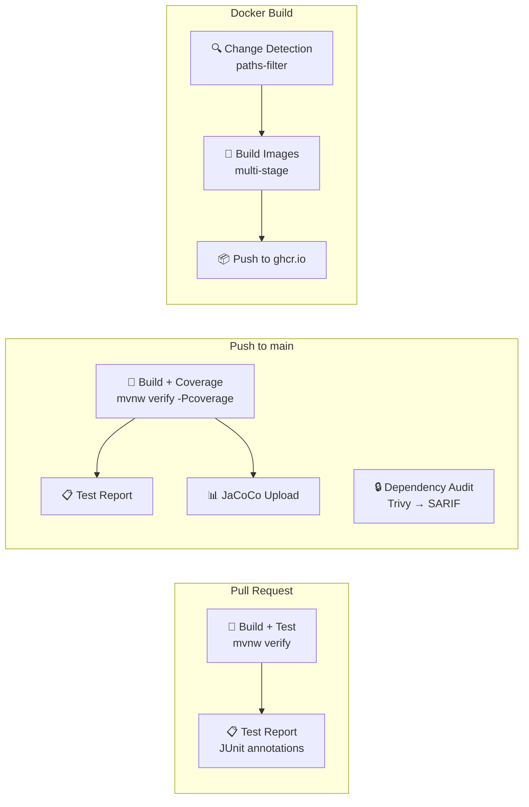

# Deployment Guide

> How to deploy the Orion platform — local development, CI/CD, and AWS environments.

---

## 1. Environments

| Environment | Infrastructure | Purpose |
|------------|---------------|---------|
| **local** | Docker Compose (Redpanda, PostgreSQL, Redis) | Developer workstation |
| **dev** | AWS (small footprint) | Iterative integration testing |
| **staging** | AWS (production-like) | Load tests, demos |
| **prod-demo** | AWS (hardened staging) | Portfolio showcase |

---

## 2. Local Development

### Prerequisites

| Tool | Version | Verify |
|------|---------|--------|
| Java (JDK) | 21+ | `java -version` |
| Maven | 3.9+ (or use wrapper) | `.\mvnw.cmd -version` |
| Docker | 24+ | `docker --version` |
| Docker Compose | v2+ | `docker compose version` |
| Git | 2.40+ | `git --version` |

### Start Local Infrastructure

```powershell
cd infra/docker-compose
docker compose up -d
```

Services available after startup:

| Service | URL | Credentials |
|---------|-----|-------------|
| Redpanda Console | http://localhost:8080 | — |
| pgAdmin | http://localhost:5050 | See `.env` file |
| Redis Commander | http://localhost:8081 | — |
| PostgreSQL | localhost:5432 | See `.env` file |
| Redis | localhost:6379 | — |
| Kafka bootstrap | localhost:19092 | — |

### Build & Test

```powershell
# Full build + tests (420 tests)
.\mvnw.cmd clean verify

# Quick compile (no tests)
.\mvnw.cmd compile

# Single module
.\mvnw.cmd verify -pl libs/grpc-api -am
```

### Stop Local Infrastructure

```powershell
cd infra/docker-compose
docker compose down      # Keep data
docker compose down -v   # Wipe data
```

---

## 3. CI/CD Pipeline (GitHub Actions)

The CI pipeline is configured across 4 workflow files in `.github/workflows/`, sharing a reusable composite action for Java/Maven setup.

### Pipeline Architecture



### Workflow Files

| File | Trigger | What It Does |
|------|---------|-------------|
| `ci-pr.yml` | PRs to `main` | Build + test, JUnit annotations, concurrency cancel-in-progress |
| `ci-main.yml` | Push to `main` | Build + coverage (JaCoCo), Trivy dependency audit → GitHub Security |
| `proto-validate.yml` | Proto/POM changes | Compile + test `libs/grpc-api` module only |
| `docker-build.yml` | Push to `main` (service changes) | Multi-stage Docker build, push to ghcr.io with SHA+branch tags |

### Reusable Composite Action

All workflows use `.github/actions/setup-java-maven/action.yml`:
- Installs Temurin JDK 21 via `actions/setup-java@v4`
- Enables Maven dependency caching
- Sets `mvnw` as executable

### Running CI Locally

```powershell
# Simulate PR workflow
.\mvnw.cmd verify -B --no-transfer-progress

# Simulate main workflow with coverage
.\mvnw.cmd verify -Pcoverage -B

# Simulate proto validation
.\mvnw.cmd verify -pl libs/grpc-api -am

# Check for dependency vulnerabilities (requires Trivy CLI)
# Install: choco install trivy
trivy fs --severity HIGH,CRITICAL .
```

### Test Reporting

- **JUnit XML** → `**/target/surefire-reports/*.xml` → `dorny/test-reporter@v1` creates GitHub check annotations
- **JaCoCo HTML** → `**/target/site/jacoco/` → uploaded as artifact on main builds
- **Surefire XMLs** → uploaded as artifact on failure for debugging

### Security Scanning

- **Trivy** scans the filesystem for vulnerable Maven dependencies
- Results published as SARIF to **GitHub Security → Code scanning alerts**
- Runs on every push to `main` (not on PRs to keep PR builds fast)

### Docker Image Strategy

Multi-stage builds for minimal image size (template at `services/Dockerfile.template`):

```dockerfile
# Stage 1: Build
FROM eclipse-temurin:21-jdk AS builder
COPY . /workspace
WORKDIR /workspace
RUN ./mvnw package -DskipTests -pl services/<name> -am

# Stage 2: Runtime
FROM eclipse-temurin:21-jre-alpine AS runtime
RUN addgroup -g 1001 orion && adduser -u 1001 -G orion -D orion
COPY --from=builder /workspace/services/<name>/target/*.jar /app/app.jar
USER orion
EXPOSE 8080 9090
ENTRYPOINT ["java", "-XX:+UseContainerSupport", "-XX:MaxRAMPercentage=75.0", "-jar", "/app/app.jar"]
```

Registry: `ghcr.io/<owner>/orion-<service-name>`  
Tags: `sha-<commit>`, `<branch>`, `latest` (main only)

### CODEOWNERS

`.github/CODEOWNERS` auto-assigns reviewers based on file paths:
- `*` → global owner
- `libs/` → library owners
- `.github/` → DevOps owners
- `docs/` → documentation owners

---

## 4. AWS Deployment (Planned)

### Architecture

```
VPC (Multi-AZ)
├── Public Subnets
│   └── ALB (Application Load Balancer)
├── Private Subnets
│   ├── ECS Fargate (BFF + Domain Services)
│   ├── MSK (Kafka)
│   ├── RDS (PostgreSQL)
│   └── ElastiCache (Redis)
└── S3 (archives, exports)
```

### Infrastructure as Code (Terraform)

Planned module structure:

```
infra/
├── terraform/
│   ├── modules/
│   │   ├── network/        ← VPC, subnets, routing
│   │   ├── compute/        ← ECS cluster, services, ALB
│   │   └── data/           ← MSK, RDS, Redis, S3
│   ├── environments/
│   │   ├── dev/
│   │   ├── staging/
│   │   └── prod-demo/
│   └── main.tf
└── docker-compose/          ← Local dev (exists now)
```

### Docker Image Strategy

Multi-stage builds for minimal image size:

```dockerfile
# Stage 1: Build
FROM eclipse-temurin:21-jdk AS build
COPY . /app
WORKDIR /app
RUN ./mvnw package -DskipTests -pl services/<name> -am

# Stage 2: Runtime
FROM eclipse-temurin:21-jre-alpine
COPY --from=build /app/services/<name>/target/*.jar /app.jar
EXPOSE 8080 9090
ENTRYPOINT ["java", "-jar", "/app.jar"]
```

Port convention:
- `8080` — HTTP (REST/WebSocket)
- `9090` — gRPC
- `8081` — Actuator (health, metrics, info)

### Scaling Strategy

| Service | Scale Signal | Notes |
|---------|------------|-------|
| BFF | CPU + WebSocket connections | Stateless, horizontal |
| Market Data Ingest | Kafka consumer lag | Scale with partitions |
| RFQ Service | CPU + RFQ rate | Scale with partitions |
| Execution Service | Low — event-driven | 2-3 instances for HA |
| Post-Trade | Low — event-driven | 2-3 instances for HA |
| Analytics | Kafka lag | Independent scaling |

---

## 5. Deployment Checklist

### Pre-Deploy

- [ ] All tests pass locally (`mvn clean verify`)
- [ ] No dependency vulnerabilities (`mvn dependency-check:check`)
- [ ] Docker image builds successfully
- [ ] Environment variables configured
- [ ] Database migrations up to date

### Post-Deploy

- [ ] Health endpoints returning 200 (`/actuator/health`)
- [ ] Kafka connectivity verified (consumer group registered)
- [ ] gRPC connectivity verified (service descriptor reachable)
- [ ] Metrics flowing to CloudWatch
- [ ] Log aggregation working
- [ ] Smoke test RFQ workflow end-to-end

---

*Last updated after US-01-07*
