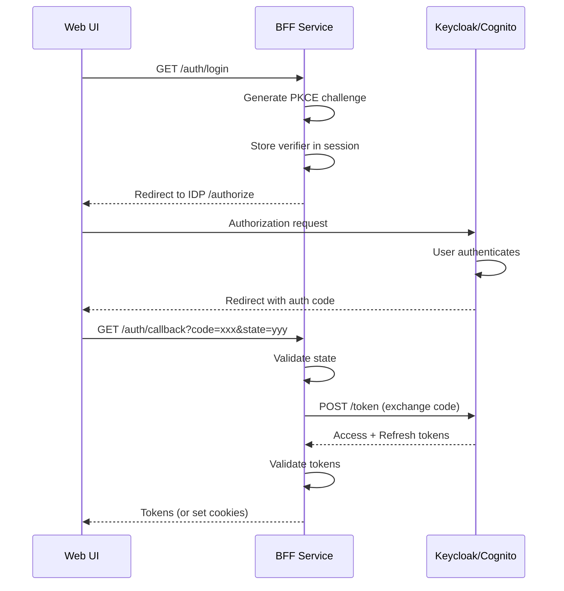

# User Story: US-02-02 - Implement OIDC Login Flow in BFF

## Story Information

| Field | Value |
|-------|-------|
| **Story ID** | US-02-02 |
| **Epic** | Epic 02 - Authentication, Sessions & Identity |
| **Title** | Implement OIDC Login Flow in BFF |
| **Priority** | P0 - Critical |
| **Story Points** | 5 |

## User Story

**As a** user  
**I want** to login via the OIDC authentication flow  
**So that** I can securely access the Orion platform with my credentials

## Description

Implement the Authorization Code flow with PKCE in the BFF. The BFF will handle the OAuth2 redirect, token exchange, and session establishment. The UI will redirect to the login page, and after successful authentication, receive tokens to use for API calls.

## Acceptance Criteria

### AC1: Login Initiation
- [ ] `GET /auth/login` redirects to OIDC provider
- [ ] PKCE challenge generated for each login
- [ ] State parameter prevents CSRF attacks
- [ ] Redirect URI registered with provider

### AC2: Callback Handling
- [ ] `GET /auth/callback` processes auth code
- [ ] Exchanges code for tokens
- [ ] Validates token signature and claims
- [ ] Sets secure HTTP-only cookies (optional pattern)
- [ ] Returns tokens to frontend (SPA pattern)

### AC3: Error Handling
- [ ] Invalid state parameter returns error
- [ ] Token exchange failures handled gracefully
- [ ] User-friendly error messages
- [ ] Error events logged

### AC4: OIDC Discovery
- [ ] Fetches OIDC configuration from discovery endpoint
- [ ] Caches discovery document
- [ ] Handles discovery endpoint unavailability

### AC5: Security Requirements
- [ ] PKCE used for all auth flows
- [ ] Tokens transmitted securely
- [ ] No tokens in URL fragments
- [ ] Secure defaults for all options

## Technical Details

### OIDC Flow Sequence


### Implementation Code

```typescript
// routes/auth.routes.ts
import { Router } from 'express';
import { Issuer, generators, Client } from 'openid-client';
import { createLogger } from '@orion/observability';

const logger = createLogger({ serviceName: 'bff-auth' });

interface AuthConfig {
  issuerUrl: string;
  clientId: string;
  clientSecret?: string;
  redirectUri: string;
  scopes: string[];
}

export function createAuthRouter(config: AuthConfig): Router {
  const router = Router();
  let client: Client;
  
  // Initialize OIDC client
  async function getClient(): Promise<Client> {
    if (!client) {
      const issuer = await Issuer.discover(config.issuerUrl);
      client = new issuer.Client({
        client_id: config.clientId,
        client_secret: config.clientSecret,
        redirect_uris: [config.redirectUri],
        response_types: ['code'],
        token_endpoint_auth_method: config.clientSecret ? 'client_secret_basic' : 'none',
      });
    }
    return client;
  }
  
  // Login initiation
  router.get('/login', async (req, res) => {
    try {
      const oidcClient = await getClient();
      
      // Generate PKCE challenge
      const codeVerifier = generators.codeVerifier();
      const codeChallenge = generators.codeChallenge(codeVerifier);
      const state = generators.state();
      
      // Store verifier in session (or encrypted cookie)
      req.session!.codeVerifier = codeVerifier;
      req.session!.state = state;
      
      const authUrl = oidcClient.authorizationUrl({
        scope: config.scopes.join(' '),
        state,
        code_challenge: codeChallenge,
        code_challenge_method: 'S256',
      });
      
      logger.info('Initiating login', { state });
      res.redirect(authUrl);
    } catch (error) {
      logger.error('Login initiation failed', { error });
      res.redirect('/login?error=init_failed');
    }
  });
  
  // Callback handling
  router.get('/callback', async (req, res) => {
    try {
      const { code, state, error, error_description } = req.query;
      
      // Check for error from IDP
      if (error) {
        logger.warn('Auth error from IDP', { error, error_description });
        return res.redirect(`/login?error=${error}`);
      }
      
      // Validate state
      if (state !== req.session?.state) {
        logger.warn('Invalid state parameter', { received: state });
        return res.redirect('/login?error=invalid_state');
      }
      
      const oidcClient = await getClient();
      const codeVerifier = req.session!.codeVerifier;
      
      // Exchange code for tokens
      const tokenSet = await oidcClient.callback(
        config.redirectUri,
        { code: code as string, state: state as string },
        { code_verifier: codeVerifier, state: req.session!.state }
      );
      
      logger.info('Token exchange successful', {
        sub: tokenSet.claims().sub,
        expiresIn: tokenSet.expires_in,
      });
      
      // Clear session state
      delete req.session!.codeVerifier;
      delete req.session!.state;
      
      // Return tokens to frontend
      // Option 1: JSON response (SPA)
      res.json({
        accessToken: tokenSet.access_token,
        refreshToken: tokenSet.refresh_token,
        idToken: tokenSet.id_token,
        expiresIn: tokenSet.expires_in,
      });
      
      // Option 2: Set HTTP-only cookies (more secure for web)
      // res.cookie('access_token', tokenSet.access_token, { httpOnly: true, secure: true });
      // res.redirect('/');
      
    } catch (error) {
      logger.error('Callback processing failed', { error });
      res.redirect('/login?error=callback_failed');
    }
  });
  
  // Logout
  router.post('/logout', async (req, res) => {
    try {
      const oidcClient = await getClient();
      
      // Clear local session
      req.session?.destroy(() => {});
      
      // Redirect to IDP logout (optional)
      const endSessionUrl = oidcClient.endSessionUrl({
        post_logout_redirect_uri: `${config.redirectUri.replace('/callback', '')}/login`,
      });
      
      res.json({ logoutUrl: endSessionUrl });
    } catch (error) {
      logger.error('Logout failed', { error });
      res.status(500).json({ error: 'logout_failed' });
    }
  });
  
  return router;
}
```

### Configuration

```typescript
const authConfig = {
  issuerUrl: process.env.OIDC_ISSUER_URL || 'http://localhost:8180/realms/orion',
  clientId: process.env.OIDC_CLIENT_ID || 'orion-workstation',
  clientSecret: process.env.OIDC_CLIENT_SECRET,
  redirectUri: process.env.OIDC_REDIRECT_URI || 'http://localhost:3000/auth/callback',
  scopes: ['openid', 'profile', 'email'],
};
```

## Implementation Steps

1. Install `openid-client` library
2. Create auth router with login/callback/logout
3. Implement PKCE flow
4. Add session storage for PKCE verifier
5. Implement token exchange
6. Add error handling and logging
7. Test with local Keycloak
8. Document API endpoints

## Definition of Done

- [ ] Login flow works end-to-end
- [ ] Tokens are returned correctly
- [ ] PKCE is implemented correctly
- [ ] Error handling is robust
- [ ] Unit tests pass
- [ ] Integration test with Keycloak passes

## Dependencies

- US-02-01: Local Keycloak Setup
- Epic 01: Base service template

## Testing Requirements

### Unit Tests
- Test PKCE generation
- Test state validation
- Test error handling

### Integration Tests
- Full login flow with Keycloak
- Invalid credentials handling
- Token expiry scenarios
